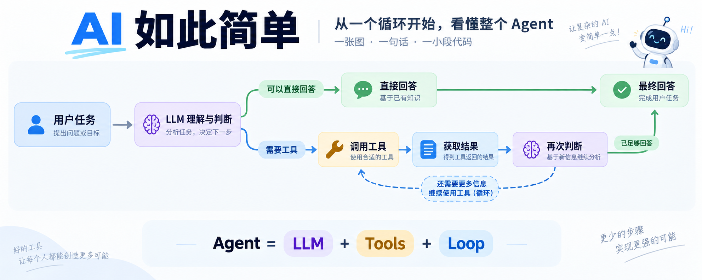
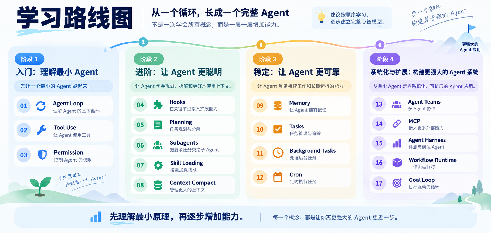

<div align="center">



# AI 如此简单

**一张图 + 一句话 + 一小段代码，把一个 AI Agent 概念真正讲明白，再亲手做出一个 Coding Agent。**

面向刚开始学习 **AI / LLM / Agent** 的开发者。  
不堆术语，不先上框架，按概念逐章理解一个完整 Agent 是怎样组成的。

</div>

---

## 这是什么？

很多 Agent 教程一上来就是框架、配置和几十个概念。

这个项目反过来：

> **先理解最小原理，再逐个认识能力。**

本项目分成两部分：第一部分用独立章节拆解 Agent 原理；第二部分把这些原理重新组合，做出一个可以运行的简易 Coding Agent，最后再把 Pi 作为工程化扩展阅读。

理论篇的每章 `code.py` 都是独立教学示例，方便单独运行和理解；它们不是一个逐章自动叠加的生产级 Agent。想学习时，建议沿着主线阅读；想实验时，可以直接进入任意一章或实战篇。

每一章只解决一个问题：

1. **先看图**：建立直觉；
2. **一句话理解**：先抓住核心；
3. **生活化例子**：把抽象概念落地；
4. **一小段代码**：真正跑起来；
5. **使用边界**：知道什么时候值得用、什么时候反而会增加复杂度。

最终你会从一次普通 Chat Completion 和一个最小循环开始，逐渐理解：

**Chat Completion → Agent Loop → Tool Use → Permission → Planning → Subagents → Skills → Context → Memory → Tasks → MCP → Agent Teams → Harness → Workflow**

---

## 一张图看懂这门课



学习主线可以先记成：

```text
Chat Completion
      ↓
Agent Loop
      ↓
Tool Use
      ↓
Permission
      ↓
Planning / Subagents / Memory / MCP ...
```

可以把一个成熟 Agent 想成不断升级的小助手：

> **会思考 → 会使用工具 → 会规划 → 会记忆 → 会协作 → 会长期运行**

所有复杂 Agent，最后都建立在同一个最小循环上：

```text
用户任务
   ↓
模型决定下一步
   ↓
需要工具？ ── 否 ──→ 输出答案
   │
   是
   ↓
执行工具
   ↓
工具结果返回模型
   └────────────→ 再次决定
```

每章都可以按这个顺序阅读：**先看主图和场景 → 看本章新增代码 → 运行独立示例 → 思考使用边界。**

---

## 第一部分：理论篇

## 学习路线

目前已完成 **18 / 18** 章。

| 状态 | 章节 | 核心概念 | 只记住一句话 |
| --- | --- | --- | --- |
| ✅ | [00 · Chat Completion](./chapters/00-chat-completion/) | 一次模型请求 | 模型只知道这一次请求提供给它的上下文 |
| ✅ | [01 · Agent Loop](./chapters/01-agent-loop/) | Agent 的最小循环 | 模型决定下一步，工具负责执行 |
| ✅ | [02 · Tool Use](./chapters/02-tool-use/) | 工具调用与分发 | 加工具，不需要重写整个循环 |
| ✅ | [03 · Permission](./chapters/03-permission/) | 权限 | 能做，不代表应该直接做 |
| ✅ | [04 · Hooks](./chapters/04-hooks/) | 扩展点 | 在关键位置留下可插拔接口 |
| ✅ | [05 · Planning](./chapters/05-planning/) | 计划 | 复杂任务先拆，再执行 |
| ✅ | [06 · Subagents](./chapters/06-subagents/) | 子 Agent | 大任务拆小，并隔离上下文 |
| ✅ | [07 · Skill Loading](./chapters/07-skill-loading/) | 技能加载 | 用到什么，再加载什么 |
| ✅ | [08 · Context Compact](./chapters/08-context-compact/) | 上下文压缩 | 上下文有限，要主动腾空间 |
| ✅ | [09 · Memory](./chapters/09-memory/) | 记忆 | 重要信息跨对话保留下来 |
| ✅ | [10 · Tasks](./chapters/10-tasks/) | 任务管理 | 把目标变成可追踪的步骤 |
| ✅ | [11 · Background Tasks](./chapters/11-background-tasks/) | 后台任务 | 慢任务不应该阻塞 Agent |
| ✅ | [12 · Cron Scheduler](./chapters/12-cron-scheduler/) | 定时任务 | 让任务在未来自动发生 |
| ✅ | [13 · Agent Teams](./chapters/13-agent-teams/) | 多 Agent 协作 | 一个 Agent 忙不过来，就分工 |
| ✅ | [14 · MCP Plugin](./chapters/14-mcp-plugin/) | 外部能力协议 | 用统一方式连接外部工具 |
| ✅ | [15 · Agent Harness](./chapters/15-integrated-harness/) | Agent 运行底座 | 把工具、上下文、权限和执行组织起来 |
| ✅ | [16 · Workflow Runtime](./chapters/16-workflow-runtime/) | 工作流 | 把稳定的编排方式沉淀成流程 |
| ✅ | [17 · Goal Loop](./chapters/17-goal-loop/) | 目标循环 | 目标决定 Agent 什么时候真正结束 |

> 不需要一次理解全部概念。  
> **按顺序学习可以建立主线；代码示例仍然可以单章运行，不要求逐章拼装。**

## 第二部分：实战篇

理论篇讲清“零件是什么”，实战篇把零件装回一个小型 Coding Agent：

| 状态 | 实战 | 核心内容 |
| --- | --- | --- |
| ✅ | [01 · Mini Coding Agent](./labs/01-mini-coding-agent/) | 用 Python + DeepSeek 实现聊天分流、`read / write / edit / bash` 和会话记录 |
| 📖 | Pi 扩展阅读 | 理解 TypeScript/Node.js Harness 如何通过 Extension、Skill、Session 和 SDK 扩展 |

实战篇不会复制 Pi 的代码，而是参考它的设计理念，先让读者拥有一个自己能读懂、能修改、能运行的最小版本，再理解更完整的工程实现。

### 为什么只保留四个工具？

实战 Agent 默认只打开四个核心工具：

```text
read   读取文件
write  写入文件
edit   精确修改文件
bash   列目录、搜索代码、查看状态、运行检查
```

能用 `bash` 表达的动作，不再单独注册一个工具。这样模型要记住的接口更少，读者也能更直观看到：工具只是能力入口，真正的权限仍然由 Harness 决定。

> `bash` 不是完整安全沙箱。示例只允许在自己的工作区实验，并会阻止敏感路径；写入、修改和需要执行的命令仍然需要确认。

---

## 5 分钟跑起来

### 1. 克隆项目

```bash
git clone https://github.com/lance2016/ai-is-simple.git
cd ai-is-simple
```

### 2. 创建 Python 环境

```bash
python3 -m venv .venv
source .venv/bin/activate
pip install -r requirements.txt
```

Windows PowerShell：

```powershell
.venv\Scripts\Activate.ps1
```

### 3. 配置模型

```bash
cp .env.example .env
```

然后填写：

```env
DEEPSEEK_API_KEY=你的_api_key
DEEPSEEK_BASE_URL=https://api.deepseek.com
DEEPSEEK_MODEL=deepseek-flash
```

### 4. 运行第 00 章

```bash
python chapters/00-chat-completion/code.py
```

先从一次最普通的模型请求开始，再继续阅读第 01 章，理解最小可运行 Agent。

如果想直接运行实战篇：

```bash
python labs/01-mini-coding-agent/agent.py \
  "用 bash 列出 labs/01-mini-coding-agent，然后读取 README.md，总结这个 Agent 的四个工具"
```

---

## 每章都长什么样？

```text
主图
 ↓
一句话总结
 ↓
生活化解释
 ↓
最小可运行代码
 ↓
今天只记住
 ↓
一个思考题
```

项目刻意避免两件事：

- ❌ 一开始堆大量框架 API；
- ❌ 用十几个术语解释另一个术语。

更希望你最后能做到：

> **合上文档，也能用自己的话解释这个概念。**

---

## 项目结构

```text
ai-is-simple/
├── README.md
├── Agents.md
├── STYLE_GUIDE.md
├── SOURCES.md
├── assets/
│   ├── readme-hero.png
│   ├── learning-roadmap.png
│   ├── chapter-00-chat-completion.png
│   ├── chapter-01-agent-loop.png
│   ├── chapter-02-tool-use.png
│   ├── chapter-03-permission.png
│   ├── chapter-04-hooks.png
│   ├── chapter-05-planning.png
│   ├── chapter-06-subagents.png
│   ├── chapter-07-skill-loading.png
│   ├── chapter-08-context-compact.png
│   ├── chapter-09-memory.png
│   ├── chapter-10-tasks.png
│   ├── chapter-11-background-tasks.png
│   ├── chapter-12-cron-scheduler.png
│   ├── chapter-13-agent-teams.png
│   ├── chapter-14-mcp-plugin.png
│   ├── chapter-15-integrated-harness.png
│   ├── chapter-16-workflow-runtime.png
│   ├── chapter-17-goal-loop.png
│   └── lab-01-mini-coding-agent.png
├── requirements.txt
├── .env.example
├── chapters/
│   ├── 00-chat-completion/
│   │   ├── README.md
│   │   └── code.py
│   ├── 01-agent-loop/
│   │   ├── README.md
│   │   └── code.py
│   ├── 02-tool-use/
│   │   ├── README.md
│   │   └── code.py
│   ├── 03-permission/
│   │   ├── README.md
│   │   └── code.py
│   ├── 04-hooks/
│   │   ├── README.md
│   │   └── code.py
│   ├── 05-planning/
│   │   ├── README.md
│   │   └── code.py
│   ├── 06-subagents/
│   │   ├── README.md
│   │   └── code.py
│   ├── 07-skill-loading/
│   │   ├── README.md
│   │   ├── code.py
│   │   └── skills/
│   ├── 08-context-compact/
│   │   ├── README.md
│   │   └── code.py
│   ├── 09-memory/
│   │   ├── README.md
│   │   └── code.py
│   ├── 10-tasks/
│   │   ├── README.md
│   │   └── code.py
│   ├── 11-background-tasks/
│   │   ├── README.md
│   │   └── code.py
│   ├── 12-cron-scheduler/
│   │   ├── README.md
│   │   └── code.py
│   ├── 13-agent-teams/
│   │   ├── README.md
│   │   └── code.py
│   ├── 14-mcp-plugin/
│   │   ├── README.md
│   │   └── code.py
│   ├── 15-integrated-harness/
│   │   ├── README.md
│   │   └── code.py
│   ├── 16-workflow-runtime/
│   │   ├── README.md
│   │   └── code.py
│   └── 17-goal-loop/
│       ├── README.md
│       └── code.py
└── labs/
    └── 01-mini-coding-agent/
        ├── README.md
        └── agent.py
```

每个章节都是一个独立的小单元：

**README 负责讲明白，代码负责跑明白。**

---

## 默认技术栈

为了降低学习成本，项目尽量保持统一：

- **Python**
- **DeepSeek**
- **OpenAI Python SDK**
- **OpenAI-compatible API**
- `.env` 管理本地配置

重点不是某个模型或框架，而是理解 **Agent 背后的通用机制**。

---

## 适合谁？

如果你：

- 刚开始学习 AI Agent；
- 会一点 Python，但对 Agent 架构没有完整心智模型；
- 用过 LangChain / LangGraph / Claude Code，却想知道底层到底发生了什么；
- 正在准备 AI 应用开发 / Agent 工程相关面试；

这个项目就是为这种学习方式准备的。

---

## 项目边界

这是个人学习与教学项目，不是 `learn-claude-code`、DeepSeek 或其他项目的官方文档。

部分学习主线受到 [`shareAI-lab/learn-claude-code`](https://github.com/shareAI-lab/learn-claude-code) 启发，但会重新组织概念、解释、插图与代码，让内容更适合初学者阅读。

- 配图规范：[STYLE_GUIDE.md](./STYLE_GUIDE.md)
- 项目协作规范：[Agents.md](./Agents.md)
- 参考来源：[SOURCES.md](./SOURCES.md)

---

<div align="center">

### 从一次请求开始，慢慢看懂整个 Agent 世界。

如果这个项目对你有帮助，欢迎 ⭐ Star 或一起补充新的章节。

</div>
