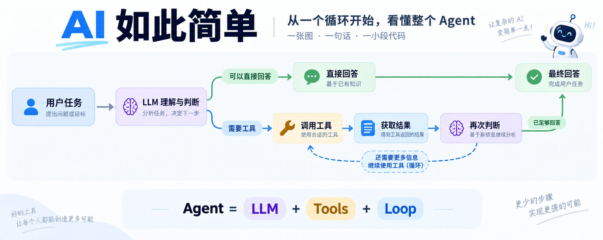
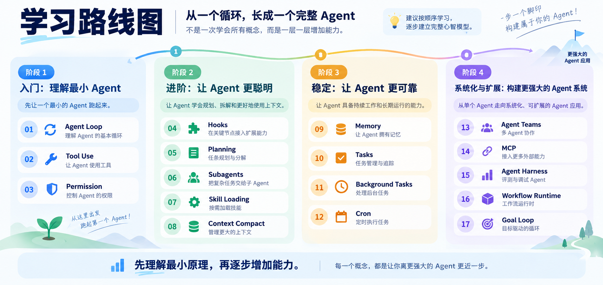

<div align="center">

<p><a href="https://lance2016.github.io/ai-is-simple/"><strong>📖 在线阅读文档</strong></a></p>



# AI 如此简单

**一张图 + 一句话 + 一小段代码，把一个 AI Agent 概念真正讲明白，再亲手做出一个 Coding Agent。**

面向刚开始学习 **AI / LLM / Agent** 的开发者。  
不堆术语，不先上框架，按概念逐章理解一个完整 Agent 是怎样组成的。

</div>

---

## 这是什么？

很多 Agent 教程一上来就是框架、配置和几十个概念。

这个项目反过来：

> **先理解最小原理，再逐个认识能力。**

本项目分成两部分：第一部分用独立章节拆解 Agent 原理；第二部分把这些原理重新组合，做出一个可以运行的简易 Coding Agent。完成主线后，可以到[扩展阅读页](./references/)继续看参考项目、记忆系统和相关标准。

理论篇的每章 `code.py` 都是独立教学示例，方便单独运行和理解；它们不是一个逐章自动叠加的生产级 Agent。想学习时，建议沿着主线阅读；想实验时，可以直接进入任意一章或实战篇。

每一章只解决一个问题。主图先帮你定位概念；正文按主题选择解释方式，可能是代码流程、方案比较、失败案例或生活类比。生活类比只在确实能减少理解成本时使用，代码也只展示本章需要理解的部分。

你会从一次普通 Chat Completion 和一个最小循环开始，先搭起 Agent 的主干，再按需要认识 Planning、Subagents、Memory、MCP、Workflow 等可选能力。

---

## 一张图看懂这门课



18 章不是一条必须走完的直线，而是**一条主干 + 一组按场景选用的能力**：

```text
【核心主干】每个 Agent 都有

  00 Chat Completion → 01 Agent Loop → 02 Tool Use → 03 Permission
                                  ↓
                   15 Harness：把用到的能力组织起来

【可选能力】遇到对应问题，再挂到主干上

  循环里的逻辑越来越多  →  04 Hooks
  任务步骤多、容易走偏  →  05 Planning / 10 Tasks / 17 Goal Loop
  上下文不够用          →  06 Subagents / 07 Skills / 08 Compact
  下次还要记得          →  09 Memory
  慢任务、定时任务      →  11 Background / 12 Cron
  需要多个 Agent 分工   →  13 Agent Teams
  要接外部服务          →  14 MCP
  流程已经固定          →  16 Workflow
```

- **主干**：建议按顺序读完 00～03，再读 15。有了这几章，就能看懂一个最小但完整的 Agent。
- **可选能力**：遇到对应问题时再读，不必全部具备。一个好用的 Agent 往往只用了其中两三种。
- 开头会先交代本章要解决的问题；需要依赖前文的地方会明确指出，其他章节可按需阅读。

所有复杂 Agent，最后都建立在同一个最小循环上：

```text
用户任务
   ↓
模型决定下一步
   ↓
需要工具？ ── 否 ──→ 输出答案
   │
   是
   ↓
执行工具
   ↓
工具结果返回模型
   └────────────→ 再次决定
```

可以先看主图和问题，再按需要读代码、比较方案或检查失败边界。独立示例供你验证心智模型，不要求逐章把它们接成完整产品。

---

## 第一部分：理论篇

### 章节索引：先读主干，再按问题选章节

### 核心主线

| 章节 | 面试时要能讲清楚 |
| --- | --- |
| [00 · Chat Completion](./chapters/00-chat-completion/) | 一次请求看到了什么；多轮对话为什么需要应用保存状态 |
| [01 · Agent Loop](./chapters/01-agent-loop/) | Agent 执行循环的四个问题；以 ReAct 为例看工具调用往返和停止条件 |
| [02 · Tool Use](./chapters/02-tool-use/) | 工具定义、参数、程序分发和结果回传各由谁负责 |
| [03 · Permission](./chapters/03-permission/) | 模型提出请求后，程序怎样验证权限和限制影响范围 |
| [15 · Agent Harness](./chapters/15-integrated-harness/) | 怎样把模型、工具、状态和安全边界组织成可维护的应用 |

### 遇到具体问题时再读

| 问题 | 章节 | 面试中可展开的取舍 |
| --- | --- | --- |
| 循环里开始堆日志、策略和检查 | [04 · Hooks](./chapters/04-hooks/) | 扩展点和必须执行的安全策略有什么区别 |
| 多步骤任务容易漏项，或需要中断后恢复 | [05 · Planning](./chapters/05-planning/)、[10 · Tasks](./chapters/10-tasks/)、[16 · Workflow](./chapters/16-workflow-runtime/)、[17 · Goal Loop](./chapters/17-goal-loop/) | 自适应计划、持久任务、固定流程和验收条件分别解决什么问题 |
| 对话变长、需要带入过去信息 | [07 · Skills](./chapters/07-skill-loading/)、[08 · Context](./chapters/08-context-compact/)、[09 · Memory](./chapters/09-memory/) | 指令、当前对话和跨会话记忆不能混成一类 |
| 需要委派、后台执行、定时触发或多人协作 | [06 · Subagents](./chapters/06-subagents/)、[11 · Background Tasks](./chapters/11-background-tasks/)、[12 · Cron](./chapters/12-cron-scheduler/)、[13 · Teams](./chapters/13-agent-teams/) | 延迟、协调成本、任务生命周期和重复执行风险如何权衡 |
| 接入外部工具服务 | [14 · MCP](./chapters/14-mcp-plugin/) | 协议互通不等于服务可信或调用已获授权 |

这些章节是问题索引，不是进阶等级。先读核心主线；需要解释某种机制时，再回到对应章节。每章代码仍可独立运行，不需要把 18 章拼成一个程序。

## 面试准备路线

项目面向 **Agent 应用开发 / Agent 工程** 面试：重点是应用怎样调用模型、连接工具、管理状态、限制风险并验证效果，不覆盖模型训练和算法研究。建议按下面顺序准备：

1. **讲清基本架构：** 读 00～03、15，并运行 [Lab 01](./labs/01-mini-coding-agent/)。练习画出“模型请求 → 工具调用 → 程序检查并执行 → 工具结果 → 模型继续”的完整往返。
2. **讲清安全边界：** 结合 03、14 和 Lab 01、[Lab 04](./labs/04-mcp/)，说明为什么提示词不能代替权限校验，外部工具和文件内容也不能默认可信。
3. **讲清长任务状态：** 按实际问题选读 05～13、16、17；能说明什么时候该用普通循环、任务记录、子 Agent 或固定 Workflow，以及各自增加的延迟、成本和失败面。
4. **讲清如何改进质量：** 运行 [Lab 05](./labs/05-verify/)、[Lab 06](./labs/06-observability/) 和 [Lab 08](./labs/08-evaluation/)，练习从失败 Trace 找原因、把失败变成回归案例，并比较改动前后的结果。

准备时不要只背术语。每个答案尽量说明：**问题是什么、控制流在哪里、失败会怎样、如何验证、代价是什么。**

### 一道综合设计题

> 设计一个 Coding Agent：它可以读取和修改指定仓库、运行测试，并在任务结束前说明改了什么。你会怎样设计工具、权限、失败处理和质量验证？

回答时可以从任务范围和信任边界开始，再说明工具调用路径、路径与命令限制、用户确认点、循环上限和取消方式，最后讲测试验收、Trace 与回归评估。面试官继续追问时，再讨论超时和重试、重复执行、并发用户隔离、成本和延迟。每项都要结合这个任务的风险解释，不必为了展示术语而全部上齐。

### 本教程的范围

项目已经提供可运行的 Agent、权限原型、MCP、可观测性和评估练习。它没有完整覆盖 RAG 检索链路、线上服务的重试与限流、成本预算、多租户隔离和持久任务队列；这些是值得继续补的应用工程主题，不应从“已经读完 18 章”推断为生产经验。

## 第二部分：实战篇

理论篇讲清“零件是什么”，实战篇把零件装回一个小型 Coding Agent。

实战篇和理论篇一样，也是 **主干 + 按需挂上的能力**：Lab 01 是主干；后面每个实战写一个扩展，挂到同一个 Agent 上，Agent Loop 一行不改。

推荐路线按能力逐步展开到 Lab 09；这是一条学习路线，02～09 仍可按场景选择。

| 状态 | 实战 | 核心内容 | 对应理论篇 |
| --- | --- | --- | --- |
| ✅ | [01 · Coding Agent 搭建](./labs/01-mini-coding-agent/) | 用 Python + DeepSeek 实现 `read / write / edit / bash` 四个工具，配一个网页界面：流式输出、逐步展示 tool call、改动前等你授权；留好三个扩展挂载点 | 01～04、15 |
| ✅ | [02 · 长期记忆](./labs/02-memory/) | 当前对话保留任务状态；项目规则跨会话常驻，历史经验按需读取 | 09 |
| ✅ | [03 · 子 Agent 任务委派](./labs/03-subagent/) | `task` 工具背后是另一个只读的 `CodingAgent`，只交回总结 | 06 |
| ✅ | [04 · MCP 工具接入](./labs/04-mcp/) | 手写 stdio MCP Server 和客户端，远程工具和本地工具走同一套授权 | 14、03 |
| ✅ | [05 · Hooks：代码验收](./labs/05-verify/) | 用第 04 章的 Stop Hook 在结束前运行测试；失败时把结果交回循环，和第 17 章的模型评审作对照 | 04（对照 17） |
| ✅ | [06 · Agent 可观测性](./labs/06-observability/) | 用 Phoenix 和 OpenTelemetry 串起一次任务里的模型请求、工具调用、耗时与错误 | 01、02、15 |
| ✅ | [07 · 上下文管理](./labs/07-context-management/) | 任务结束后压缩旧对话，保留当前任务和关键信息 | 08、04 |
| ✅ | [08 · Agent 效果评估](./labs/08-evaluation/) | 用固定数据集和评分器比较 Agent 版本，并回到 Trace 定位失败 | 01、15 |
| ✅ | [09 · Skill Loading：代码审查](./labs/09-skill-loading/) | 按需加载 `SKILL.md`，再用技能附带的脚本定位代码边界 | 07 |
| 📖 | [扩展阅读](./references/) | 参考项目、记忆系统、Agent 框架、协议与评测资料；包含 Pi 和 learn-claude-code | — |

想看哪个实战，一条命令启动，页面上会列出这个实战的示例任务，点一下就能用：

```bash
uv run python labs/01-mini-coding-agent/server.py --lab 05   # 换成 02～09
```

想同时挂多个能力，再加 `--ext`，例如 `--lab 05 --ext subagent`。

实战篇不会复制 Pi 的代码，而是参考它的设计理念，先让读者拥有一个自己能读懂、能修改、能运行的最小版本，再理解更完整的工程实现。

### 为什么只保留四个工具？

实战 Agent 默认只打开四个核心工具：

```text
read   读取文件
write  写入文件
edit   精确修改文件
bash   列目录、搜索代码、查看状态、运行检查
```

能用 `bash` 表达的动作，不再单独注册一个工具。这样模型要记住的接口更少，读者也能更直观看到：工具只是能力入口，真正的权限仍然由 Harness 决定。

> `bash` 不是完整安全沙箱。示例只允许在自己的工作区实验，并会阻止敏感路径；写入、修改和需要执行的命令仍然需要确认。

---

## 5 分钟跑起来

### 1. 克隆项目

```bash
git clone https://github.com/lance2016/ai-is-simple.git
cd ai-is-simple
```

### 2. 创建 Python 环境

先安装 [uv](https://docs.astral.sh/uv/getting-started/installation/)，然后在项目根目录运行：

```bash
uv sync
```

`uv sync` 会创建 `.venv` 并安装锁定版本的依赖。后续用 `uv run` 运行 Python 文件，不需要手动激活环境。

### 3. 配置模型

```bash
cp .env.example .env
```

然后填写：

```env
DEEPSEEK_API_KEY=你的_api_key
DEEPSEEK_BASE_URL=https://api.deepseek.com
# DeepSeek-V4.1-Flash 在 API 中的模型名是 deepseek-flash
DEEPSEEK_MODEL=deepseek-flash
```

### 4. 运行第 00 章

```bash
uv run python chapters/00-chat-completion/code.py
```

先从一次最普通的模型请求开始，再继续阅读第 01 章，理解最小可运行 Agent。

如果想直接运行实战篇：

```bash
uv run python labs/01-mini-coding-agent/server.py
```

然后打开 <http://127.0.0.1:8765>，在输入框里试试：「看看 labs 目录里有什么，读一下里面的 README」。

### 5. 本地打开文档站（可选）

想在本地预览文档站：

```bash
npm install
npm run docs:dev
```

网站只是这些 Markdown 的阅读界面，内容仍以各目录的 `README.md` 为准。

---

## 怎样阅读各章？

章节共享一些入口，方便快速定位主图、示例和使用边界；具体顺序与详略会跟着主题变化。介绍状态管理的章节会区分状态归属，安全章节会追踪信任边界，Workflow 章节则关注恢复和重复副作用。不是每章都需要同一套类比、总结和练习题。

优先看主图，再沿着本章的问题读下去。遇到核心机制时，跟着代码看一次完整来回；遇到可选能力时，先判断它解决什么问题、带来什么代价。结尾练习也会按章节设计成取舍题、故障场景或系统设计追问。

项目刻意避免两件事：

- ❌ 一开始堆大量框架 API；
- ❌ 用十几个术语解释另一个术语。

更希望你最后能做到：

> **合上文档，也能用自己的话解释这个概念。**

---

## 项目结构

```text
ai-is-simple/
├── README.md
├── Agents.md
├── STYLE_GUIDE.md
├── SOURCES.md
├── assets/
│   ├── readme-hero.png
│   ├── learning-roadmap.png
│   ├── chapter-00-chat-completion.png
│   ├── chapter-01-agent-loop.png
│   ├── chapter-02-tool-use.png
│   ├── chapter-03-permission.png
│   ├── chapter-04-hooks.png
│   ├── chapter-05-planning.png
│   ├── chapter-06-subagents.png
│   ├── chapter-07-skill-loading.png
│   ├── chapter-08-context-compact.png
│   ├── chapter-09-memory.png
│   ├── chapter-10-tasks.png
│   ├── chapter-11-background-tasks-v2.png
│   ├── chapter-12-cron-scheduler.png
│   ├── chapter-13-agent-teams.png
│   ├── chapter-14-mcp-plugin.png
│   ├── chapter-15-integrated-harness.png
│   ├── chapter-16-workflow-runtime.png
│   ├── chapter-17-goal-loop.png
│   ├── lab-01-mini-coding-agent.png
│   ├── lab-02-long-term-memory.png
│   ├── lab-06-observability.png
│   ├── lab-07-context-management.png
│   ├── lab-08-evaluation.png
│   └── lab-09-skill-loading.png
├── pyproject.toml
├── uv.lock
├── .env.example
├── chapters/
│   ├── 00-chat-completion/
│   │   ├── README.md
│   │   └── code.py
│   ├── 01-agent-loop/
│   │   ├── README.md
│   │   └── code.py
│   ├── 02-tool-use/
│   │   ├── README.md
│   │   └── code.py
│   ├── 03-permission/
│   │   ├── README.md
│   │   └── code.py
│   ├── 04-hooks/
│   │   ├── README.md
│   │   └── code.py
│   ├── 05-planning/
│   │   ├── README.md
│   │   └── code.py
│   ├── 06-subagents/
│   │   ├── README.md
│   │   └── code.py
│   ├── 07-skill-loading/
│   │   ├── README.md
│   │   ├── code.py
│   │   └── skills/
│   ├── 08-context-compact/
│   │   ├── README.md
│   │   └── code.py
│   ├── 09-memory/
│   │   ├── README.md
│   │   └── code.py
│   ├── 10-tasks/
│   │   ├── README.md
│   │   └── code.py
│   ├── 11-background-tasks/
│   │   ├── README.md
│   │   └── code.py
│   ├── 12-cron-scheduler/
│   │   ├── README.md
│   │   └── code.py
│   ├── 13-agent-teams/
│   │   ├── README.md
│   │   └── code.py
│   ├── 14-mcp-plugin/
│   │   ├── README.md
│   │   └── code.py
│   ├── 15-integrated-harness/
│   │   ├── README.md
│   │   └── code.py
│   ├── 16-workflow-runtime/
│   │   ├── README.md
│   │   └── code.py
│   └── 17-goal-loop/
│       ├── README.md
│       └── code.py
├── references/
│   └── README.md         # Agent 项目、记忆系统、协议与评测资料
└── labs/
    ├── 01-mini-coding-agent/
    │   ├── README.md
    │   ├── agent.py      # Agent 内核 + 扩展接口
    │   ├── server.py     # 网页界面的后端，--lab / --ext 加载扩展
    │   ├── observability.py # 可选的 Phoenix 事件追踪桥
    │   └── web/          # 前端页面
    ├── 02-memory/        # 每个实战：extension.py + README.md，需要时带一个 demo/
    ├── 03-subagent/
    ├── 04-mcp/           # 另有 notes_server.py 和 notes/
    ├── 05-verify/
    ├── 06-observability/ # Phoenix Compose 配置、演示工作区和实战截图
    ├── 07-context-management/ # 上下文预算与对话压缩
    ├── 08-evaluation/ # Phoenix 固定案例集与实验评分
    └── 09-skill-loading/ # SKILL.md 与配套的代码审查脚本
```

每个章节都是一个独立的小单元：

**README 负责讲明白，代码负责跑明白。**

---

## 默认技术栈

为了降低学习成本，项目尽量保持统一：

- **Python**
- **DeepSeek**
- **OpenAI Python SDK**
- **OpenAI-compatible API**
- `.env` 管理本地配置

重点不是某个模型或框架，而是理解 **Agent 背后的通用机制**。

Phoenix 相关依赖放在独立的 uv 依赖组里，基础实战不需要安装它们：

- Lab 06 使用 observability 依赖组，运行 uv sync --group observability。
- Lab 08 再加 evaluation 依赖组，运行 uv sync --group observability --group evaluation。

具体运行步骤见各自的 README；所有依赖版本都记录在 uv.lock 锁文件中。

---

## 适合谁？

如果你：

- 刚开始学习 AI Agent；
- 会一点 Python，但对 Agent 架构没有完整心智模型；
- 用过 LangChain / LangGraph / Claude Code，却想知道底层到底发生了什么；
- 正在准备 AI 应用开发 / Agent 工程相关面试；

这个项目就是为这种学习方式准备的。

---

## 项目边界

这是个人学习与教学项目，不是 `learn-claude-code`、DeepSeek 或其他项目的官方文档。

部分学习主线受到 [`shareAI-lab/learn-claude-code`](https://github.com/shareAI-lab/learn-claude-code) 启发，但会重新组织概念、解释、插图与代码，让内容更适合初学者阅读。

- 配图规范：[STYLE_GUIDE.md](./STYLE_GUIDE.md)
- 项目协作规范：[Agents.md](./Agents.md)
- 参考来源：[SOURCES.md](./SOURCES.md)

---

<div align="center">

### 从一次请求开始，慢慢看懂整个 Agent 世界。

如果这个项目对你有帮助，欢迎 ⭐ Star 或一起补充新的章节。

</div>
