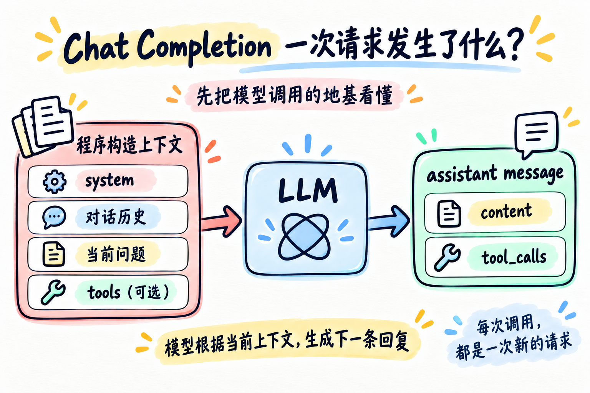

# 第 00 章：Chat Completion —— 一次请求到底发生了什么？



> **一句话总结：大模型不会自动知道你的应用发生了什么，它只会根据这一次请求提供给它的上下文生成下一条回复。**

在学习 Agent Loop、Tool Calling 和 MCP 之前，先把最普通的一次模型调用看懂。

很多复杂的 Agent，最后都建立在这个简单结构上：

```text
你的程序
   ↓
构造上下文
   ↓
调用模型
   ↓
得到 assistant message
```

## 1. 先看最简单的一次请求

使用 OpenAI Python SDK 风格调用 DeepSeek：

```python
from openai import OpenAI

client = OpenAI(
    api_key="你的_api_key",
    base_url="https://api.deepseek.com",
)

messages = [
    {"role": "system", "content": "你是一个简洁的 Python 助手。"},
    {"role": "user", "content": "Python 的 list 和 tuple 有什么区别？"},
]

response = client.chat.completions.create(
    model="deepseek-flash",
    messages=messages,
)

print(response.choices[0].message.content)
```

这里先只看懂一条关系：

```text
messages
   ↓
模型
   ↓
assistant message
```

这还不是 Agent，只是一次普通的大模型请求。

## 2. `messages` 到底是什么

`messages` 可以简单理解成：

> **这一次请求里，你希望模型看到的对话上下文。**

最常见的角色可以先这样理解：

| `role` | 可以先理解成 |
| --- | --- |
| `system` | 给模型的总体规则和身份 |
| `user` | 用户说的话 |
| `assistant` | 模型之前说过的话 |
| `tool` | 工具执行后返回给模型的结果 |

不同模型服务和 API 的角色设计可能略有区别。本项目先用 Chat Completions 中最容易理解的形式建立心智模型。

## 3. 模型没有自动记住上一轮

假设第一轮对话是：

```python
messages = [
    {"role": "user", "content": "我叫小明。"},
]
```

模型回答：

```text
你好，小明。
```

接下来用户问：“我叫什么？”

程序通常会把前面的内容再次放进上下文：

```python
messages = [
    {"role": "user", "content": "我叫小明。"},
    {"role": "assistant", "content": "你好，小明。"},
    {"role": "user", "content": "我叫什么？"},
]
```

模型之所以看起来“记得”之前的聊天，通常是因为应用程序把历史消息再次发送给了它。

> **每一次调用，都应该把它看成一次新的模型请求。**

这里讨论的是普通 API 调用的心智模型，不展开 ChatGPT 产品里的 Memory。

## 4. 一次请求到底长什么样

可以先把一次请求想成一个装上下文的盒子：

```text
┌─────────────────────────────┐
│       一次模型请求           │
│                             │
│  model                      │
│                             │
│  messages                   │
│   ├─ system                 │
│   ├─ 对话历史               │
│   ├─ 当前 user message      │
│   └─ assistant 历史消息     │
│                             │
│  tools（可选）              │
└──────────────┬──────────────┘
               ↓
              LLM
               ↓
┌─────────────────────────────┐
│      assistant message       │
│                             │
│  content                    │
│        或                   │
│  tool_calls                 │
└─────────────────────────────┘
```

核心结论是：

> 大模型真正做的事情，可以先粗略理解成：根据当前上下文，生成下一条 `assistant message`。

### 这条回复接下来有两条路

| 返回内容 | 程序下一步 | 适合的场景 |
| --- | --- | --- |
| `assistant.content` | 直接展示或继续处理文本 | 普通解释、改写、总结 |
| `assistant.tool_calls` | 程序执行工具，把 `role="tool"` 结果追加后再次请求 | 需要读文件、查日期、写入外部系统 |

`tools` 只是“可选能力说明”，不是每次都必须调用。模型可以选择直接回答；即使模型提出了 `tool_call`，也只是提出请求，真正执行仍由程序决定。

## 5. Tool Calling 也是一次模型请求

普通请求：

```python
response = client.chat.completions.create(
    model=MODEL,
    messages=messages,
)
```

加入工具描述后：

```python
response = client.chat.completions.create(
    model=MODEL,
    messages=messages,
    tools=tools,
)
```

`tools` 是在告诉模型：

> “除了直接回答问题之外，你还可以选择这些工具。”

工具描述里通常会包含：

```text
工具名称
工具作用
参数结构
```

模型可能返回：

```text
我要调用 read_file
参数：path = README.md
```

但必须分清：

> **模型选择工具，不等于模型执行工具。**

模型只是生成了一个 `tool_call`。真正执行 `read_file("README.md")` 的，是你的 Python 程序。

## 6. 工具结果怎么回到模型

工具执行完成后，程序会把结果变成一条新的上下文：

```python
messages.append({
    "role": "tool",
    "tool_call_id": tool_call.id,
    "content": result,
})
```

然后再次请求模型：

```python
response = client.chat.completions.create(
    model=MODEL,
    messages=messages,
    tools=tools,
)
```

工具结果并不是神秘地“进入模型”。程序只是把它加入 `messages`，再调用一次模型：

```text
模型选择工具
      ↓
程序执行工具
      ↓
得到结果
      ↓
结果加入 messages
      ↓
再次请求模型
```

到这里先停下。下一章会把这个过程真正放进一个循环里，那就是最小 Agent Loop。

## 7. API Request 不等于模型真的在“读 JSON”

开发者看到的是这样的 API 表达形式：

```python
{"role": "user", "content": "你好"}
```

可以简单理解真实链路为：

```text
Python 数据结构
      ↓
API Request
      ↓
模型服务处理
      ↓
Token / Model Context
      ↓
模型生成结果
```

我们说“模型看到 `messages`”，是为了方便理解。模型本身并不是像程序员一样阅读 JSON。

## 8. 这和 Agent 有什么关系

普通 Chat Completion：

```text
上下文
  ↓
模型
  ↓
答案
```

升级成 Agent：

```text
上下文
  ↓
模型决定下一步
  ↓
需要工具？
  ↓
程序执行
  ↓
结果加入上下文
  ↓
再次请求模型
```

因此可以得出：

> **Agent 并没有改变大模型最基础的调用方式，它只是在模型外面增加了循环、工具和状态管理。**

本章的 `code.py` 只演示普通回答和消息历史；工具调用分支会在第 01、02 章展开。这样每一章只增加一个新概念，不需要一开始就把完整 Agent 全塞进来。

## 用 DeepSeek 跑起来

本章的完整代码在 [`code.py`](./code.py)。它只做五件事：

1. 构造 `messages`；
2. 调用一次 Chat Completion；
3. 把 assistant 回复 append 回 `messages`；
4. 再加入第二条 user message；
5. 再调用一次。

先配置 `.env`：

```env
DEEPSEEK_API_KEY=你的_api_key
DEEPSEEK_BASE_URL=https://api.deepseek.com
DEEPSEEK_MODEL=deepseek-flash
```

运行：

```bash
python chapters/00-chat-completion/code.py
```

重点观察这两行：

```python
messages.append(assistant_message.model_dump(exclude_none=True))
messages.append({"role": "user", "content": "我叫什么名字？"})
```

第一行保存模型之前的回复，第二行加入新的问题。多轮连续性来自这些消息被再次发送，而不是模型在请求之间自动记住了什么。

## 今天只记住

> **LLM 不会自动知道你的应用发生过什么，它只知道这一次请求提供给它什么。**

> **一次最基本的调用，就是：构造上下文 → 请求模型 → 得到下一条 assistant message。**

后面的 Tool Calling、Memory、Context、MCP 和 Agent Harness，都是在这个基础之上逐渐增加能力。

## 想一想

假设你和模型已经聊了 20 轮。现在用户发送第 21 条消息。

模型为什么还能理解前面聊过的内容？

是因为模型自己一直记着，还是因为程序做了什么？

## 参考

- [DeepSeek OpenAI SDK 调用示例](https://api-docs.deepseek.com/api_samples/chat_python/)
- [OpenAI Chat Completions API](https://platform.openai.com/docs/api-reference/chat)
