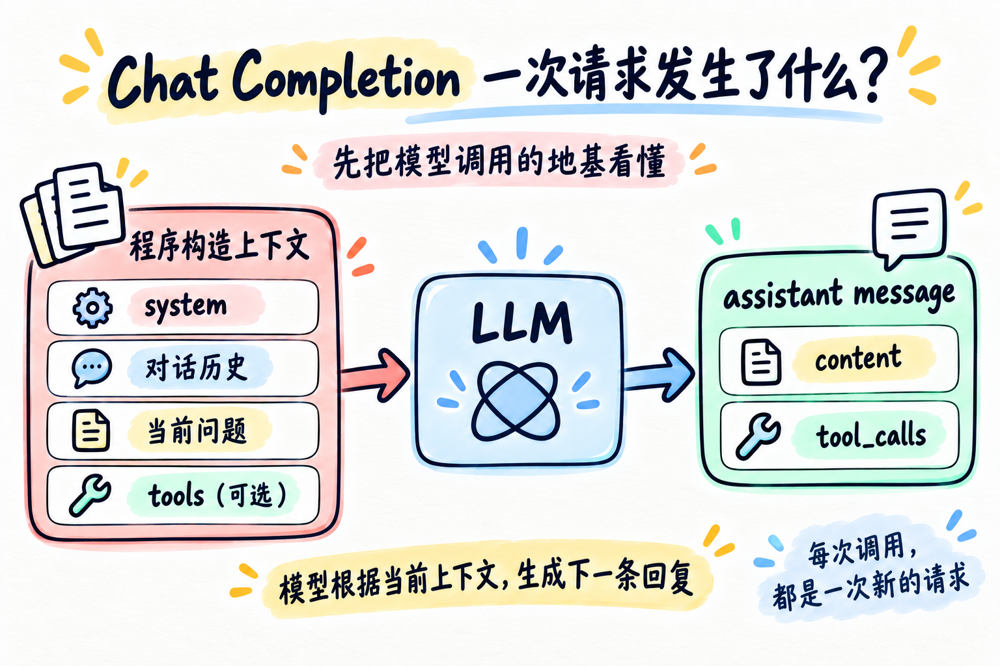

# 第 00 章：Chat Completion —— 一次请求发生了什么？



> **一句话总结：在本章使用的 DeepSeek Chat Completions 调用里，程序把 `messages` 发给模型，模型据此生成一条 `assistant message`。**

面试里常见的追问是：“第二轮问模型我的名字，它为什么答得出来？”先看清一次请求里到底带了什么，后面的 Agent Loop 才好理解。

这里说的是项目当前使用的 DeepSeek Chat Completions 接口：它不会替应用保存上一轮对话，应用要把需要的历史放进本次 `messages`。其他 API 或产品可能提供服务端会话状态，不能把这条结论推广到所有模型接口。

## 先看图里的请求

- 程序准备 `system` 规则、对话历史和当前问题，再发起请求。
- 模型根据这次收到的内容，返回一条 `assistant message`。
- 如果请求提供了工具，返回也可能包含 `tool_calls`；本章先只认出这个名字，工具怎么执行留到后面讲。

一次最小调用的关键部分是：

```python
response = client.chat.completions.create(
    model=MODEL,
    messages=messages,
)
assistant_message = response.choices[0].message
```

`messages` 是按顺序排列的消息列表。先认识这几种角色就够了：

| `role` | 这条消息是谁的 |
| --- | --- |
| `system` | 应用给模型的规则或背景 |
| `user` | 用户输入 |
| `assistant` | 模型之前的回复 |
| `tool` | 工具执行后返回的结果，后续章节再展开 |

完整的客户端配置和可运行代码在 [`code.py`](./code.py)，上面只摘出一次请求的核心。

## 第二轮为什么还认得“小明”

第一次请求里，用户说了“我叫小明”。程序收到模型回复后，把这条回复和新问题接在历史后面，再发起第二次请求：

```python
messages.append(assistant_message.model_dump(exclude_none=True))
messages.append({"role": "user", "content": "我叫什么名字？"})
```

此时发出的 `messages` 大致是：

```text
user: 我叫小明。请简单介绍一下 Python。
assistant: 第一轮模型返回的内容
user: 我叫什么名字？
```

所以模型不是在两次请求之间自己保存了记忆；第二次请求里再次出现了相关历史。应用可以把历史存在数据库里，但仍要在请求时取出来并放进 `messages`，模型才看得到。

### 面试里再追问一步

**如果历史已经存进数据库，模型为什么还可能接不上话？**

<details>
<summary>参考思路</summary>

存储和模型可见是两件事。应用还要找到当前会话的历史并放进请求；历史过长时，也要决定保留、裁剪或总结哪些内容。上下文变长带来的问题会在第 08 章继续讲。

</details>

## 跑一下两轮对话

完整示例先问 Python，再问“我叫什么名字？”。先在 `.env` 配置：

```env
DEEPSEEK_API_KEY=你的_api_key
DEEPSEEK_BASE_URL=https://api.deepseek.com
DEEPSEEK_MODEL=deepseek-flash
```

运行：

```bash
uv run python chapters/00-chat-completion/code.py
```

观察第二次 `create()` 收到的 `messages`：第一轮的 user 输入、assistant 回复和第二轮问题都在里面。这就是本章的关键，不需要给 system prompt 加一句“请记住用户”。

## 今天只记住

多轮对话能接上，是因为应用把需要的消息带进了下一次请求。

## 想一想

如果用户开了一个新会话，但程序误把上个会话的历史也放进 `messages`，模型会怎样回答？

<details>
<summary>参考思路</summary>

模型可能把旧会话的信息当成当前背景，给出不合适的回答。应用需要按会话区分历史，不能只把所有消息都追加到同一个列表里。

</details>

## 参考

- [DeepSeek 多轮对话说明](https://api-docs.deepseek.com/guides/multi_round_chat/)
- [DeepSeek Chat Completions API](https://api-docs.deepseek.com/api/create-chat-completion/)
