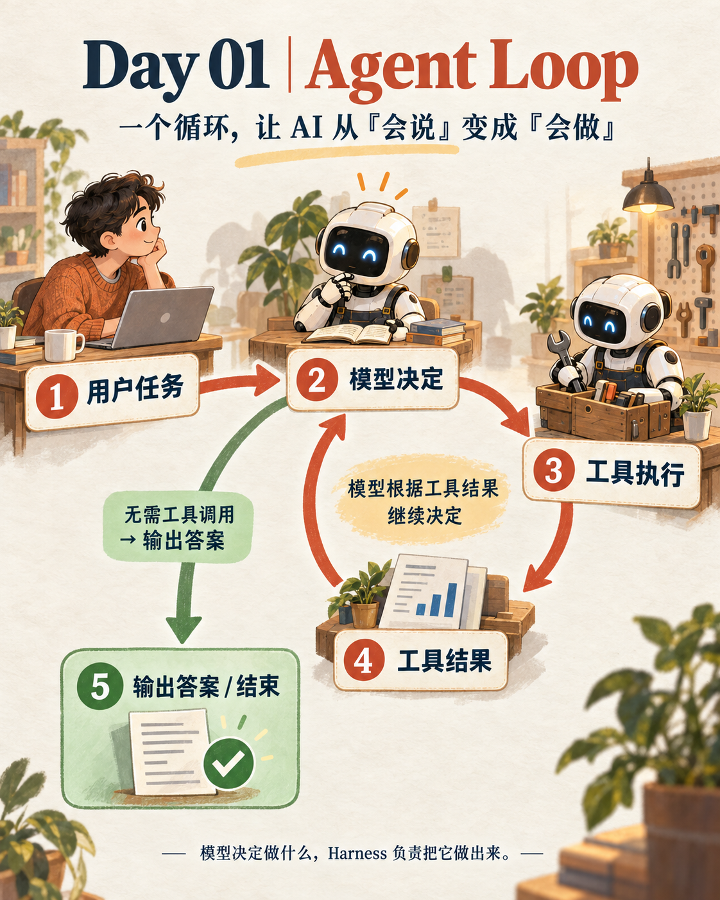

# 第 01 章：Agent Loop



> **一句话总结：模型决定下一步，工具负责把这一步做出来。**

## 先看图

这张图只讲一个来回：

- 用户输入一次任务；
- 模型决定要不要用工具；
- 工具执行并返回结果；
- 模型根据结果继续决定；
- 不需要工具时，输出答案并结束。

注意：工具结果回到的是“模型决定”，不是重新回到“用户任务”。用户不会每一轮都重新输入。

## 用生活例子理解

你对一个助理说：

> “帮我整理一下上周的产品反馈，并生成一份报告。”

助理会这样工作：

1. 理解任务；
2. 找到合适的工具；
3. 读取工具返回的内容；
4. 决定要不要继续查找；
5. 信息足够后，输出报告。

第 4 步是 Agent 和普通问答最不一样的地方：它会根据刚刚拿到的结果自己继续判断。

## 用 DeepSeek 跑起来

先安装依赖：

```bash
pip install -r requirements.txt
cp .env.example .env
```

然后在 `.env` 中填写：

```bash
DEEPSEEK_API_KEY=你的_api_key
```

本章的完整代码在 [`code.py`](./code.py)。它只提供一个安全的小工具：获取今天的日期。

```python
from openai import OpenAI

client = OpenAI(
    api_key=os.environ["DEEPSEEK_API_KEY"],
    base_url="https://api.deepseek.com",
)
```

真正的循环只有这几步：

```python
while True:
    response = client.chat.completions.create(
        model="deepseek-flash",
        messages=messages,
        tools=tools,
    )

    message = response.choices[0].message
    messages.append(message.model_dump(exclude_none=True))

    if not message.tool_calls:
        return message.content

    for call in message.tool_calls:
        result = run_tool(call)
        messages.append({
            "role": "tool",
            "tool_call_id": call.id,
            "content": result,
        })
```

代码里的角色很清楚：

- `message.tool_calls` 有内容：模型想做事，循环继续；
- `message.tool_calls` 为空：模型不需要工具，循环结束；
- `role="tool"`：把工具结果送回模型。

## 最小的 Agent 是什么

项目的第一个课程把复杂的 Agent 简化成三个部分：

- **模型**：理解任务，决定下一步做什么；
- **工具**：执行模型要求的动作；
- **循环**：把工具结果送回模型。

可以把它记成：

```text
模型决定 → 工具执行 → 工具结果 → 模型再次决定
                         ↘ 不需要工具 → 输出答案
```

## 模型和 Harness 的分工

可以把模型理解成驾驶者，把 Harness 理解成车辆：

- 模型负责理解、判断和选择动作；
- Harness 提供工具、上下文、权限和执行环境；
- 工具真的去读文件、运行命令或访问外部系统；
- 循环负责把结果带回来。

模型本身不会凭空获得“手脚”。没有工具，它只能告诉你“应该做什么”；有了 Harness，动作才会真的发生。

## 今天只记住

> **模型决定做什么，Harness 负责把它做出来。**

一个工具加一个循环，就构成了一个最小的 Agent。后面的权限、计划、记忆、团队协作，都是在这个基础循环上逐步加出来的。

## 想一想

如果模型只有一把 `bash` 工具，会遇到什么问题？

提示：它可以做很多事，但每件事都要自己拼命令，容易出错。下一章会把更多清晰、专用的工具接进来。

## 参考

- [learn-claude-code](https://github.com/shareAI-lab/learn-claude-code)
- [s01 Agent Loop](https://github.com/shareAI-lab/learn-claude-code/tree/main/s01_agent_loop)
- [DeepSeek OpenAI SDK 调用示例](https://api-docs.deepseek.com/api_samples/chat_python/)
- [DeepSeek Tool Calls](https://api-docs.deepseek.com/guides/tool_calls/)
