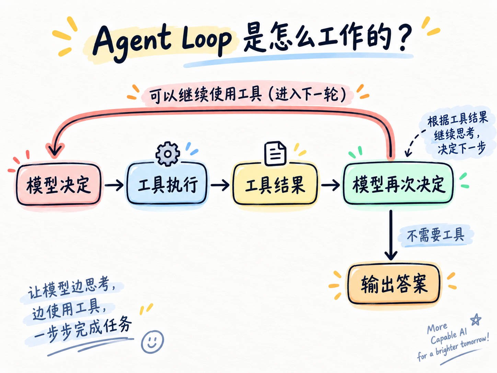

# 第 01 章：Agent Loop —— 模型定下一步，程序负责执行



> **一句话总结：Agent Loop 是 Agent 的执行骨架：程序反复把当前状态交给模型，模型决定下一步，程序执行并记下结果，直到满足停止条件。**

## 先看图

图里的循环由应用程序（Harness，负责提供工具并控制执行的代码）驱动：

1. 应用把用户任务和可用工具一起发给模型。
2. 模型返回 `tool_calls` 时，它是在提出调用请求；工具还没有运行。
3. 应用检查请求并执行工具，把结果作为 `role="tool"` 消息带上对应的 `tool_call_id`。
4. 应用把更新后的消息再次发给模型。模型可以继续请求工具，也可以返回文字。
5. 模型不再请求工具时，走出口：把文字交给用户，循环结束。

模型本身不会执行你的 Python 函数。它只负责“决定下一步”，执行和回传都是应用的事。

## 一个循环，四个问题

不管 Agent 叫什么名字、用什么框架，它的执行循环都要回答四个问题：

| 问题 | 本章的回答 |
| --- | --- |
| 状态放在哪？ | 一份 `messages` 列表，每轮追加 |
| 下一步谁来定？ | 模型，每轮决定调哪个工具或直接回答 |
| 执行结果什么时候回到模型？ | 每执行一步就回传，模型马上看到 |
| 什么时候停？ | 模型不再调用工具，或到达 `MAX_TURNS` |

这四个问题就是 Agent Loop 的统一抽象。后面几章，以及文末扩展阅读里的各种方案，都可以看成对其中某个问题换了一种回答。

## 第一个实现：ReAct

本章选的回答组合有个名字，叫 **ReAct**（Reasoning + Acting，推理加行动），出自 2022 年的同名论文。它是最常见、也最适合入门的一种实现，但不是唯一的一种。

### 它要解决什么问题

在 ReAct 之前，常见做法各缺一半：

| 做法 | 怎么做 | 问题 |
| --- | --- | --- |
| 只想不做（Chain-of-Thought） | 模型一步步推理，直接给答案 | 知识过时或记错时，只能“编”下去 |
| 只做不想（Act-only） | 模型直接连续调用工具 | 不说明为什么做这一步，容易跑偏，出错后也不会调整 |

ReAct 把两者交替起来：**想一步、做一步、看结果，再想下一步。** 关键在最后这半句：每个动作的结果都回到模型，可能改变它接下来的打算。

### 原始格式长什么样

论文里，模型输出的是纯文本，程序从文本里解析出动作：

```text
Question: Python 3 是哪年发布的？
Thought 1: 我需要查 Python 3 的发布时间。
Action 1: Search[Python 3]
Observation 1: Python 3.0 于 2008 年 12 月发布……
Thought 2: 找到了，可以回答。
Action 2: Finish[2008 年]
```

### 换到今天的代码里

思想没变，Action 的写法变了。现在的模型接口原生支持工具调用：模型输出结构化的 `tool_calls`，工具名、参数和 `tool_call_id` 分开放，应用不用再从文本里抠。`tool_calls` 只是 Action 的一种写法，和 ReAct 不在同一层；本项目只使用原生 `tool_calls`。

| ReAct 概念 | 本章代码里的对应物 |
| --- | --- |
| Thought：想下一步 | 模型内部的推理，或 assistant 消息里附带的文字 |
| Action：做一步 | assistant 消息里的 `tool_calls` |
| Observation：看结果 | 应用追加的 `role="tool"` 消息 |
| Finish：给出答案 | 没有 `tool_calls`、`finish_reason` 为 `stop` 的回复 |

## 用生活例子理解

你让助理“查一下今天是几号”。

- 助理先想：“我得看看日历。”（Thought）
- 然后拿起手机看一眼。（Action）
- 看到日期。（Observation）
- 觉得够了，直接告诉你。（Finish）

这是 ReAct 式的助理：走一步看一步。换一个助理，也可以先列好一整天的计划再照做，或者做完后自己复查一遍再交差。它们都在“循环干活”，只是对四个问题的回答不同。

## 用 DeepSeek 跑起来

本章的完整示例在 [`code.py`](./code.py)，用 ReAct 式循环实现，只注册了一个无副作用的日期查询工具。先准备密钥并运行：

```bash
uv sync
cp .env.example .env
```

在 `.env` 中填写 `DEEPSEEK_API_KEY`，然后执行：

```bash
uv run python chapters/01-agent-loop/code.py
```

控制流的关键部分是：

```python
for _ in range(MAX_TURNS):
    response = client.chat.completions.create(
        model=MODEL,
        messages=messages,
        tools=TOOLS,
        tool_choice="auto",
    )
    choice = response.choices[0]
    message = choice.message
    # Thought + Action: the model's reply, possibly with tool_calls
    messages.append(message.model_dump(exclude_none=True))

    # Finish: no tool call means the model is ready to answer
    if not message.tool_calls:
        if choice.finish_reason != "stop":
            return f"模型未正常结束：{choice.finish_reason}"
        return message.content or ""

    if choice.finish_reason != "tool_calls":
        return f"工具调用未正常结束：{choice.finish_reason}"

    # Observation: run each tool and feed the result back
    for call in message.tool_calls:
        result = run_tool(call)
        messages.append({
            "role": "tool",
            "tool_call_id": call.id,
            "content": result,
        })
```

问“今天是几号？”时，`messages` 会这样一步步变长：

```text
system:    你是一个简洁的中文助手……
user:      今天是几号？
assistant: tool_calls=[get_today()]          ← Action
tool:      2026-10-08                        ← Observation
assistant: 今天是 2026 年 10 月 8 日。        ← Finish
```

`messages` 就是循环的状态。模型每一轮都能看到之前做过什么、看到了什么，所以能接着判断。示例按返回顺序逐个执行调用；如果改成并行，先确认这些工具互不依赖，并且并发执行不会带来副作用问题。

## 停止不代表任务已完成

这里有两种不同的停止信号：

- 没有 `tool_calls` 且 `finish_reason` 为 `stop`：这轮模型回复正常结束，程序把文字交给调用方。
- 到达 `MAX_TURNS`：程序停止继续请求，避免循环无限延长。

两者都不能单独证明用户目标已经达成。比如工具返回了错误，模型仍可能生成“已完成”。应用要验证结果，就得看可信证据，例如文件差异、测试退出码或数据库状态，而不是只信模型的自我报告。

`finish_reason` 也值得检查：DeepSeek 文档列出的结束原因包括 `length`、`content_filter`、`insufficient_system_resource` 和 `aborted`。本例只有在没有工具调用且原因为 `stop` 时才返回模型文字；有工具调用时也只有原因为 `tool_calls` 才执行。其他状态都交给调用方，避免执行可能被截断的参数。生产应用还需对 API 超时、无效工具参数和工具执行失败分别定义恢复策略。

每次继续循环都会再请求一次模型并带上消息历史，会增加延迟和 token 成本。直接回答就足够的任务不必调用工具；工具调用只是模型可选的下一步。

## 扩展阅读：ReAct 不是唯一方案

下面几种思路都还是“循环干活”，区别在于它们换掉了四个问题中的哪一个。它们也能组合使用，不是非此即彼。

| 方案 | 和 ReAct 的区别 | 适合什么任务 | 本项目在哪展开 |
| --- | --- | --- | --- |
| Plan-and-Execute | 先让模型列出整份计划再执行；结果是否回到模型、多久回一次，各家做法不同 | 步骤多、需要先看清全局的任务 | 第 05 章 |
| Reflection | 模型给出答案后不马上停，先自我检查，发现问题就带着反馈重来 | 质量要求高、一次难做对的任务 | 第 17 章（程序验收） |
| Workflow | 下一步由代码决定，模型只负责其中需要理解内容的步骤 | 步骤固定、要求稳定可复现的流程 | 第 16 章 |
| Multi-Agent | 状态拆到多个上下文，由多个 Agent 分工 | 子任务能独立完成、上下文容易塞满的任务 | 第 06、13 章 |

几点补充：

- **Plan-and-Execute 有两种。** 纯计划型（例如 ReWOO）在执行阶段完全不调用模型，中途出了意外也不会改计划；带重新规划的版本每步之后让模型回看计划，本质上又回到了“结果回到模型”。第 05 章的 `todo_write` 属于后一种：计划放在 `messages` 里，模型随时可以改。
- **Reflection 和程序验收不是一回事。** Reflection 是模型检查自己的答案，检查者和作答者是同一个模型；第 17 章的 Goal Loop 由程序按明确条件验收，更可靠，但要求任务能写出验收条件。
- **Workflow 和 Agent 的界线**在“下一步谁来定”：代码定的叫 Workflow，模型定的叫 Agent。真实系统常常是 Workflow 里嵌着几个 Agent 步骤。

怎么选：先用 ReAct，它最简单，也最灵活。遇到具体问题再换：容易漏步骤，就加计划；质量不稳，就加检查；流程固定，就写成 Workflow；上下文装不下，再考虑拆给多个 Agent。

## 今天只记住

Agent Loop 是“状态、决策、执行、停止”四件事组成的循环；ReAct 是它最常见的一种实现，但不是唯一的一种。

## 想一想

第 16 章的 Workflow 里，下一步由代码决定，模型只负责其中几个步骤。按本章的四个问题看，它和 ReAct 式的 Agent Loop 差在哪？

<details>
<summary>参考思路</summary>

主要差在“下一步谁来定”：ReAct 每轮由模型决定，Workflow 由代码决定。所以 Workflow 更稳定、更容易复现，但遇到流程外的情况不会变通。实践中常把两者组合：固定的部分写进代码，需要判断的部分交给模型。

</details>

## 参考

- [ReAct: Synergizing Reasoning and Acting in Language Models（Yao et al., 2022）](https://arxiv.org/abs/2210.03629)
- [ReWOO: Decoupling Reasoning from Observations（Xu et al., 2023）](https://arxiv.org/abs/2305.18323)
- [Reflexion: Language Agents with Verbal Reinforcement Learning（Shinn et al., 2023）](https://arxiv.org/abs/2303.11366)
- [Anthropic：Building effective agents](https://www.anthropic.com/engineering/building-effective-agents)
- [learn-claude-code：s01 Agent Loop](https://github.com/shareAI-lab/learn-claude-code/tree/main/s01_agent_loop)
- [DeepSeek Tool Calls](https://api-docs.deepseek.com/guides/tool_calls/)
- [DeepSeek Chat Completions API](https://api-docs.deepseek.com/api/create-chat-completion/)
- [OpenAI Function Calling](https://developers.openai.com/api/docs/guides/function-calling)
