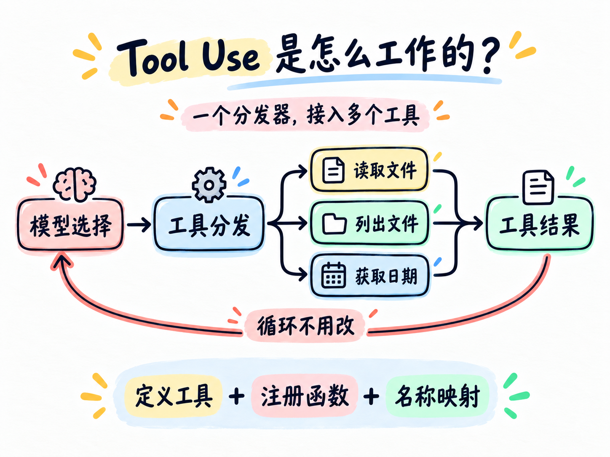

# 第 02 章：Tool Use



> **一句话总结：增加工具，不需要重写循环，只需要增加工具定义和处理函数。**

## 先看图

第 01 章只有一把工具：`get_today`。

这一章增加两把工具：

- `list_files`：列出文件；
- `read_file`：读取文件。

模型只负责说出工具名称和参数。

Python 通过 `TOOL_HANDLERS` 找到对应函数，再把结果送回模型。

## 为什么需要工具分发

如果所有事情都交给一个 `bash`：

- 模型要自己拼命令；
- 命令容易写错；
- 程序也很难控制每个动作的边界。

更好的方式是把能力拆开：

```text
模型说：调用 read_file
程序找：TOOL_HANDLERS["read_file"]
程序做：run_read(...)
```

工具名称像菜单，处理函数才是真正的厨房。

### 什么时候需要工具？

- **直接回答就够了**：概念解释、改写一句话、头脑风暴，不必为了“像 Agent”而调用工具；
- **需要外部事实或动作**：读取项目文件、查询当前日期、保存结果，才需要工具；
- **代价**：每多一个工具，就多一份参数定义、错误处理和权限边界。工具越多，模型选择错误的机会也越多。

## 用 DeepSeek 跑起来

本章的完整代码在 [`code.py`](./code.py)。核心变化只有两处：

### 1. 定义工具

工具定义告诉 DeepSeek：工具叫什么、能做什么、需要哪些参数。

```python
TOOLS = [
    {
        "type": "function",
        "function": {
            "name": "read_file",
            "description": "读取项目内的文本文件。",
            "parameters": {
                "type": "object",
                "properties": {"path": {"type": "string"}},
                "required": ["path"],
            },
        },
    }
]
```

### 2. 注册处理函数

```python
TOOL_HANDLERS = {
    "list_files": list_files,
    "read_file": read_file,
    "get_today": get_today,
}
```

循环仍然是第 01 章的循环，只是执行工具时不再写死某一个函数：

```python
for tool_call in message.tool_calls:
    name = tool_call.function.name
    arguments = json.loads(tool_call.function.arguments or "{}")
    handler = TOOL_HANDLERS.get(name)
    result = handler(**arguments)

    messages.append({
        "role": "tool",
        "tool_call_id": tool_call.id,
        "content": result,
    })
```

这就是本章的核心：**工具名称和处理函数通过一个字典连接起来。**

模型只负责“提出调用”，程序才负责“查找函数并执行”。参数格式正确，也不代表这个动作被授权；权限检查会在下一章单独加入。

## 模型和程序各自负责什么

| 谁 | 负责什么 |
| --- | --- |
| 模型 | 选择工具、填写参数、决定下一步 |
| 工具定义 | 告诉模型有哪些能力 |
| `TOOL_HANDLERS` | 把工具名称映射到 Python 函数 |
| Python 函数 | 真正执行动作并返回结果 |
| Agent Loop | 把结果继续送回模型 |

## 今天只记住

> **加一个工具 = 加一个工具定义 + 加一个处理函数 + 加一条映射。**

循环不需要跟着一起改。

## 想一想

如果有 20 个工具，还把所有逻辑都写在 `if/elif` 里，会发生什么？

下一章会开始处理另一个问题：工具可以调用，不代表所有操作都应该直接执行。

## 参考

- [learn-claude-code](https://github.com/shareAI-lab/learn-claude-code)
- [s02 Tool Use](https://github.com/shareAI-lab/learn-claude-code/tree/main/s02_tool_use)
- [DeepSeek Tool Calls](https://api-docs.deepseek.com/guides/tool_calls/)
