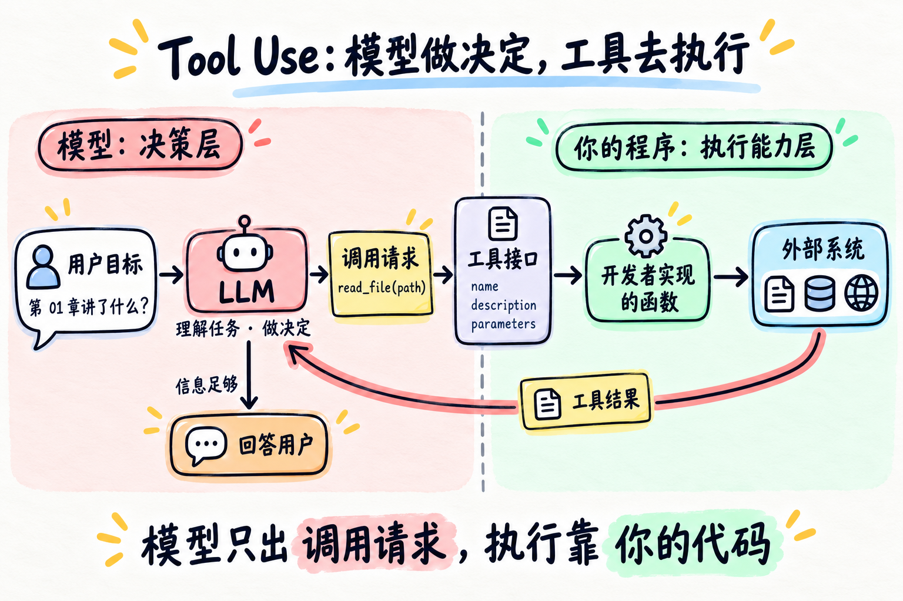

# 第 02 章：Tool Use —— 模型做决定，工具去执行



> **一句话总结：LLM 负责理解任务、决定用哪个工具；工具是开发者提前写好、暴露给模型的能力接口，真正的动作由工具背后的代码完成。**

**本章新增：** 第 01 章只有一个查日期的工具；本章给模型几个能读取外部世界的工具，并讲清“决策”和“执行”怎么分工。

## 一次工具调用的全过程

```text
用户目标：“第 01 章讲了什么？”
  ↓
LLM：理解任务，决定要读文件                    ← 决策层
  ↓
工具名 + 参数：read_file(path="chapters/01-agent-loop/README.md")
  ↓
工具接口：TOOLS 里登记的 name / description / parameters
  ↓
开发者实现的函数：read_file()                 ← 执行能力层
  ↓
外部系统：磁盘上的文件
  ↓
工具结果：文件内容（role="tool" 消息）
  ↓
回到 LLM，决定继续调用还是回答
```

- 上半段发生在模型里：它只做判断，输出“想调哪个工具、带什么参数”。
- 下半段发生在你的程序里：真正读文件、查数据库、发请求的，是你写的函数。
- 两段之间的分界线就是**工具接口**。模型只看得到接口，看不到也碰不到背后的代码。

## 为什么 Agent 需要 Tool

没有工具时，模型只是在聊天：

```text
Chat：  用户 → LLM → 回答
```

它能用的只有训练时学到的知识和你发给它的文字。今天几号、你的项目里有哪些文件、测试能不能跑通，它都不知道，更改变不了任何东西。

有了工具，模型可以借你的代码去够外部世界：

```text
Agent： 用户 → LLM → Tool → 外部世界 → 结果 → LLM
```

| 任务 | 只靠模型 | 有了工具 |
| --- | --- | --- |
| 今天几号？ | 只能猜，或说不知道 | 调 `get_today` 拿到真实日期 |
| 第 01 章讲了什么？ | 没见过这个文件，只能编 | 调 `read_file` 读到原文 |
| 修好这个 bug | 只能给建议 | 读代码、改文件、跑测试（实战篇） |

工具给模型的是**外部能力**：拿到训练数据之外的信息，或者改变外部状态。反过来，已有上下文就足够回答的问题，不必为了“像 Agent”而调用工具。

## 两个常见误解

**误解一：模型会执行工具。**
不会。模型只生成一段调用请求，也就是工具名加 JSON 参数。执行的是你的程序。模型甚至无从确认函数是否真的跑过，它只看到你回传的结果。

**误解二：工具是模型生成的。**
不是。工具是开发者提前实现好，通过 `tools` 参数告诉模型的。模型只能从这份清单里选；它报出清单外的名字，程序就该拒绝。

## 一个工具由什么组成

一个工具有四部分，前三部分写给模型看，最后一部分留给程序用：

| 组成 | 作用 | 本章例子 |
| --- | --- | --- |
| `name` | 模型调用时报的名字 | `read_file` |
| `description` | 告诉模型这个工具能干什么、什么时候该用 | “读取项目内的文本文件。” |
| `parameters` | 用 JSON Schema 描述参数格式 | `path` 必填，`limit` 可选 |
| 执行能力 | 背后真正干活的函数 | Python 函数 `read_file(path, limit)` |

```python
TOOLS = [
    {
        "type": "function",
        "function": {
            "name": "read_file",
            "description": "读取项目内的文本文件。",
            "parameters": {
                "type": "object",
                "properties": {
                    "path": {"type": "string"},
                    "limit": {"type": "integer"},
                },
                "required": ["path"],
            },
        },
    },
    # list_files, get_today ...
]
```

`description` 写得好不好，直接影响模型会不会在对的时候选对工具。`parameters` 是给模型的格式说明，不是输入校验：模型照样可能给出越界的路径或非法的 JSON，程序必须自己检查。本例没有开启 DeepSeek 的 Beta `strict` 模式；即使开了，业务规则（路径能不能访问、数值是否在范围内）也仍要应用来判断。

## 用 DeepSeek 跑起来

完整示例在 [`code.py`](./code.py)，注册了 `list_files`、`read_file`、`get_today` 三个工具。直接运行：

```bash
uv run python chapters/02-tool-use/code.py
```

### 先看最小的工具循环

循环本身和第 01 章一样，只是工具多了：

```python
response = client.chat.completions.create(
    model=MODEL,
    messages=messages,
    tools=TOOLS,              # tell the model which tools exist
    tool_choice="auto",
)
message = response.choices[0].message
messages.append(message.model_dump(exclude_none=True))

if not message.tool_calls:    # the model decided no tool is needed
    return message.content or ""

for tool_call in message.tool_calls:   # the model picked tools and arguments
    result = run_tool(tool_call)       # our code does the real work
    messages.append({
        "role": "tool",
        "tool_call_id": tool_call.id,
        "content": result,
    })
```

模型决定用不用、用哪个；`run_tool()` 负责执行；结果带着 `tool_call_id` 回到消息历史，下一轮模型就能看到。即使结果是错误信息，也只是模型收到的一条工具结果，不代表任务成功或失败，后续怎么办仍由循环决定。

一条回复可能包含多个工具调用，本例按返回顺序逐个执行。如果第二个调用依赖第一个的结果，模型得先收到结果才能提出下一次调用；相互独立的读取则可以由应用考虑并行，但每个结果都要对上自己的 `tool_call_id`。

### 再看 `run_tool()` 里面：工程实现细节

`run_tool()` 是连接“工具名”和“真实函数”的那层运行时，通常叫 handler 或 dispatcher。它负责四件事：

1. **按工具名路由**：查登记表 `TOOL_HANDLERS`，找到对应函数。
2. **校验参数**：参数必须是合法的 JSON 对象；路径越界、行数超限等业务检查放在各个函数里。
3. **调用真实函数**。
4. **返回结果**：成功和失败都变成一段文字，作为工具结果交回模型，不让进程崩溃。

```python
TOOL_HANDLERS = {
    "list_files": list_files,
    "read_file": read_file,
    "get_today": get_today,
}

handler = TOOL_HANDLERS.get(name)
if handler is None:
    return f"Error: 未注册的工具 {name}"
```

用字典而不是一串 `if/elif`，是为了让新增工具只需三步：写工具定义、实现函数、登记名字，循环本身不用改。这份登记表也是工具白名单：未登记的名字一律拒绝。但它不是权限系统，判断“这次读取是否允许”“这次写入要不要确认”是下一章的事。

本章示例把文件访问限制在项目目录，并隐藏点号开头的路径（如 `.env` 和 `.git`）。这是方便学习的窄范围保护，不是生产环境的完整沙箱。

## 工具要拆多细

像 `read_file` 这样的窄工具，输入和结果都容易界定，也容易逐项加校验；代价是工具数量会增加。`bash` 这类宽工具更灵活，但命令解释、执行范围和副作用检查都要由 Harness 承担。

本项目实战篇用受控的 `bash`，因为 Coding Agent 要组合列目录、搜索、检查等命令；这里用专用工具，是为了让“接口”和“执行”的边界一目了然。

## 今天只记住

LLM 是决策层，只生成调用请求；Tool 是开发者提供的执行能力层，真正的动作由背后的代码完成。

## 想一想

模型返回了一个 `TOOLS` 里没有的工具名，比如 `delete_file`，程序该怎么办？

<details>
<summary>参考思路</summary>

工具由开发者提供，不由模型生成，所以清单外的名字直接返回错误结果，绝不能把名字当成函数去 `eval()` 或动态查找。错误作为工具结果交回模型，它通常会改用已有的工具，或告诉用户做不到。

</details>

## 参考

- [DeepSeek Tool Calls 官方说明](https://api-docs.deepseek.com/guides/tool_calls/)
- [DeepSeek Chat Completions API：工具调用字段与参数](https://api-docs.deepseek.com/api/create-chat-completion/)
- [OpenAI Function Calling：工具定义与应用侧执行流程](https://developers.openai.com/api/docs/guides/function-calling)
- [learn-claude-code：s02 Tool Use](https://github.com/shareAI-lab/learn-claude-code/tree/main/s02_tool_use)
