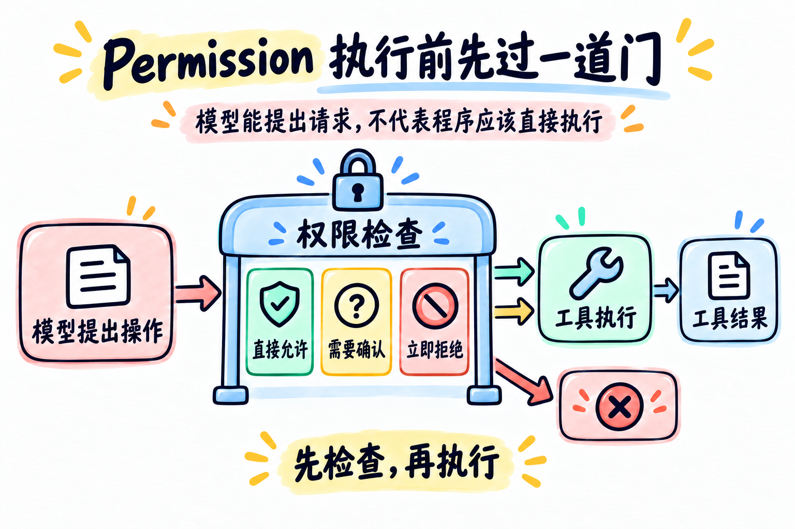

# 第 03 章：Permission —— 执行前先过一道门



> **一句话总结：模型可以提出工具请求，但程序必须在真正执行前检查权限。**

第 02 章解决了“模型选中工具后，程序怎么找到它”。

这一章继续问一个更重要的问题：

> **找到工具之后，是不是任何请求都应该直接执行？**

答案是：不应该。模型会犯错，用户也可能提出危险操作。权限检查应该放在工具函数真正运行之前。

## 先看图

图里只有一条新规则：

- 模型只是提出操作；
- 程序先把请求送进“权限检查”；
- 普通读取可以直接允许；
- 写入等有影响的操作需要用户确认；
- 明确危险的操作直接拒绝；
- 最后才有机会进入工具执行。

权限检查不是对模型“更有礼貌地提醒一下”，而是程序自己的控制点。

## 用门卫理解 Permission

把工具想成办公室里的房间：

- `read_file` 像查看公开资料，可以直接进入；
- `write_note` 像修改文件，需要问一下负责人；
- `delete_file` 像拆除房间，示例程序直接禁止。

模型可以走到门口提出请求，但不能自己决定门是否打开。

## 三种结果

一个简单的权限管道，可以先分成三种结果：

| 结果 | 什么时候发生 | 程序怎么做 |
| --- | --- | --- |
| 直接允许 | 只读、范围明确 | 调用工具函数 |
| 需要确认 | 会改变文件或状态 | 暂停并询问用户 |
| 立即拒绝 | 明确禁止或越界 | 不调用工具，返回拒绝结果 |

代码里的顺序很重要：先检查，再执行。

## 权限检查应该放在哪里

第 02 章的工具执行大致是：

```python
handler = TOOL_HANDLERS[name]
result = handler(**arguments)
```

第 03 章只增加一个关卡：

```python
allowed, reason = check_permission(name, arguments)

if not allowed:
    result = f"Permission denied: {reason}"
else:
    handler = TOOL_HANDLERS[name]
    result = handler(**arguments)
```

注意：权限检查必须发生在 `handler(...)` 之前。否则工具已经执行完了，再说“要不要允许”就没有意义了。

## 不要只相信模型

可以让模型尽量选对工具，但不能把安全责任交给模型：

```text
模型说：请删除这个文件
程序问：这个工具允许删除吗？
程序答：不允许，所以根本不执行
```

权限是程序代码，模型输出只是待检查的输入。

### 这个示例到底允许什么？

- `read_file` 只读根目录的教学文档和 `chapters/` 下的文件；`.env`、`.git` 等敏感路径会被拒绝；
- `write_note` 只能写入 `notes/`，不会因为模型传入一个路径就覆盖项目任意文件；
- `delete_file` 永久拒绝。参数“看起来合法”，不等于动作“已经获授权”。

这是一条很重要的边界：模型负责提出意图，程序负责把意图限制在安全范围内。

## 用 DeepSeek 跑起来

本章的完整代码在 [`code.py`](./code.py)。它沿用前一章的 Tool Use，但增加了 `check_permission()`：

- `read_file`：读取允许范围内的文件，`.env` 等敏感文件会拒绝；
- `write_note`：只能写入 `notes/`，并在确认时展示目标路径和完整内容；
- `delete_file`：列在拒绝列表里，永远不会执行；
- 路径跳出项目目录：直接拒绝。

先配置 `.env`：

```env
DEEPSEEK_API_KEY=你的_api_key
DEEPSEEK_BASE_URL=https://api.deepseek.com
DEEPSEEK_MODEL=deepseek-flash
```

运行：

```bash
python chapters/03-permission/code.py
```

可以试试：

```text
请读取 README.md
请写一条笔记到 notes/today.txt
请删除 README.md
```

观察第三个请求：模型可以提出 `delete_file`，但程序不会执行对应动作。

## 今天只记住

> **模型负责提出请求，程序负责决定请求能不能执行。**

权限检查应该位于“工具调用”和“工具执行”之间。

## 想一想

如果下一章又想增加日志、统计和结果检查，难道还要把这些判断一行行塞进 `agent_loop` 吗？

## 参考

- [learn-claude-code：s03 Permission](https://github.com/shareAI-lab/learn-claude-code/tree/main/s03_permission)
- [DeepSeek Tool Calls 官方说明](https://api-docs.deepseek.com/guides/tool_calls/)
