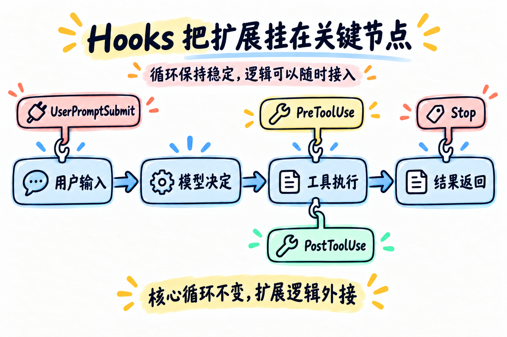

# 第 04 章：Hooks —— 把扩展挂在关键节点



> **一句话总结：Hooks 让循环保持稳定，把日志、权限和检查逻辑挂到固定节点上。**

第 03 章加入权限检查后，`agent_loop` 里已经出现了新的判断。

如果再继续加入日志、统计、结果校验和清理逻辑，循环很快会变成一团线：

```python
检查权限
记录日志
发送通知
执行工具
检查结果
统计用量
```

这些都是有用的能力，但不应该全部写死在循环里面。

## 先看图

图中间是一条稳定的核心流程：

```text
用户输入 → 模型决定 → 工具执行 → 结果返回
```

四个 Hook 像挂钩，分别挂在关键节点：

- `UserPromptSubmit`：用户问题进入模型前；
- `PreToolUse`：工具真正执行前；
- `PostToolUse`：工具执行完成后；
- `Stop`：循环准备结束时。

循环只负责触发事件，具体扩展逻辑放在回调函数里。

## 用插座理解 Hooks

把 Agent Loop 想成一面墙：

- 墙里的电路是稳定的核心循环；
- Hook 是预留的插座；
- 日志、权限、统计等功能是插上去的设备。

换设备，不需要重新砌墙。增加一个功能，也不一定要修改循环主体。

## Hook 是什么

Hook 可以先理解成：

> **在某个固定时刻，自动调用的一小段函数。**

主循环负责必须发生的事情：请求模型、执行工具、把结果送回上下文。Hook 负责可插拔的旁路逻辑：日志、统计、提醒或权限检查。如果一段逻辑决定了任务下一步是什么，它更适合留在主循环；如果只是“每次经过这里都顺便做一下”，Hook 更合适。

最小的注册表可以这样写：

```python
HOOKS = {
    "UserPromptSubmit": [],
    "PreToolUse": [],
    "PostToolUse": [],
    "Stop": [],
}


def register_hook(event, callback):
    HOOKS[event].append(callback)


def trigger_hooks(event, *args):
    blocked = None
    for callback in HOOKS[event]:
        result = callback(*args)
        if result is not None and blocked is None:
            blocked = result
    return blocked
```

这里有两个角色：

- `register_hook`：把回调函数挂到事件上；
- `trigger_hooks`：事件发生时，依次调用这些回调。

## 四个节点分别做什么

| 事件 | 发生时间 | 常见用途 |
| --- | --- | --- |
| `UserPromptSubmit` | 用户输入之后、请求模型之前 | 校验输入、补充上下文 |
| `PreToolUse` | 工具执行之前 | 权限检查、记录日志 |
| `PostToolUse` | 工具执行之后 | 检查结果、统计输出 |
| `Stop` | 循环准备结束时 | 清理、输出总结、决定是否继续 |

第 03 章的权限逻辑，就可以从循环里搬到 `PreToolUse` Hook：

```python
def permission_hook(name, arguments):
    if name == "delete_file":
        return "Permission denied"
    return None


register_hook("PreToolUse", permission_hook)
```

返回 `None` 表示放行；返回一段文字表示拦截当前动作。

回调按注册顺序运行。即使权限 Hook 返回了拦截原因，后面的日志 Hook 仍然会执行；`trigger_hooks()` 只把第一个非空结果作为最终阻止原因返回。这样“拦截”和“记录”不会互相吞掉。

## 循环只保留触发点

没有 Hook 时，循环容易直接写成：

```python
check_permission(name, arguments)
output = execute_tool(name, arguments)
log_output(output)
```

使用 Hook 后，循环只需要知道事件：

```python
blocked = trigger_hooks("PreToolUse", name, arguments)
if blocked:
    result = blocked
else:
    result = execute_tool(name, arguments)
    trigger_hooks("PostToolUse", name, result)
```

这就是本章的核心变化：

> **扩展逻辑可以增加，但 Agent Loop 的主干不需要不断变长。**

### 什么时候不必上 Hook？

只有一处调用、不会复用的简单判断，直接写在主流程里通常更易读。Hook 的价值在于多个地方都需要同一类行为，或者你希望在不改主流程的情况下插拔它；同时也要接受事件顺序和隐式行为带来的理解成本。

## 用 DeepSeek 跑起来

本章的完整代码在 [`code.py`](./code.py)。它注册了几类简单 Hook：

- 收到用户问题时打印提示；
- 工具执行前复用权限检查并记录日志；
- 工具执行后提醒过大的结果；
- 循环结束时打印一次总结。

先配置 `.env`：

```env
DEEPSEEK_API_KEY=你的_api_key
DEEPSEEK_BASE_URL=https://api.deepseek.com
DEEPSEEK_MODEL=deepseek-flash
```

运行：

```bash
python chapters/04-hooks/code.py
```

可以试试读取文件或写入笔记，然后观察终端里的 `[hook]` 日志。

## 今天只记住

> **核心循环负责推进任务，Hooks 负责在关键时刻接入额外逻辑。**

当你想增加能力时，先问一句：这是循环主干，还是应该挂在某个 Hook 上？

## 想一想

如果想在每次工具执行后统计耗时，应该修改 `agent_loop`，还是注册一个 `PostToolUse` Hook？

## 参考

- [learn-claude-code：s04 Hooks](https://github.com/shareAI-lab/learn-claude-code/tree/main/s04_hooks)
- [DeepSeek Tool Calls 官方说明](https://api-docs.deepseek.com/guides/tool_calls/)
