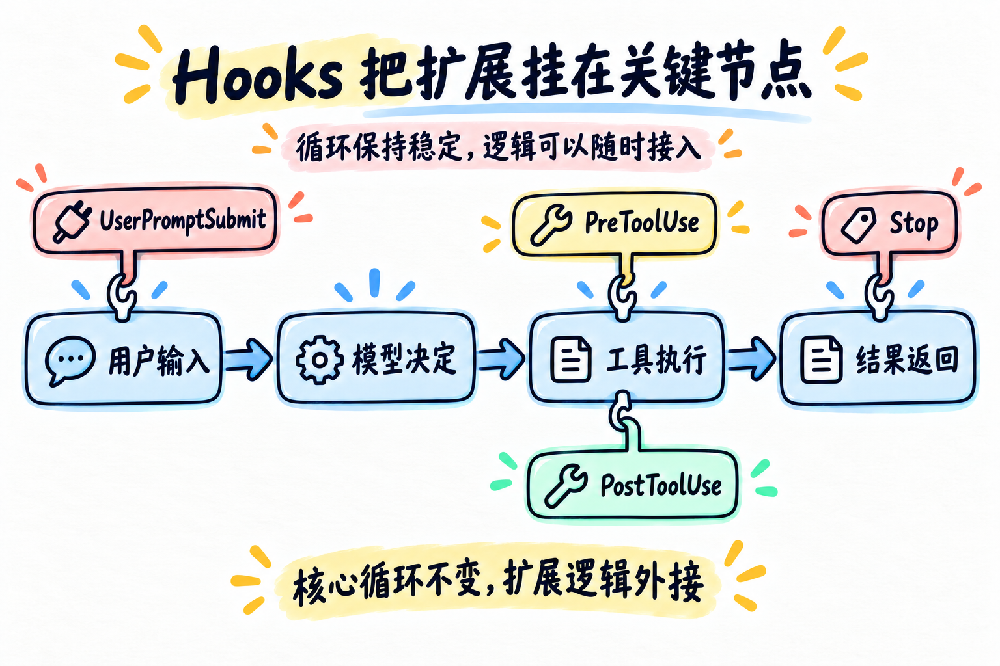

# 第 04 章：Hooks —— 在循环节点上接入扩展



> **一句话总结：Hook 在事件发生时调用回调；它能不能改变流程，要看主循环是否处理回调的返回值。**

第 03 章把权限判断加进了工具执行流程。接着要加日志、统计和结果检查时，如果每项都直接塞进 `agent_loop`，核心循环就会越来越难读。Hook 提供了一个扩展入口，但它不该成为安全边界的唯一保障。

## 图里的四个挂点

Hook（钩子）就是事件发生时由程序调用的一段回调函数。本章的图把它们挂在 Agent 生命周期的几个位置：

- `UserPromptSubmit`：请求模型前；
- `PreToolUse`：工具执行前；
- `PostToolUse`：工具执行后；
- `Stop`：循环准备结束时。

这些事件名是本项目的教学实现，不是所有 Agent 框架都通用的标准。面试时要先说清事件在哪触发，再说回调结果会不会改变流程。

| 事件 | 本章示例里的行为 | 常见用途 |
| --- | --- | --- |
| `UserPromptSubmit` | 打印用户问题；回调返回值不参与后续处理 | 记录输入；校验和补充上下文需主循环配合 |
| `PreToolUse` | 权限回调返回非空值时拦截工具；日志回调仍会执行 | 权限检查、审计日志 |
| `PostToolUse` | 工具返回后检查结果；返回值被忽略，不能撤销已发生的操作 | 统计、结果检查、通知 |
| `Stop` | 打印本轮消息数；返回值被忽略，循环仍会结束 | 清理、结束通知 |

特别注意：有的框架允许 `Stop` Hook 要求 Agent 继续，本章代码没有实现这种控制。事件名本身不决定行为，真正决定行为的是 `agent_loop` 怎么处理回调结果。

## 循环保留什么，Hook 接走什么

本章的循环仍然负责工具执行前后的顺序，也负责根据 `PreToolUse` 的结果决定放行还是拦截：

```python
for tool_call in message.tool_calls:
    name = tool_call.function.name
    arguments = json.loads(tool_call.function.arguments or "{}")
    blocked = trigger_hooks("PreToolUse", name, arguments)
    if blocked:
        result = blocked
    else:
        result = run_tool(tool_call)
        trigger_hooks("PostToolUse", name, result)
```

具体的权限判断、日志和结果提醒放在回调里。`trigger_hooks()` 按注册顺序运行全部回调，并把第一个非 `None` 返回值交还给调用处。本章的权限回调返回一段非空说明文字，循环据此拦截工具；即使已经拒绝，后面的日志回调仍能记录这次尝试。

这个版本没有隔离 Hook 异常：回调抛出异常会沿调用栈冒泡。尤其 `PreToolUse` 出错时，工具不会继续执行，但当前 Agent 调用也会中断。真实系统需要明确每类 Hook 出错时是拒绝、放行还是重试，并把错误记录下来。

## 面试里怎么讲这个取舍

跨工具复用的日志、统计和提醒适合做成 Hook；只在一处使用、影响核心流程的简单判断，直接写在主流程可能更清楚。Hook 带来扩展性，也带来隐式调用、执行顺序和异常处理成本。

本章把权限策略放进 `PreToolUse`，是为了展示“在工具执行前插入检查”。但可选回调可能被漏注册或移除，不能单独承担生产环境的安全边界。真正的授权应在必经的工具执行入口再次保证；Lab 01 就把路径和权限检查放在 Python Harness 中。

## 跑一下示例

完整代码在 [`code.py`](./code.py)。它会记录用户输入和工具调用；读取文件时可直接观察日志，写入笔记时会先要求确认，删除工具会被拒绝。

在 `.env` 配好 DeepSeek API Key 后运行：

```bash
uv run python chapters/04-hooks/code.py
```

试着让 Agent 读取 `README.md`，再请求它写一条笔记。观察 `PreToolUse` 日志在工具执行前出现；拒绝写入时，工具处理函数不会运行。

## 今天只记住

Hook 提供扩展点，主循环仍决定回调结果对流程有什么影响。

## 想一想

如果要阻止某个写操作，`PostToolUse` Hook 能做到吗？

<details>
<summary>参考思路</summary>

不能可靠阻止：`PostToolUse` 触发时，写操作已经发生。需要在执行前检查，并在所有执行路径都会经过的工具入口强制校验。

</details>

## 参考

- [learn-claude-code：s04 Hooks](https://github.com/shareAI-lab/learn-claude-code/tree/main/s04_hooks)（参考事件挂点的讲解思路；事件名和控制行为以本项目代码为准。）
