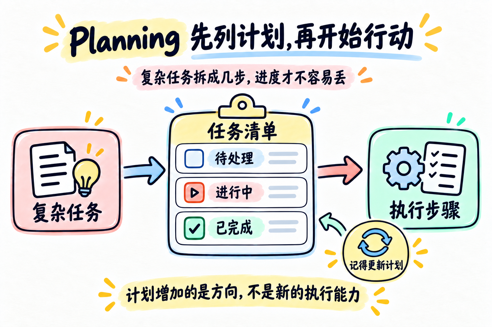

# 第 05 章：Planning —— 先列计划，再开始行动



> **一句话总结：复杂任务先拆成几步，并持续更新状态，Agent 才不容易做到一半忘记目标。**

**本章新增：** 新增 `todo_write` 工具和一张持续更新的任务清单，外加“太久没更新计划”的提醒。

第 04 章让我们可以在循环关键节点挂上扩展逻辑。

但即使循环安全、工具也很多，Agent 面对复杂任务时仍然可能走偏：做了几步之后，只盯着眼前的工具结果，忘记最初还有哪些事情没有完成。

## 先看图

这一章增加的不是一个“更强的执行工具”，而是一张会被持续更新的任务清单：

- 先把复杂任务拆成几个步骤；
- 当前正在做的步骤标记为 `in_progress`；
- 做完的步骤标记为 `completed`；
- 还没开始的步骤保持 `pending`；
- 工具执行过程中，也要回头更新清单。

任务清单像路标，帮助 Agent 记得“现在在哪一步，下一步是什么”。

### 什么时候值得先做计划？

- “今天是几号”“解释一下 list 和 tuple”这类一步完成的请求，不需要计划；
- “检查多个章节、比较差异、修改文件、再验证结果”这类有先后关系的任务，值得先列计划；
- 计划的代价是多一次状态维护，所以不要为了形式给每个小问题都套一层 `todo_write`。

## 用旅行清单理解 Planning

准备一次旅行时，你不会只写一句“去旅行”，而会拆成：

```text
订车票 → 预订酒店 → 准备行李 → 出发
```

每完成一项，就划掉一项。这样即使中间处理了很多细节，也不容易忘记主线。

Agent 的 `todo_write` 做的就是类似的事情：把计划变成模型和程序都能看到的状态。

## 计划清单不是执行工具

`todo_write` 不会读取文件，也不会修改代码。它只负责保存计划：

```text
计划工具：我接下来要做什么？
其他工具：我现在具体怎么做？
```

所以 Planning 增加的是方向感，不是新的执行能力。

真正执行任务的，仍然是 `read_file`、`list_files` 等工具。

## 最小的 TodoManager

可以先把任务状态限制在三种：

| 状态 | 含义 |
| --- | --- |
| `pending` | 还没有开始 |
| `in_progress` | 当前正在处理 |
| `completed` | 已经完成 |

同时约束：

- 任务内容不能为空；
- 一次最多保存 10 项；
- 同时只能有一个 `in_progress`。

这些限制不是为了增加麻烦，而是让模型看到的计划更稳定。

注意：`completed` 只是计划状态已经被更新，不是系统替你验证了外部结果。比如任务写着“测试通过”，仍然需要真正运行测试；计划是路标，不是证据。

## 为什么需要提醒

如果模型连续调用了几轮工具，却一直不更新计划，程序可以发出一个轻量提醒：

```text
已经连续执行了几步，请检查任务清单并更新状态。
```

提醒不是替模型做计划，而是防止计划长时间不更新。

## 用 DeepSeek 跑起来

本章的完整代码在 [`code.py`](./code.py)。它增加了：

- `todo_write`：创建或更新任务清单；
- `list_files`、`read_file`：真正执行读取任务；
- 三种任务状态的校验；
- 连续多轮没有更新计划时的提醒。

先配置 `.env`：

```env
DEEPSEEK_API_KEY=你的_api_key
DEEPSEEK_BASE_URL=https://api.deepseek.com
DEEPSEEK_MODEL=deepseek-flash
```

运行：

```bash
python chapters/05-planning/code.py
```

可以试试：

```text
请先列出计划，再检查 chapters 目录下有哪些 Markdown 文件，并总结第 03 章。
```

观察模型是否先调用 `todo_write`，以及任务状态是否从 `pending` 变成 `in_progress` 和 `completed`。

## 今天只记住

> **复杂任务不要只靠模型临时记忆，先把步骤写成可更新的状态。**

## 想一想

如果一个任务有 10 个步骤，但模型只完成了前 3 步就开始回答，程序可以怎样提醒它回头检查计划？

<details>
<summary>参考思路（先自己想一想，再展开）</summary>

在模型准备结束（这一轮没有 `tool_calls`）时，程序先检查清单：如果还有 `pending` 或 `in_progress` 的步骤，就追加一条提醒，让模型继续做，或者说明为什么跳过。提醒要设次数上限，避免死循环。第 17 章的 Goal Loop 会把这个思路做得更完整。

</details>

## 参考

- [learn-claude-code：s05 TodoWrite](https://github.com/shareAI-lab/learn-claude-code/tree/main/s05_todo_write)
- [DeepSeek Tool Calls 官方说明](https://api-docs.deepseek.com/guides/tool_calls/)
