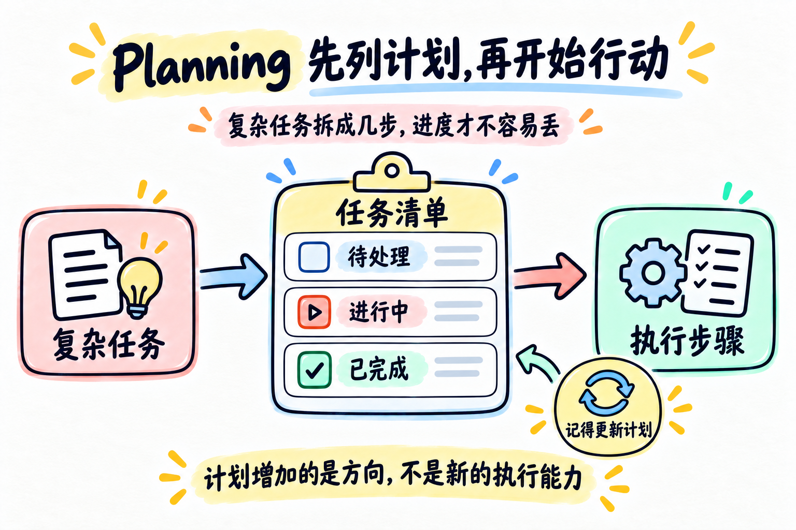

# 第 05 章：Planning —— 给多步骤任务一张进度清单



> Planning 把多步骤请求拆成一张可更新的清单，帮助 Agent 跟住进度；它不会替 Agent 执行任务，也不能证明任务已经完成。

任务要经过几步时，Agent 容易只顾着眼前的工具结果，漏掉后续事项。本章用 `todo_write` 把计划和状态放进当前对话，让模型在执行过程中能回头查看。

“解释一下 list 和 tuple”一步就能回答，不必计划。“检查多个文件、比较差异、修改后再验证”包含几个阶段，列清单通常更有帮助。代价是模型要额外维护状态；简单请求硬套计划，只会增加调用和噪声。

## 清单由谁维护？

本例用三种状态表示每一步的进度：

| 状态 | 含义 |
| --- | --- |
| `pending` | 还没开始 |
| `in_progress` | 正在处理 |
| `completed` | 清单上标记为完成 |

`todo_write` 每次接收一份完整清单，校验通过后替换旧清单。真正读取文件、修改内容或运行检查，仍要由相应工具完成。示例中的 `TodoManager` 在内存里保存当前清单，并校验状态值、任务数量和正在处理的任务数：

```python
if status not in {"pending", "in_progress", "completed"}:
    raise ValueError(f"不支持的状态：{status}")
if status == "in_progress":
    in_progress_count += 1

# 所有项目都通过校验后，再整体替换清单
self.items = validated
```

最多 10 项、同时只有一个 `in_progress`，是这个教学示例选定的约束，不是 Planning 的通用标准。换一种任务管理方式，也可以采用不同规则。

## 计划不会自动变成约束

示例的 system prompt 会要求模型对多步骤任务先列计划，但 `tool_choice="auto"`（让模型选择直接回答或调用工具）仍允许它直接回答；程序没有强制它先调用 `todo_write`。模型也可能忘记更新状态。代码在连续三轮工具调用都没有成功更新清单时，才追加一条提醒。这只是提醒，不会自动纠正清单。

这也是面试时要说清的边界：如果“必须先规划”是业务要求，就要在 Harness（承载模型调用和工具执行的程序层）里增加明确的状态规则，不能只靠提示词。若任务不能在仍有待办时结束，还需要单独设计结束检查；本章的 Agent 在模型不再请求工具时会直接返回。

`completed` 同样只是清单状态，不是结果证据。比如清单写着“测试通过”，系统仍要实际运行测试并检查退出码。清单帮助跟进过程，验收要依靠可核对的结果。

## Planning 适合解决什么？

Planning 记录当前 Agent 的步骤；任务需要更持久或流程更固定时，可以看对应机制：

| 需求 | 更合适的机制 |
| --- | --- |
| 跟进当前一次执行里的待办 | 本章 Planning |
| 跨会话保存任务、负责人和依赖 | [Tasks](../10-tasks/) |
| 按固定步骤编排，并从中断处恢复 | [Workflow Runtime](../16-workflow-runtime/) |
| 结束前按验收条件判断是否完成 | [Goal Loop](../17-goal-loop/) |

这些机制可以组合，但不需要每个请求都启用。

## 用 DeepSeek 跑起来

完整示例在 [`code.py`](./code.py)。它提供 `todo_write`、`list_files` 和 `read_file` 三个工具：第一个维护清单，后两个读取项目文件。读取范围限制在项目内的非隐藏路径，工具参数也由程序校验；模型生成的参数不能直接视作可信输入。[DeepSeek 文档也提醒应用校验工具参数](https://api-docs.deepseek.com/api/create-chat-completion/)。

先在 `.env` 配置：

```env
DEEPSEEK_API_KEY=你的_api_key
DEEPSEEK_BASE_URL=https://api.deepseek.com
DEEPSEEK_MODEL=deepseek-flash
```

运行：

```bash
uv run python chapters/05-planning/code.py
```

试着输入：

```text
请先列出计划，再检查 chapters 目录下有哪些 Markdown 文件，并总结第 03 章。
```

留意模型是否先提交清单，以及后续有没有更新状态。再试一个简单问题，观察它是否会跳过计划；即使示例提示它先规划，也不保证每次都照做。

## 练习：模型说做完了，清单还没完成

如果模型在清单仍有 `pending` 项时停止调用工具，当前示例会怎样处理？如果业务不允许这种情况，应该把检查放在哪里？

<details>
<summary>参考思路</summary>

当前代码会直接返回模型答案；计划清单本身没有拦住结束。可以在返回答案前增加结束检查，但“所有项目都标成 completed”仍不能证明外部结果正确。关键任务应再用程序运行测试、检查文件或核对其他客观条件。第 17 章会专门讲结束条件。

</details>

## 参考

- [learn-claude-code：s05 TodoWrite](https://github.com/shareAI-lab/learn-claude-code/tree/main/s05_todo_write)
- [DeepSeek Chat Completions API：工具参数格式与校验](https://api-docs.deepseek.com/api/create-chat-completion/)
- [DeepSeek Tool Calls 指南](https://api-docs.deepseek.com/guides/tool_calls/)
