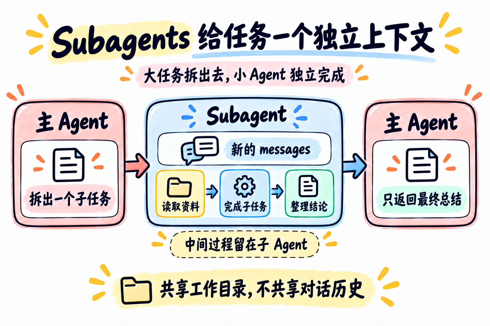

# 第 06 章：Subagents —— 给任务一个独立上下文



> **一句话总结：把一个聚焦的子任务交给新的 Agent 上下文，最后只把总结带回主 Agent。**

**本章新增：** 新增 `task` 工具，它背后是另一个拥有独立 `messages` 的小循环。

第 05 章用任务清单帮助一个 Agent 管理复杂任务。

但有些任务本身就太大：需要阅读很多文件、调查多个方向，所有中间过程都塞进同一个 `messages` 后，上下文会越来越拥挤。

这时可以把一个聚焦的小任务委派给 Subagent。

## 先看图

Subagent 的关键不是“多启动一个机器人”，而是创建一段新的对话上下文：

- 主 Agent 提出一个清晰的子任务；
- Subagent 使用自己的 `messages` 开始工作；
- Subagent 可以读取资料、调用基础工具、整理结论；
- 主 Agent 最后只收到最终总结；
- 子 Agent 的中间对话不会全部塞回主 Agent。

可以把它记成：

```text
主 Agent
   ↓ 委派 task
Subagent：新的 messages[]
   ↓ 完成并总结
主 Agent：只收到最终文本
```

## 先判断：普通工具、主循环，还是 Subagent？

不要把所有事情都委派出去。先问“这件事是否有清晰边界，是否值得隔离中间过程？”：

| 场景 | 更合适的选择 | 代价或原因 |
| --- | --- | --- |
| 只读 `requirements.txt`，回答依赖是什么 | 一个 `read_file` | 委派反而多了一次模型调用 |
| 连续调用两三个工具，主 Agent 能看懂结果 | 主 Agent 自己继续循环 | 路径短，沟通成本最低 |
| 阅读多个文件、整理证据，再给出独立结论 | Subagent | 多一段上下文和一次委派，但主上下文更干净 |

Subagent 适合“范围清楚、过程可能很长、结果可以浓缩”的子任务；不适合只是为了显得高级而拆一个一步就能完成的动作。

## `task` 其实也是一个工具

主 Agent 通过工具调用委派任务：

```python
TASK_TOOL = {
    "type": "function",
    "function": {
        "name": "task",
        "description": "使用新的上下文完成一个聚焦的子任务。",
        "parameters": {
            "type": "object",
            "properties": {"prompt": {"type": "string"}},
            "required": ["prompt"],
        },
    },
}
```

分发时，`task` 指向的不是普通文件函数，而是另一个小型 Agent Loop：

```python
def run_subagent(prompt: str) -> str:
    messages = [{"role": "user", "content": prompt}]
    # 子 Agent 在自己的 messages 中循环
    # 完成后只 return 最终总结
```

## 隔离的是什么，没有隔离的是什么

本章先区分三个边界：

| 内容 | 主 Agent 和 Subagent 的关系 |
| --- | --- |
| 对话历史 | 不共享，各自有自己的 `messages` |
| 返回结果 | 只返回 Subagent 的最终文本 |
| 工作目录 | 本示例共享，同一个 Python 进程可以看到同一批文件 |

所以 Subagent 是“上下文隔离”，不是“进程隔离”或“文件系统隔离”。

当前代码是同步执行：主 Agent 会等待 Subagent 返回，不代表天然并行，也不一定更快。它主要解决的是“中间过程放在哪里”，不是“自动增加计算能力”。

这也意味着：如果子 Agent 修改了共享目录里的文件，主 Agent 后续仍然可能看到这些修改。

## 为什么子 Agent 不能再继续委派

本章为了保持结构简单，让 Subagent 只拥有基础工具，不把 `task` 放进它的工具列表：

```text
主 Agent：可以调用 task
Subagent：不能调用 task
```

这样只保留一层委派，读者更容易看懂“谁委派给谁”。以后要做多层 Agent，需要额外考虑深度、预算和停止条件。

## 用 DeepSeek 跑起来

本章的完整代码在 [`code.py`](./code.py)。它包含两个循环：

- 主 Agent：拥有 `task` 和基础读取工具；
- Subagent：拥有基础读取工具，但没有 `task`。

先配置 `.env`：

```env
DEEPSEEK_API_KEY=你的_api_key
DEEPSEEK_BASE_URL=https://api.deepseek.com
DEEPSEEK_MODEL=deepseek-flash
```

运行：

```bash
python chapters/06-subagents/code.py
```

可以试试：

```text
请委派一个子任务，使用 pattern=chapters/07-skill-loading/skills/**/*.md 检查技能文件，返回每个文件名和一句话用途。
```

观察：子 Agent 的读取过程不会变成主 Agent 的完整对话，只会以 `tool` 结果的形式返回最终总结。

## 今天只记住

> **Subagent 的价值，是用一段新的上下文完成一个聚焦任务，再把结果带回来。**

它首先解决的是上下文管理问题，不是自动让任务并行，也不是天然提供文件隔离。

## 想一想

如果只是读取一个小文件就能回答，为什么不应该直接调用 `read_file`，而要额外启动一个 Subagent？

<details>
<summary>参考思路（先自己想一想，再展开）</summary>

委派至少要多一轮模型调用，还要写清楚子任务描述；结果回来时又被压成总结，可能丢掉细节。小文件的内容本来就短，放进主上下文没有负担，直接 `read_file` 更快、更省，也更准。只有中间过程很长、结果能浓缩时，Subagent 才划算。

</details>

## 参考

- [learn-claude-code：s06 Subagent](https://github.com/shareAI-lab/learn-claude-code/tree/main/s06_subagent)
- [DeepSeek Tool Calls 官方说明](https://api-docs.deepseek.com/guides/tool_calls/)
