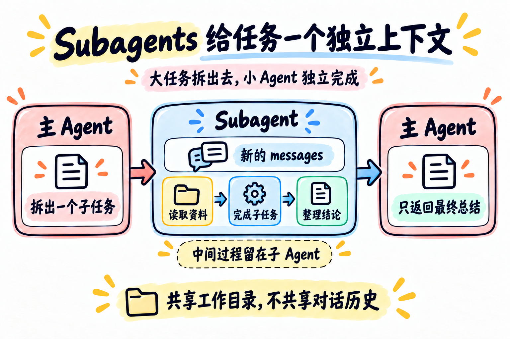

# 第 06 章：Subagents —— 把一个子任务交给独立上下文



> **Subagent 让主 Agent 把一个范围明确的任务交给新上下文，再根据返回结果继续回答。**

主 Agent 不必把调查过程中的每条消息都留在自己的对话里。它可以通过 `task` 工具启动一个 Subagent：子 Agent 使用自己的 `messages` 工作，结束后把最终文本作为工具结果交还主 Agent。

按[第 01 章](../01-agent-loop/)的四个问题看，Subagent 换掉的是“状态放在哪”：子任务的过程放进独立的 `messages`，主 Agent 只收到结果。

图里表达的是上下文和控制权的关系：子 Agent 负责完成委派任务，主 Agent 仍负责面向用户的最终回答。

## 哪些任务适合委派？

适合委派的任务通常有三个特点：目标说得清、过程可能较长、结果可以压缩成摘要。比如“阅读这几份配置，找出它们对重试策略的不同约定，并列出证据”。

只读一个小文件或回答一个简单问题，直接调用工具更省。委派会增加模型调用、延迟和 token 成本；子 Agent 的摘要还可能漏掉细节。

## `task` 工具启动的是另一个 Agent Loop

主 Agent 把 `task` 暴露为工具。收到 `task` 调用后，Python 创建一份新的消息列表，再运行子 Agent 自己的模型—工具循环：

```python
def run_subagent(prompt: str) -> str:
    sub_messages = [
        {"role": "system", "content": "完成一个聚焦的子任务，并汇报依据。"},
        {"role": "user", "content": prompt},
    ]
    # 子 Agent 在自己的 messages 中调用基础工具
    # 完成后把最终文本作为 task 的工具结果返回
```

`task` 的结果会以 `role="tool"` 回到主 Agent，所以主 Agent 可以继续判断、补充调查或组织最终答案。本章采用的是“Agent 作为工具”的委派方式；如果希望专家 Agent 接管用户对话，控制流就不同了，通常称为 handoff（交接）。[OpenAI Agents SDK 的编排说明](https://openai.github.io/openai-agents-python/multi_agent/)也区分了这两种模式。

## 新上下文不等于新权限

这份示例只隔离对话历史，不隔离所有运行状态：

| 项目 | 本示例中的行为 |
| --- | --- |
| `messages` | 主 Agent 与子 Agent 各自维护 |
| 工具结果 | 子 Agent 只把最终文本交回主 Agent |
| 工具权限、进程和工作目录 | 两者共享；都使用同一组只读工具和项目目录 |
| 执行方式 | 同步等待子 Agent 返回，不会因此自动并行 |

因此，Subagent 不是安全沙箱，也不会自动更快。若要并行，需要显式的并发调度；若要限制访问范围，需要在工具层另外实施权限控制。本例会拒绝读取项目中的隐藏路径，但这只是教学示例的路径限制，不是操作系统级隔离。

## 面试时要追问结果是否可信

子 Agent 的总结是模型输出，不是验证凭据。主 Agent 应能追溯结论依据；例如让子 Agent 返回文件路径、相关行或引用片段，再由主 Agent 检查关键证据。任务若没完成或触及轮数上限，也要把“不完整”传回去，不能把它包装成成功总结。

## 跑一个只读示例

完整代码在 [`code.py`](./code.py)。主 Agent 可以调用 `task`，而子 Agent 只能使用 `list_files` 和 `read_file`，不能继续委派。主循环和子循环都有轮数上限；单次用户请求最多启动 3 个子 Agent，即使模型在一轮里提出多条 `task` 调用，也会逐个等待执行。

将 `.env.example` 复制为 `.env` 并填写 `DEEPSEEK_API_KEY`；如果 `.env` 已存在，直接编辑它。然后运行：

```bash
uv sync
uv run python chapters/06-subagents/code.py
```

可以试试：

```text
请委派一个子任务，检查 chapters/07-skill-loading/skills/ 下的技能文件，列出文件名、用途和支持用途的原文依据。
```

观察 `task` 工具的返回：主 Agent 收到的是子 Agent 的总结文本，而不是子 Agent 的完整 `messages`。如果要提高结论可靠性，下一步会怎样核对其中的文件和原文？

<details>
<summary>参考思路</summary>

要求子 Agent 附上文件路径和短引用，再由主 Agent 用只读工具复查关键部分。若子 Agent 达到轮数上限或只返回空内容，应明确报告未完成，并缩小任务或增加可用轮数；不能仅凭它说“完成了”就判定成功。

</details>

## 参考

- [learn-claude-code：s06 Subagent](https://github.com/shareAI-lab/learn-claude-code/tree/main/s06_subagent)
- [DeepSeek Tool Calls 官方说明](https://api-docs.deepseek.com/guides/tool_calls/)
- [OpenAI Agents SDK：Agent 编排（Agent 作为工具与 handoff）](https://openai.github.io/openai-agents-python/multi_agent/)
