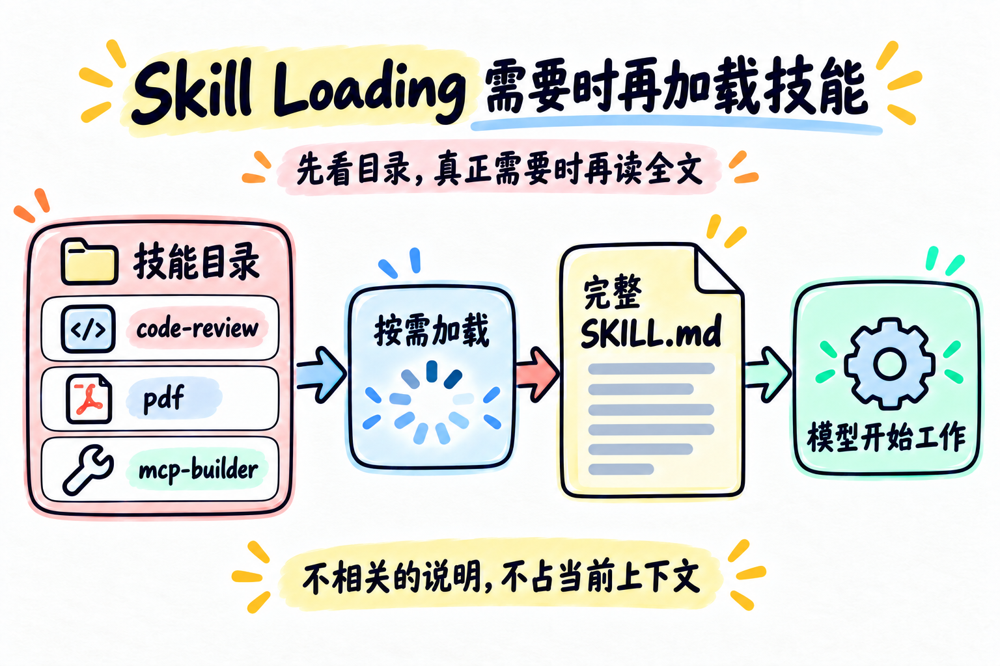

# 第 07 章：Skill Loading —— 需要时再加载技能



> **一句话总结：系统提示只保留技能目录，真正需要时再加载对应的完整说明。**

如果项目里有 React 规范、SQL 规范和 API 规范，最直接的做法是把它们全部塞进 system prompt。

但当前任务可能只是在改 React 组件。无关的 SQL 和 API 文档仍然会占用每一次请求的上下文空间。

## 先看图

Skill Loading 把“知道有哪些技能”和“读取技能全文”分成两步：

- 启动时扫描技能目录；
- 只把技能名称和简介放进 system prompt；
- 模型判断当前任务需要哪个技能；
- 调用 `load_skill(name)`；
- 完整的 `SKILL.md` 作为工具结果加入上下文。

可以把它记成：

```text
技能目录
   ↓ 先看简介
需要某个技能？
   ↓ 是
加载完整 SKILL.md
```

## 用工具箱理解 Skill

工具箱外面有一张标签卡：

```text
螺丝刀：拧螺丝
扳手：拧螺母
```

只有当你真的要拧螺丝时，才拿出螺丝刀的使用说明。技能目录就是标签卡，完整 `SKILL.md` 才是使用说明。

### Tool 和 Skill 不是一回事

- **Tool** 提供动作：读取文件、执行函数、保存结果；
- **Skill** 提供做事的方法：审查代码时看哪些点、写文档时遵循什么格式。

只读一个小文件、回答普通问题，通常不需要 Skill；任务涉及固定规范、领域流程或一组检查清单时，才值得加载。加载了 `SKILL.md` 也不等于程序自动执行了它——它只是进入上下文的指导，最终仍要检查模型是否真的按要求完成。

## 先放目录，还是先放全文

| 内容 | 什么时候进入上下文 |
| --- | --- |
| 技能名称和简介 | Agent 启动时 |
| 完整 `SKILL.md` | 当前任务需要时 |

这样做的好处是：

- system prompt 更短；
- 无关技能不会持续占用上下文；
- 技能仍然可以在需要时被准确加载；
- 新增技能主要是新增目录，不必改主循环。

这套设计也有代价：每次按需加载都要多一次工具调用和上下文内容。如果技能很短、几乎每次都会用，把核心规则直接放在 system prompt 反而更简单。

## `load_skill` 不是任意读文件

初学示例里，`load_skill` 接收的是技能名称：

```python
load_skill("code-review")
```

程序通过启动时建立的注册表查找它，而不是让模型随便传一个文件路径。这样边界更清楚，也不容易把“加载技能”变成任意文件读取。

## 用 DeepSeek 跑起来

本章的完整代码在 [`code.py`](./code.py)。示例技能放在本章目录下：

```text
chapters/07-skill-loading/skills/
├── code-review/SKILL.md
└── pdf/SKILL.md
```

代码会先把它们压缩成目录，再通过 `load_skill` 返回完整内容。

先配置 `.env`：

```env
DEEPSEEK_API_KEY=你的_api_key
DEEPSEEK_BASE_URL=https://api.deepseek.com
DEEPSEEK_MODEL=deepseek-flash
```

运行：

```bash
python chapters/07-skill-loading/code.py
```

可以试试：

```text
有哪些技能？请加载 code-review，然后告诉我审查 README 时要注意什么。
```

## 今天只记住

> **先让模型知道“有什么”，需要时再让它读取“全文”。**

## 想一想

如果一个项目有 50 份技能说明，为什么不应该把它们全部放进每一次模型请求？

## 参考

- [learn-claude-code：s07 Skill Loading](https://github.com/shareAI-lab/learn-claude-code/tree/main/s07_skill_loading)
- [DeepSeek Tool Calls 官方说明](https://api-docs.deepseek.com/guides/tool_calls/)
