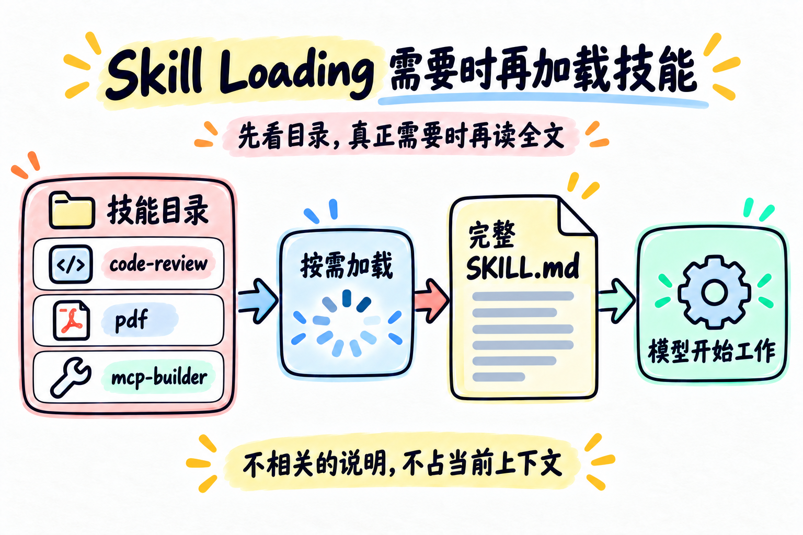

# 第 07 章：Skill Loading —— 按需加载工作方法



> **一句话总结：先让模型看到技能简介，任务需要时再把完整说明放进上下文。**

Agent 项目可能积累代码审查、数据分析、文档处理等操作规范。每次请求都带上所有规范，简单任务也会为无关内容付出上下文和延迟成本。

这里的**上下文**是一次模型请求中可见的信息。Skill Loading（技能加载）把这些信息分阶段提供：模型先根据名称和简介判断是否需要某项技能，再通过工具读取完整说明。

## 加载分成哪几步

- **发现：**启动时读取每项技能的名称和简介，作为目录放进系统提示。
- **激活：**模型认为任务相关时，调用 `load_skill(name)`。
- **执行：**Harness（负责组织模型请求和工具执行的应用层）读取登记过的 `SKILL.md`，把内容作为工具结果发回模型。

模型发出加载请求不等于完成任务。加载只是让说明进入上下文；模型是否照做，仍要看后续输出或工具结果。

## Skill 是说明，不是权限

Skill 通常是一个目录，里面有 `SKILL.md`，也可以带参考文档、脚本或模板。它描述某类任务的流程和注意事项；Tool（工具）则让应用执行具体动作，例如读文件、调用函数或运行脚本。

本章的示例只读取 `SKILL.md`。读到一段“运行脚本”的说明，不会因此自动运行脚本，也不会扩大 Harness 已授予的权限。技能内容可能来自仓库或第三方，进入上下文前要考虑来源是否可信；真正的安全边界仍由工具实现和授权策略控制。

## 按需加载的收益和代价

| 方案 | 适合的情况 | 代价 |
| --- | --- | --- |
| 规则直接写进系统提示 | 规则短、每次任务都需要 | 每次请求都携带这些内容 |
| 先给目录、需要时再加载 | 技能较多，任务只会用到其中一部分 | 目录本身也占上下文；加载要多一次工具往返 |

所以渐进加载不是“上下文免费”。如果技能数量很多，光是简介目录也可能变长，需要分组或增加检索；如果 `SKILL.md` 很长，可以把细节放到参考文件，再按需读取。反过来，只有一两条很短、每次都用的规则，直接放进稳定提示通常更简单。

面试里可以把效果拆成三件事验证：相关任务有没有选中技能、无关任务有没有误加载、加载后任务质量是否提升。只看调用次数，无法证明机制有效。

## 看代码如何限制读取范围

示例启动时只把名称和简介放入目录；完整内容通过已登记的技能名读取：

```python
def load(self, name: str) -> str:
    skill = self.skills.get(name)
    if skill is None:
        return f"Error: 未知技能 {name}"

    path = Path(skill["path"]).resolve()
    if not path.is_relative_to(self.skills_dir.resolve()):
        return "Error: 技能文件不在技能目录中"
    return path.read_text(encoding="utf-8")
```

模型传的是技能名，不是任意文件路径；代码还会解析真实路径并检查它仍在技能目录内。这样可挡住通过符号链接逃出目录的读取。它仍是教学示例：只在 `---` 包围的前置信息里用简单正则提取字段，不是完整 YAML 解析器。

本项目只实现 Agent Skills 逐步披露的前两层：启动时加载 `name` 和 `description`，激活时加载完整 `SKILL.md`。标准还允许技能引用其他资源、在后续需要时再加载；当前代码没有实现这一步。

完整代码在 [`code.py`](./code.py)，示例技能位于：

```text
chapters/07-skill-loading/skills/
├── code-review/SKILL.md
└── pdf/SKILL.md
```

配置 `.env` 后运行：

```env
DEEPSEEK_API_KEY=你的_api_key
DEEPSEEK_BASE_URL=https://api.deepseek.com
DEEPSEEK_MODEL=deepseek-flash
```

```bash
uv run python chapters/07-skill-loading/code.py
```

可以输入：“请加载 code-review，然后告诉我审查 README 时要注意什么。”再试试普通闲聊，观察模型是否会跳过加载。

### 面试追问

**如果有 50 个技能，只把简介放进提示，是不是上下文就不会随技能数量增长？**

<details>
<summary>参考思路</summary>

不会。完整正文按需加载能减少无关内容，但每项技能的名称和简介仍在目录里。目录过大时要考虑分组、检索或更精简的描述；还要用相关任务和无关任务分别评估召回与误触发，并比较 token、延迟和任务质量。

</details>

## 参考

- [Agent Skills 格式规范](https://agentskills.io/specification)：目录、`SKILL.md` 元数据和渐进披露机制。
- [DeepSeek Tool Calls 官方说明](https://api-docs.deepseek.com/guides/tool_calls/)：模型返回工具调用，应用负责执行；工具参数仍需在代码中校验。
- [learn-claude-code：s07 Skill Loading](https://github.com/shareAI-lab/learn-claude-code/tree/main/s07_skill_loading)
- [实战篇 09：Skill Loading 与代码审查脚本](../../labs/09-skill-loading/)
