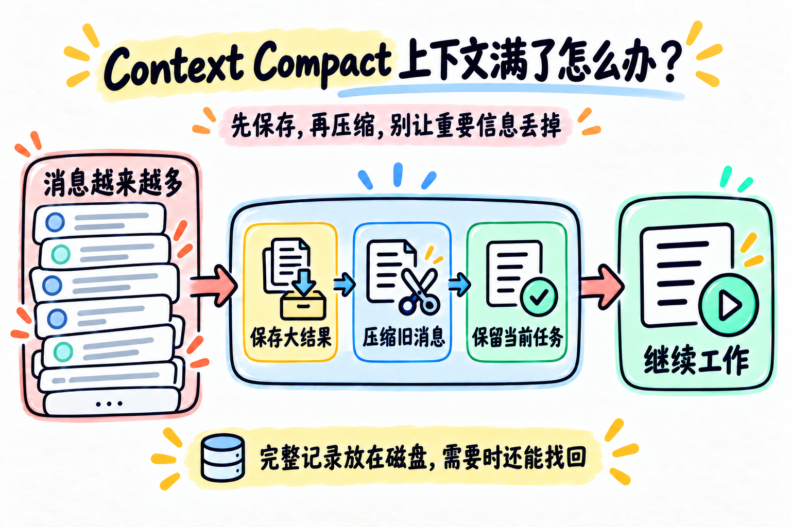

# 第 08 章：Context Compact —— 上下文满了怎么办？



> **一句话总结：上下文快装满时，先保存可恢复的大结果，再压缩旧内容，同时保留当前任务。**

**本章新增：** 上下文变长时，新增三步处理：保存大结果、裁剪旧历史、必要时生成摘要。

前面的章节不断把消息、工具调用和工具结果加入 `messages`。

短任务没问题，但长任务会遇到一个现实限制：上下文窗口不是无限的。

## 先看图

Context Compact 不是简单地“删掉旧消息”，而是按信息损失从小到大处理：

```text
消息越来越多
      ↓
保存大结果
      ↓
压缩旧消息
      ↓
保留当前任务
      ↓
继续工作
```

第一原则是：能恢复的内容先保存，能局部处理就不要立刻总结整段历史。

## 用书桌理解上下文

把上下文想成一张有限大小的书桌：

- 当前正在看的资料要放在桌面上；
- 已经看完的大文件可以放进抽屉，留下一个索引；
- 很久以前的过程可以整理成一页摘要；
- 当前用户的问题不能被整理掉。

压缩的目标不是让 Agent 失忆，而是让有限桌面继续放得下当前工作。

## 为什么工具结果优先处理

在代码任务里，最容易占空间的通常是工具结果：

- 读取长文件会把全文放进上下文；
- 测试日志可能一次增加几万字；
- 搜索很多文件会不断追加结果。

这些内容往往可以保存到磁盘，需要时再读取。因此，先处理工具结果，通常比立刻总结全部对话更稳妥。

举两个具体场景：

- `read_file` 返回一大段源码：先把完整结果保存到 `.task_outputs/`，上下文只留“保存在哪里”和一小段预览；需要细节时，再调用 `read_file` 读取保存的文件；
- 历史里有很多已经完成的讨论：可以生成摘要，但要接受摘要会丢失原文细节，不能把它当成无损备份。

## 一个适合初学者的三步版本

本章代码用一个简化版演示三步：

1. `persist_large_results`：把过大的工具结果保存到 `.task_outputs/`，上下文只留下预览；
2. `snip_history`：历史消息太多时，保存完整 transcript，只保留开头、摘要标记和最近消息；
3. `compact_history`：仍然太长时，请模型生成当前状态摘要。

真实系统还需要处理 token 估算、工具调用和结果成对保留、API 拒绝后的重试等边界。本章先建立顺序感：

> **先做可恢复的压缩，最后才做有信息损失的总结。**

代码里的 `CONTEXT_CHAR_LIMIT = 12000` 只是教学用的字符数近似，不是模型真实 token 上限。生产系统应按所用模型的上下文限制估算 token，并保留足够的安全余量。

压缩时还要保留 assistant 的工具调用和对应的 `tool` 结果，不能只留下半条消息；否则下一次请求的消息结构可能失效。完整 transcript 负责恢复，摘要只负责让模型快速接上当前进度。

## 当前任务为什么要单独保留

历史摘要可能遗漏用户刚刚提出的要求，所以压缩时要把 `active_request` 单独带上：

```text
当前用户请求：请继续完成第 08 章
对话摘要：已经读过哪些资料，当前做到哪一步
完整记录：.transcripts/xxx.json
```

这样即使旧消息被替换，模型仍然知道这一次要完成什么。

## 用 DeepSeek 跑起来

本章的完整代码在 [`code.py`](./code.py)。为了方便观察，示例把阈值设得比较小：

- 结果超过一定长度就保存预览；
- 消息数量过多就保存 transcript；
- 仍然超限时调用一次模型生成摘要。

先配置 `.env`：

```env
DEEPSEEK_API_KEY=你的_api_key
DEEPSEEK_BASE_URL=https://api.deepseek.com
DEEPSEEK_MODEL=deepseek-flash
```

运行：

```bash
python chapters/08-context-compact/code.py
```

可以试试读取多个较长文件，再观察 `.task_outputs/` 和 `.transcripts/` 目录。

## 今天只记住

> **上下文有限，先保存、再压缩、最后总结；当前任务必须一直保留。**

## 想一想

如果一条旧工具结果已经保存到磁盘，为什么上下文里可以只保留“文件路径 + 一小段预览”？

<details>
<summary>参考思路（先自己想一想，再展开）</summary>

因为完整内容没有丢，只是换了个地方放。模型需要细节时，可以按路径再读回来；预览帮它判断值不值得回头读。这是可恢复的压缩，比直接总结安全。

</details>

## 参考

- [learn-claude-code：s08 Context Compact](https://github.com/shareAI-lab/learn-claude-code/tree/main/s08_context_compact)
- [DeepSeek Chat API 示例](https://api-docs.deepseek.com/api_samples/chat_python/)
