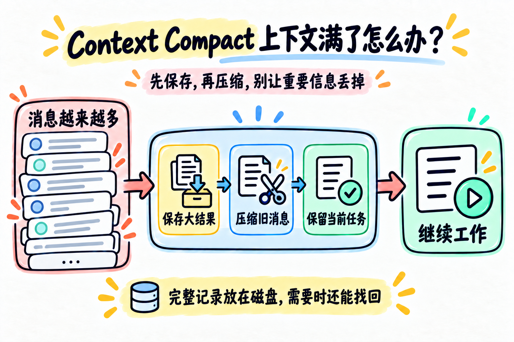

# 第 08 章：Context Compact —— 上下文满了怎么办？



> **一句话总结：先把可恢复的大结果移出上下文，再裁剪旧消息；只有仍然超限时才让模型总结。**

面试里如果只回答“做摘要”，还没有说明信息怎么恢复、摘要会丢什么。本章的示例按信息损失从小到大做三件事。

## 这三步各自解决什么

| 操作 | 本章做法 | 保留什么、代价是什么 |
| --- | --- | --- |
| 外置大结果 | 把过长的 `tool` 返回写入 `.task_outputs/`，上下文里保留路径和预览 | 原文还能按路径读回；多了本地文件，需要管理保留期限 |
| 裁剪旧消息 | 完整历史存到 `.transcripts/`，当前请求保留开头和最近消息，中间用标记代替 | 精确原文还在磁盘，但模型当前看不到被裁掉的细节 |
| 总结剩余历史 | 仍超出教学阈值时，请模型留下当前请求、摘要和 transcript 路径 | 节省更多上下文，但摘要有损，不能替代原始证据 |

先看图里的顺序：大结果先保存，旧消息再裁剪，最后保留当前任务继续工作。不是每次都需要三步；示例只有在前两步之后仍超过阈值时才调用模型生成摘要。

## 为什么工具结果先处理

读取长文件、搜索结果和测试日志通常比一条用户消息更占空间，而且有些内容可以从文件重新读取。外置结果时，`persist_large_results()` 保留一小段预览和文件路径；模型需要细节时，可以再调用 `read_file`。

裁剪消息时，代码会把完整记录写入 `.transcripts/`，留下开头和最近消息。它会避开工具调用与对应 `tool` 结果的断点，避免保留半条调用记录。完整记录可以恢复；但除非应用把原文重新读进请求，模型不会自动看到它。

如果裁剪后仍然太长，`compact_history()` 才请求模型生成摘要，并把 `active_request` 单独保留。摘要请求只带最近一段历史（最多约 10,000 个字符），完整 transcript 仍留在磁盘。当前代码把未完成事项交给摘要归纳，没有单独结构化保留，因此可能遗漏；面试时可以指出，重要的待办、约束和验收条件应由程序明确带到下一轮。摘要也可能把推断写成事实，关键结论要回到文件、工具结果或其他可信来源核对。

这处理的是当前会话的上下文空间；transcript 是原始记录，不会自动变成可跨会话检索的记忆。跨会话记忆在第 09 章讨论。

## 看代码时注意两个边界

本章把 JSON 序列化后的字符数当作上下文长度近似值，`CONTEXT_CHAR_LIMIT = 12000` 只是为了让示例容易触发，不是模型真实的 token 上限。字符数和 token 数并不相等；估算不准时，请求仍可能被服务端拒绝。真实应用要按模型限制估算 token、留出安全余量，并对超限错误设计有上限的恢复或清晰失败。模型生成摘要本身也会增加一次请求的延迟和成本。

示例会把完整工具结果和历史写到本地的 `.task_outputs/`、`.transcripts/`。这两个目录已加入 `.gitignore`，但忽略 Git 不等于删除数据；真实服务仍要考虑敏感信息、按用户隔离和清理策略。示例读取工具拒绝 `.env`、`.git` 等隐藏路径，并允许按保存路径重新读取示例生成的结果文件和 transcript。

## 跑一下示例

完整代码在 [`code.py`](./code.py)。在 `.env` 中填写 `DEEPSEEK_API_KEY`，然后运行：

```bash
uv run python chapters/08-context-compact/code.py
```

试着让它读取几个较长文件，观察 `.task_outputs/` 和 `.transcripts/`。由于阈值很小，示例可能很快触发裁剪或摘要；重点看上下文中保留了什么，以及被移出的内容去了哪里。

## 面试追问

**为什么大工具结果可以只留路径和预览，而摘要不能当作事实来源？**

<details>
<summary>参考思路</summary>

路径指向磁盘上的原始结果，需要时可以重新读取；摘要是模型重新组织过的文字，可能省略细节或出现错误。路径也只有在应用保证文件仍存在、调用者有权读取时才有用。

</details>

## 今天只记住

先做可恢复的裁剪，最后才做有损摘要；当前请求单独保留，重要待办和约束也要明确带到下一轮。

## 参考

- [learn-claude-code：s08 Context Compact](https://github.com/shareAI-lab/learn-claude-code/tree/main/s08_context_compact)（参考压缩顺序的讲解思路；本章只实现其中的简化版本。）
- [DeepSeek Chat Completions API](https://api-docs.deepseek.com/api/create-chat-completion/)
