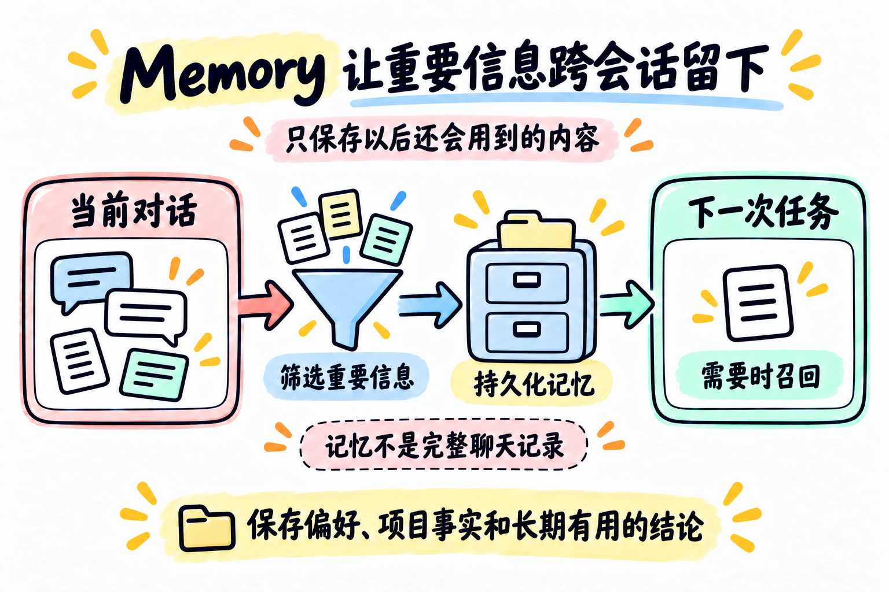

# 第 09 章：Memory —— 让重要信息跨会话留下



> **一句话总结：Memory 不是保存完整聊天记录，而是把以后还会用到的重要信息存到对话之外。**

**本章新增：** 新增对话之外的 `.memory/` 存储，以及 `remember` / `recall_memory` 两个工具。

第 08 章解决的是“当前这次任务的上下文太长怎么办”。

Memory 解决的是另一个问题：这次对话结束后，下一次任务还需要知道什么？

## 先看图

Memory 可以先理解成四步：

```text
当前对话
   ↓
筛选重要信息
   ↓
持久化记忆
   ↓
下一次任务需要时召回
```

重点不是“把所有内容都记住”，而是只留下以后还会有用的部分。

## 用工作笔记理解 Memory

你不会把每天所有聊天都打印下来带在身上，而会留下几条长期有用的笔记：

- 用户偏好：喜欢简洁的回答；
- 项目事实：项目默认使用 DeepSeek；
- 长期约定：所有主图放在根目录 `assets/`。

下一次工作时，先看笔记目录，相关的再打开。

## Memory 和 Context Compact 的区别

| | Context Compact | Memory |
| --- | --- | --- |
| 解决什么 | 当前会话太长 | 下一次会话缺少背景 |
| 保存什么 | 当前任务的可恢复过程 | 以后还会用的知识 |
| 保存多久 | 当前任务或一段时间 | 跨会话 |
| 是否保存完整历史 | 不一定 | 不应该 |

Memory 不是压缩版聊天记录，也不应该替代 Context Compact。

## 一个最小的 Memory Store

本章使用 `.memory/` 目录，每条记忆单独保存成 Markdown 文件：

```text
.memory/
├── MEMORY.md
├── user-preference.md
└── project-default-model.md
```

`MEMORY.md` 只做索引，正文留在具体文件里。这样可以先看目录，再按需读取完整记忆，和第 07 章的 Skill Loading 有相似之处。

每条记录至少包含：

```text
名称
类型
简介
正文
```

## 记忆也需要筛选

不是用户说的每句话都应该保存：

- “这次先不要改文件”通常只是当前任务限制；
- “以后都使用中文短句”可能是长期偏好；
- “项目默认使用 DeepSeek”是稳定的项目事实。

因此，`remember` 应该是一个明确的写入动作，`recall_memory` 负责按当前问题选择相关记录。

同时要记住：当前用户请求优先级更高。旧记忆只能作为背景，不能偷偷变成新的用户命令。

### 什么值得记，什么不值得记？

| 值得记 | 不值得记 |
| --- | --- |
| 稳定的用户偏好、项目默认约定、可复用的决策 | 只对这一次任务有效的临时要求、一次性路径、已经过期的状态 |

本章的 `remember` 是显式写入：用户明确要求，或程序判断它是长期信息时才保存。`recall_memory` 只是一个简单的关键词匹配，不是可靠的语义检索；可能误召回，也可能漏召回。中文示例按单字匹配只是为了让小例子能工作，真实项目可以换成更可靠的检索和冲突处理。

如果旧记忆与当前要求冲突，当前用户要求优先；如果记忆本身已经过期，也应该更新或删除，而不是继续盲目相信。

## 用 DeepSeek 跑起来

本章的完整代码在 [`code.py`](./code.py)。它提供两个核心工具：

- `remember`：写入一条持久化记忆，并更新索引；
- `recall_memory`：根据关键词召回相关记忆。

先配置 `.env`：

```env
DEEPSEEK_API_KEY=你的_api_key
DEEPSEEK_BASE_URL=https://api.deepseek.com
DEEPSEEK_MODEL=deepseek-flash
```

运行：

```bash
python chapters/09-memory/code.py
```

可以先输入：

```text
请记住：本项目的章节主图统一放在根目录 assets/。
```

再重新运行一次，输入：

```text
这个项目的图片应该放在哪里？
```

观察 `.memory/` 中留下的文件，以及模型是否召回了相关内容。

这个例子故意不做“自动从每句话提取记忆”：自动保存看似省事，却更容易把临时指令、错误结论也留下。持久化之前多一步筛选，通常更值得。

## 今天只记住

> **Memory 保存的是可复用知识，不是完整聊天记录。**

## 想一想

如果一条记忆和当前用户的新要求冲突，应该听旧记忆，还是听当前请求？为什么？

<details>
<summary>参考思路（先自己想一想，再展开）</summary>

听当前请求。旧记忆只是过去的背景，用户现在明确说的才是最新意图，偏好本身也可能已经变了。合理的做法是按当前要求做，必要时指出冲突，再问用户要不要更新或删除这条记忆。

</details>

## 参考

- [learn-claude-code：s09 Memory](https://github.com/shareAI-lab/learn-claude-code/tree/main/s09_memory)
- [DeepSeek Tool Calls 官方说明](https://api-docs.deepseek.com/guides/tool_calls/)
