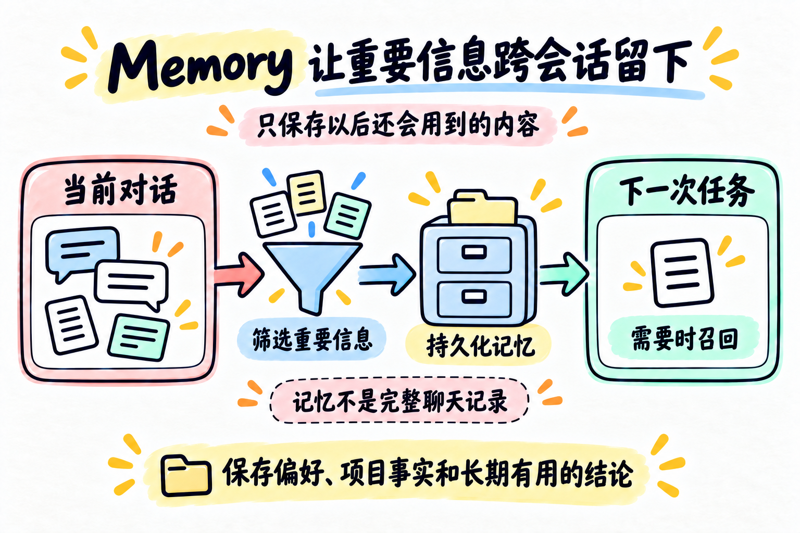

# 第 09 章：Memory——让后续任务用得上过去的信息



> **会话历史保存这次任务的过程；长期记忆只留下以后可能复用、并且能核对的信息。**

第 08 章处理的是当前上下文太长。这里讨论任务结束后留下什么，以及下一次怎样把相关信息找回来。面试时，光说“存到向量库”还不够：还要交代记忆属于谁、从哪来、怎样更新、何时失效。

## 先分清要保存的是什么

“短期”和“长期”是常用说法，不是所有框架都遵循的统一分类。按使用范围理解更实用：

| 状态 | 例子 | 常见实现 |
| --- | --- | --- |
| 当前调用的上下文 | 这一步要看的消息、文件片段、召回结果 | 当前发给模型的 context |
| 同一会话的过程 | 对话历史、工具结果、暂停后的运行状态 | Session、thread state、checkpoint |
| 后续任务可复用的信息 | 项目约定、用户偏好、过去解决过的问题 | 文件、数据库或可检索的 store |

会话记录即使写进数据库，只要仍属于原来的对话线程，它保存的还是这次会话的过程；长期记忆则要能在之后的任务中按需找到。不同框架对 session、thread 的叫法不完全相同，先问清它们的边界。LangGraph 把 thread 内的状态持久化和跨 thread 的 Store 分开；OpenAI Agents SDK 也把会话消息与供后续运行使用的 sandbox memory 分开。[LangGraph：Memory](https://docs.langchain.com/oss/python/concepts/memory) · [OpenAI Agents SDK：Sessions](https://openai.github.io/openai-agents-python/sessions/) · [Agent Memory](https://openai.github.io/openai-agents-python/sandbox/memory/)

长期记忆可以按用途粗分：

- **事实和偏好：** 项目使用 Python，测试命令是 `uv run pytest`。
- **经历和经验：** 曾发现 `median()` 对偶数个元素处理不正确，修复时漏了边界测试。
- **可重复的方法：** 发布步骤或代码审查规范。本项目把这类规则作为 Skill 单独管理，见[第 07 章](../07-skill-loading/)。

分类名称并不重要，重要的是记录的适用范围、来源和有效性。比如“这次先不要跑测试”是当前任务指令，不应自动变成长期偏好。

## 记忆要经过写入、召回和维护

```text
写入：筛选值得复用的信息，确认范围和来源，再保存
                         ↓
召回：先检查访问范围，再按当前任务找少量相关记录
                         ↓
使用：把记忆当线索，必要时回到当前文件、配置或测试核实
                         ↓
维护：更新过时记录，处理冲突，并提供删除和过期机制
```

记忆质量取决于整条链路。自动保存会留下噪声；召回太多会挤占上下文；旧结论如果没有时间和来源，可能被误当成当前事实。项目、用户和团队的数据也应分开授权，不能因为语义相似就跨范围混用。

**Memory 和 RAG（检索增强生成）有关联，但关注点不同。** RAG 通常从文档集合取证据回答当前问题；Memory 还要管理跨任务可复用的状态，例如谁的偏好、何时记录、后来是否被更新。两者都可能使用关键词、向量或混合检索，因此面试时要说清数据和生命周期，而非只报存储技术。

## 面试里要讲清的取舍

- **写什么：** 只留对未来任务有用的信息；区分用户明确要求、模型推断和工具验证结果。
- **什么时候写：** 请求内立刻写入，信息马上可用，但会增加延迟；后台整理不挡住当前回答，却可能晚些才能被后续任务看到。本例只在用户明确要求时写入。
- **怎么找到：** 先按用户或项目做权限过滤，再排序相关记录；只把有限结果放进上下文，并保留来源。
- **怎么处理变化：** 记录时间和适用范围；新决定覆盖旧决定时标明失效关系，必要时让 Agent 检查当前配置。
- **怎么证明有用：** 用相同任务比较记忆开启和关闭时的完成质量、错误率、耗时和 token；另外检查过期召回、跨项目泄漏与删除路径。能复述已保存的内容，不等于能帮助完成任务。

## 跑一个可检查的原型

完整代码在 [`code.py`](./code.py)。它把项目级记录保存在仓库根目录的 `.memory/`，通过 `remember` 显式写入、通过 `recall_memory` 按关键词找回。Markdown 文件方便检查；关键词匹配只是教学用的简化召回，没有语义检索、自动归纳或多用户隔离。

先在 `.env` 中配置：

```env
DEEPSEEK_API_KEY=你的_api_key
DEEPSEEK_BASE_URL=https://api.deepseek.com
DEEPSEEK_MODEL=deepseek-flash
```

运行：

```bash
uv run python chapters/09-memory/code.py
```

先输入一条明确要求保存的项目事实，退出后重新运行，再问相关问题。也可以看[实战篇 02：长期记忆](../../labs/02-memory/)，它展示记忆如何与 Coding Agent 的会话状态配合。

示例会把 `.memory/` 写在项目目录中；忽略 Git 不代表数据已加密或自动清理。这里的来源是模型填写的说明，不能单独作为审计证据；真实应用应由程序关联用户、项目、时间和可核对的来源，并明确授权、隔离、保留期限、并发写入和删除方式。记忆内容可能过期或包含不可信指令，模型应把它当作参考资料，不能让记忆覆盖当前用户要求或当前代码证据。

## 想一想

记忆里写着测试命令是 `pytest`，但项目配置现在改成了 `uv run pytest`。Agent 应该怎样回答？

<details>
<summary>参考思路</summary>

不要直接照抄旧记录。先看当前项目配置或近期用户确认，再更新或标记旧记忆失效，并保留新结论的来源。原型只支持同名记录覆盖，没有版本历史；生产实现需要补上变更追踪和删除策略。

</details>

## 参考

- [LangGraph：Memory 概览](https://docs.langchain.com/oss/python/concepts/memory)
- [OpenAI Agents SDK：Sessions](https://openai.github.io/openai-agents-python/sessions/)
- [OpenAI Agents SDK：Agent Memory](https://openai.github.io/openai-agents-python/sandbox/memory/)
- [DeepSeek：Chat Completions API](https://api-docs.deepseek.com/api/create-chat-completion/)
- [learn-claude-code：s09 Memory](https://github.com/shareAI-lab/learn-claude-code/tree/main/s09_memory)
