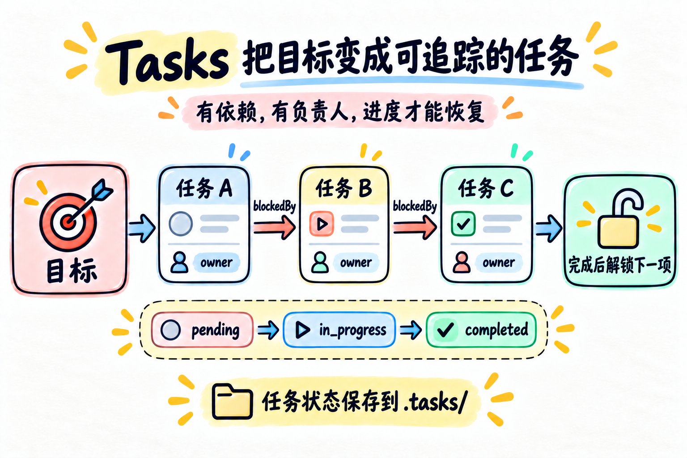

# 第 10 章：Tasks —— 把目标变成可追踪的任务



> **一句话总结：Tasks 把大目标保存成有 ID、有依赖、有负责人的任务记录，完成一项才能解锁下一项。**

**本章新增：** 把第 05 章的临时清单换成 `.tasks/*.json`，新增任务 ID、`blockedBy` 和 `owner`。

第 05 章的 `todo_write` 是当前 Agent 的执行清单。

但当任务要跨会话、跨 Agent，或者存在先后依赖时，一张临时清单就不够了：

```text
先建表结构
      ↓
再写 API
      ↓
最后补测试
```

程序需要知道：每项任务是谁负责、当前状态是什么、被什么任务阻塞。

## 先看图

Task System 关注的不是一句待办事项，而是一组可以保存和恢复的任务记录：

- 每个任务有唯一 ID；
- `blockedBy` 表示前置依赖；
- `owner` 表示当前负责人；
- 状态从 `pending` 变成 `in_progress`，最后变成 `completed`；
- 前置任务完成后，后面的任务才会解锁。

## TodoWrite 和 Tasks 的区别

| | `todo_write` | Task System |
| --- | --- | --- |
| 目标 | 记录当前 Agent 的步骤 | 管理可恢复的任务节点 |
| 保存位置 | 当前进程 / 当前会话 | `.tasks/*.json` |
| 依赖关系 | 没有 | `blockedBy` |
| 负责人 | 没有 | `owner` |
| 恢复方式 | 重新看当前上下文 | 重新读取任务文件 |

可以把 `todo_write` 看成“我接下来要做什么”，把 Tasks 看成“整个项目有哪些任务、谁能开始做”。

例如“写 API 依赖数据库”：第 05 章的 Todo 记录当前 Agent 的步骤；第 10 章会把“数据库”和“API”保存成两个有 ID 的节点，再把依赖关系连起来。前者适合当前上下文，后者适合跨会话、跨负责人恢复。

## 一个任务有哪些字段

```python
{
    "id": "task_a1b2c3d4",
    "subject": "创建 API",
    "description": "实现用户接口",
    "status": "pending",
    "owner": None,
    "blockedBy": ["task_11223344"],
}
```

其中 `blockedBy` 里的任务必须先完成，当前任务才可以被领取。

## 状态不是动作

状态只有三种：

```text
pending ── claim_task ──→ in_progress ── complete_task ──→ completed
```

`claim_task` 和 `complete_task` 是动作；
`pending`、`in_progress`、`completed` 是结果状态。

这样程序就能拒绝一些不合理的操作：

- 已经完成的任务不能再次领取；
- 有未完成依赖的任务不能领取；
- 不是负责人不能完成任务。

`completed` 只表示任务记录的状态已经改成完成，不代表系统自动验证了代码、测试或交付物。真正完成前，仍应调用相应工具检查结果。

## 为什么要先创建，再连接依赖

任务 ID 是程序运行时生成的，所以通常分两步：

```text
第一步：创建所有任务，得到 task_id
第二步：使用这些 task_id 添加 blockedBy
```

先有节点，再连边，依赖关系才不会引用不存在的任务。

## 用 DeepSeek 跑起来

本章的完整代码在 [`code.py`](./code.py)。它把任务保存到项目根目录的 `.tasks/`：

- `create_task`：创建任务并生成 ID；
- `update_task`：添加前置依赖；
- `list_tasks` / `get_task`：查看任务；
- `claim_task`：领取一个已解锁任务；
- `complete_task`：完成任务并提示被解锁的后续任务。

示例只提示“这次刚刚变成可开始”的任务，不会在每次完成别的任务时重复报告早已解锁的任务。

先配置 `.env`：

```env
DEEPSEEK_API_KEY=你的_api_key
DEEPSEEK_BASE_URL=https://api.deepseek.com
DEEPSEEK_MODEL=deepseek-flash
```

运行：

```bash
python chapters/10-tasks/code.py
```

可以试试：

```text
创建四个任务：创建数据库、编写 API、补充测试、写文档。API 依赖数据库，测试依赖 API，文档依赖数据库。
```

然后继续输入：

```text
列出所有任务，领取第一个没有依赖的任务并完成它。
```

观察 `.tasks/` 下的 JSON 文件，以及完成任务后哪些任务变成了可开始状态。

## 今天只记住

> **TodoWrite 记录步骤，Tasks 记录可恢复的任务关系。**

有了任务 ID、依赖和负责人，进度才能跨会话恢复，也才能为后面的协作打基础。

## 想一想

如果“写测试”依赖“写 API”，但 API 任务还没有完成，程序为什么应该拒绝领取测试任务？

<details>
<summary>参考思路（先自己想一想，再展开）</summary>

测试要基于已经存在的 API 才能写、才能跑。提前领取，要么白等，要么按猜测写出和最终 API 对不上的测试。依赖是状态约束，由程序直接拒绝，比指望模型自己记住依赖可靠得多。

</details>

## 参考

- [learn-claude-code：s10 Task System](https://github.com/shareAI-lab/learn-claude-code/tree/main/s10_task_system)
- [DeepSeek Tool Calls 官方说明](https://api-docs.deepseek.com/guides/tool_calls/)
