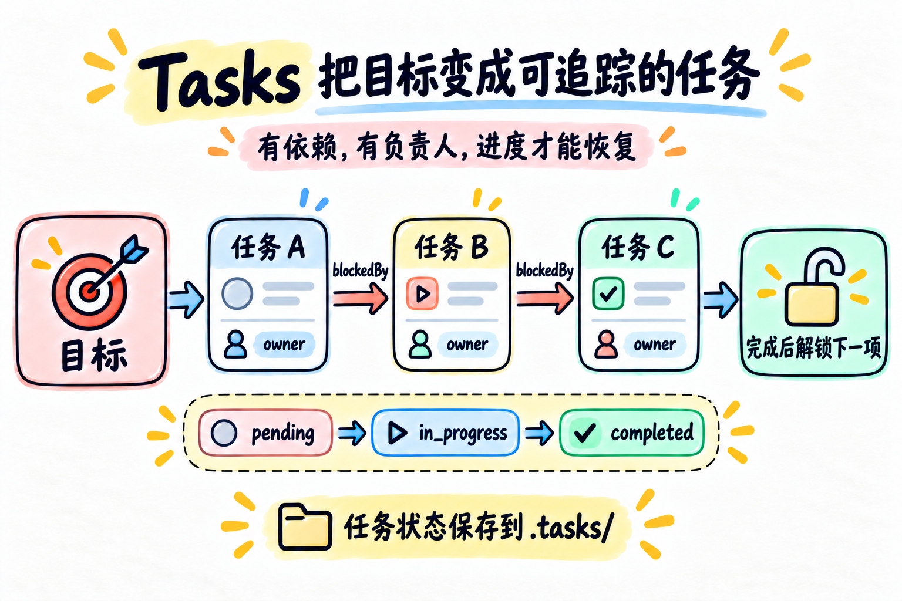

# 第 10 章：Tasks —— 让任务状态和依赖可恢复



> **Tasks 把待办变成可保存的状态记录，并由程序检查依赖是否已经满足。**

第 05 章的 `todo_write` 记录当前 Agent 接下来要做什么。本章把任务保存到 `.tasks/`，程序重启后仍可读到任务状态；每项任务有 ID、依赖关系，并可在领取时记下负责人。

有先后顺序的工作可以表示为：

```text
先建表结构
      ↓
再写 API
      ↓
最后补测试
```

这解决的是“哪些任务存在、哪些已就绪”。文件能跨进程保存记录，但不会自动让多个 Agent 安全协作；共享存储、身份校验和并发领取还要另外设计。

## 先看图

一个任务不只是标题，而是一条有状态的记录：

- 每个任务有唯一 ID；
- `blockedBy` 表示前置依赖；
- `owner` 表示当前负责人；
- 状态从 `pending` 变成 `in_progress`，最后变成 `completed`；
- 前置任务完成后，后面的任务才会解锁。

## TodoWrite 和 Tasks 的区别

| | `todo_write` | Task System |
| --- | --- | --- |
| 目标 | 记录当前 Agent 的步骤 | 管理可恢复的任务节点 |
| 保存位置 | 当前进程 / 当前会话 | `.tasks/*.json`，进程重启后可读取 |
| 依赖关系 | 没有 | `blockedBy` |
| 负责人 | 没有 | `owner` |
| 恢复方式 | 重新看当前上下文 | 重新读取任务文件 |

比如“API 依赖数据库”：清单可以提示当前 Agent 先做数据库；Tasks 则能保存两个有 ID 的节点，并在数据库完成前拒绝领取 API。一个跟进当前执行步骤，一个保存可由程序检查的项目状态。

## 一个任务有哪些字段

```python
{
    "id": "task_a1b2c3d4",
    "subject": "创建 API",
    "description": "实现用户接口",
    "status": "pending",
    "owner": None,
    "blockedBy": ["task_11223344"],
}
```

`blockedBy` 里的任务必须先完成，当前任务才可以被领取。添加依赖时，代码还会拒绝自依赖、缺失任务和循环依赖；否则就绪状态可能永远无法计算。

## 状态不是动作

状态只有三种：

```text
pending ── claim_task ──→ in_progress ── complete_task ──→ completed
```

`claim_task` 和 `complete_task` 是动作；
`pending`、`in_progress`、`completed` 是结果状态。

因此程序可以拒绝不合法的状态迁移：

- 已经完成的任务不能再次领取；
- 有未完成依赖的任务不能领取；
- 只有当前负责人才能完成任务。本例用 `AGENT_ID` 标识运行中的 Agent，默认值是 `agent`；它只是示例身份，不是认证机制。

`completed` 只表示任务记录的状态已经改成完成，不代表系统自动验证了代码、测试或交付物。真正完成前，仍应调用相应工具检查结果。

## 文件持久化不等于并发安全

本例把每个任务写成 JSON，便于打开文件观察状态，也能在进程重启后继续读取。但领取任务的“检查 `pending`、再写入 `in_progress`”不是原子操作；两个进程同时领取时，都可能读到旧状态并都认为自己领取成功。JSON 文件也没有提供事务和崩溃恢复。

所以当前代码适合单进程演示，不应当当作多 Agent 任务服务。实际协作时，需要共享的任务存储、原子领取（例如数据库事务）和可信的运行时身份；进程退出后还要处理长期停留在 `in_progress` 的任务。下一章的 Agent Teams 会进一步展示领取时的并发问题。

## 为什么要先创建，再连接依赖

任务 ID 是程序运行时生成的，所以通常分两步：

```text
第一步：创建所有任务，得到 task_id
第二步：使用这些 task_id 添加 blockedBy
```

先有节点，再连边，依赖关系才不会引用不存在的任务。

## 用 DeepSeek 跑起来

本章的完整代码在 [`code.py`](./code.py)。它把任务保存到项目根目录的 `.tasks/`：

- `create_task`：创建任务并生成 ID；
- `update_task`：添加前置依赖；
- `list_tasks` / `get_task`：查看任务；
- `claim_task`：领取一个已解锁任务；
- `complete_task`：完成自己领取的任务，并列出刚解锁任务的 ID 和标题。

工具参数仍要由 Python 校验。代码会把无效 JSON、错误参数和任务文件异常作为工具结果返回，不会直接把模型生成的参数交给存储层。

示例只提示“这次刚刚变成可开始”的任务，不会在每次完成别的任务时重复报告早已解锁的任务。

先配置 `.env`：

```env
DEEPSEEK_API_KEY=你的_api_key
DEEPSEEK_BASE_URL=https://api.deepseek.com
DEEPSEEK_MODEL=deepseek-flash
AGENT_ID=agent-local
```

`AGENT_ID` 是运行时使用的负责人标签；不配置时默认为 `agent`。它用于演示所有权校验，不负责验证调用者身份。

运行：

```bash
uv run python chapters/10-tasks/code.py
```

可以试试：

```text
创建四个任务：创建数据库、编写 API、补充测试、写文档。API 依赖数据库，测试依赖 API，文档依赖数据库。
```

然后继续输入：

```text
列出所有任务，领取第一个没有依赖的任务并完成它。
```

观察 `.tasks/` 下的 JSON 文件，以及完成任务后哪些任务变成了可开始状态。

## 任务状态要由程序守住

模型可以提出创建、领取或完成任务；依赖检查、负责人校验和状态转换应由存储层执行。JSON 文件适合看懂原型，多进程并发更新时需要锁或事务。

## 练习：依赖关系由谁保证？

如果“写测试”依赖“写 API”，但 API 任务还没有完成，为什么应该由程序拒绝领取测试任务，而不是只在提示词里提醒模型？

<details>
<summary>参考思路（先自己想一想，再展开）</summary>

测试要基于已经存在的 API 才能写、才能跑。提前领取，要么白等，要么按猜测写出和最终 API 对不上的测试。依赖是状态约束，由程序直接拒绝，比指望模型自己记住依赖可靠得多。

</details>

## 参考

- [learn-claude-code：s10 Task System](https://github.com/shareAI-lab/learn-claude-code/tree/main/s10_task_system)
- [DeepSeek Tool Calls 官方说明](https://api-docs.deepseek.com/guides/tool_calls/)
