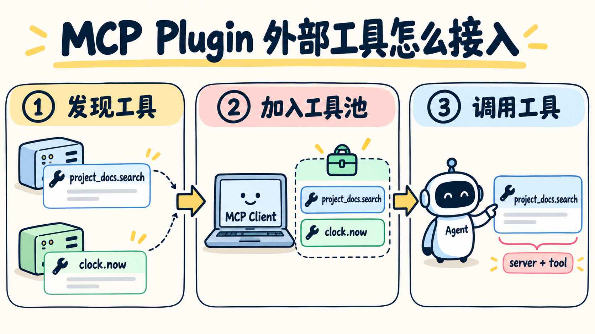

# 第 11 章：Background Tasks —— 慢任务放到后台



> **一句话总结：明确的慢任务先返回任务 ID，让 Agent Loop 继续做独立工作，结果稍后再收回来。**

**本章新增：** 新增后台任务管理器：慢任务先返回 `bg_id`，结果在后续轮次再收回来。

第 10 章把任务变成了可追踪的记录，但“任务已经存在”和“任务正在执行”仍然是两回事。

## 先看图

```text
同步执行像站在洗衣机旁边等它结束：

模型 → 执行慢任务 ─────────→ 结果
       Agent 一直等待
```

后台执行则是：

```text
模型 → 启动慢任务 → 返回 bg_id → 继续处理其他事情
                         ↓
                  后续轮次收集通知
```

本章只增加一个边界：只有工具参数明确要求后台执行时，才放入后台；普通读取仍然同步完成。

## 用洗衣机理解

你按下洗衣机的开始键后，可以去整理桌面。洗衣机不会把衣服洗好后“强行插进”你的手里，而是亮一盏完成提示灯。

后台任务也是这样：

- `start_background_job` 只负责登记并启动线程；
- 主循环马上拿到一个任务 ID；
- worker 在线程里执行；
- `collect_background_jobs` 返回完成通知。

通知不是原始工具结果的替代品，而是下一轮上下文里的一条新消息。

## 什么时候值得放后台？

- 适合：构建、测试、安装依赖、等待外部任务等明显耗时且不依赖当前结果的工作；
- 不适合：读取一个小文件、检查日期、必须立刻拿到结果才能继续的步骤；
- 代价：要处理任务状态、异常、进程退出和结果收集，复杂度会高于同步调用。

后台线程也不是安全沙箱。本章为了安全，只模拟等待任务，不执行任意 Shell 命令。

## 用 DeepSeek 跑起来

完整代码在 [`code.py`](./code.py)，本章新增的是后台管理器和两个工具：

```python
start_background_job("生成测试报告", seconds=3)
collect_background_jobs()
```

工具定义仍然交给 DeepSeek 选择，真正创建线程和修改状态的是 Python 程序。代码还给 Agent Loop 加了 `MAX_TURNS`，避免后台任务一直收不到结果时无限循环。

运行：

```bash
uv run python chapters/11-background-tasks/code.py
```

可以输入：

```text
后台运行一个 3 秒的测试报告任务，同时读取 README.md，最后告诉我后台任务是否完成。
```

注意：示例线程是 daemon 线程，主进程退出后它也会停止；真实系统需要把任务交给更可靠的任务运行器。

## 今天只记住

> **后台执行解决的是“不要阻塞当前循环”，不是“任务自动完成并且永远不丢结果”。**

## 想一想

如果后台任务失败了，下一轮应该收到“完成通知”，还是收到带状态和错误原因的任务通知？为什么？

<details>
<summary>参考思路（先自己想一想，再展开）</summary>

应该收到带状态和错误原因的通知。如果失败也叫“完成”，模型会以为任务成功，接着基于一个不存在的结果往下做。通知里写清 `status`（成功还是失败）和错误原因，模型才能决定重试、换方案，还是告诉用户。

</details>

## 参考

- [learn-claude-code：s11 Background Tasks](https://github.com/shareAI-lab/learn-claude-code/tree/main/s11_background_tasks)
- [上游中文说明](https://raw.githubusercontent.com/shareAI-lab/learn-claude-code/main/s11_background_tasks/README.zh.md)
