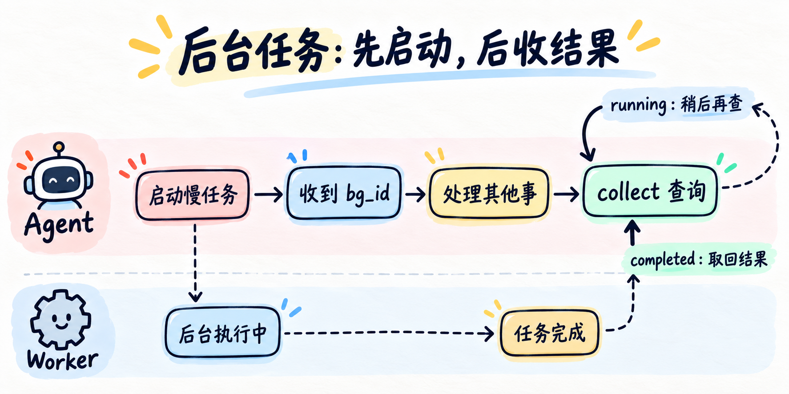

# 第 11 章：Background Tasks —— 慢任务放到后台



> **一句话总结：后台任务让慢操作先返回任务 ID；Agent 可以先做别的事，再主动查询结果。**

第 10 章把任务变成了可追踪的记录，但“任务已经存在”和“任务正在执行”仍然是两回事。

同步调用会让 Agent Loop 等待慢工具返回。后台调用则让 worker 在线程里继续执行，工具先返回 `bg_id`；模型可以再做独立的读取工作，之后主动调用 `collect_background_jobs`。

这不是并行执行多个 Agent Loop。worker 完成后不会主动打断模型，只有查询时才会把结果取回上下文。普通的短读取仍同步执行。

`bg_id`（后台任务 ID）用于关联启动请求和结果。它只在本例进程内有效，不是可跨重启恢复的任务凭证。

## 放后台之前要判断什么？

- 适合：构建、测试、等待外部服务等明显耗时，而且 Agent 还有独立工作可做的步骤；
- 不适合：很快就能返回的操作，或后续步骤必须使用它的结果。此时转后台只会增加状态管理和查询成本；
- 面试中要继续追问：结果由谁拉取或推送？任务失败、超时、进程重启后怎么处理？同一任务会不会被重复启动？

第 10 章的 Tasks 记录“要做哪些工作及依赖”；本章记录“一项已启动的慢操作正在运行或已结束”；第 12 章的 Cron 则是在未来某个时间启动工作。三者解决的问题不同。

这里用守护线程模拟等待，不执行 Shell 命令，也不提供取消、持久化或重试。进程退出时，守护线程可能被直接终止；真实任务应交给可恢复的任务运行器。

## 用 DeepSeek 跑起来

完整代码在 [`code.py`](./code.py)。后台机制新增两个工具：

```python
start_background_job("生成测试报告", seconds=3)
collect_background_jobs()
```

DeepSeek 选择何时启动、何时查询；Python 管理线程和状态。查询是非阻塞的：任务还在跑时会返回 `running`，不会替 Agent 等待。终态通知只保存在内存队列里，收集时取出一次；如果进程在收集后、模型处理前退出，通知不会自动重放。本例也不清理历史记录，长时间运行的服务还要设置保留和清理策略。

运行：

```bash
uv run python chapters/11-background-tasks/code.py
```

可以输入：

```text
后台运行一个 3 秒的测试报告任务，同时读取 README.md，再查询任务状态并告诉我结果。
```

## 一个面试追问

如果 worker 报错，为什么不能只把它从运行列表里删掉？

<details>
<summary>参考思路（先自己想一想，再展开）</summary>

任务需要留下终态，至少区分成功和失败，并把错误交给 Agent。否则模型无法判断是继续、重试还是向用户报告。真实系统还要考虑超时、取消、重试是否安全，以及任务状态和结果如何持久化。

</details>

## 参考

- [learn-claude-code：s11 Background Tasks](https://github.com/shareAI-lab/learn-claude-code/tree/main/s11_background_tasks)
- [上游中文说明](https://raw.githubusercontent.com/shareAI-lab/learn-claude-code/main/s11_background_tasks/README.zh.md)
