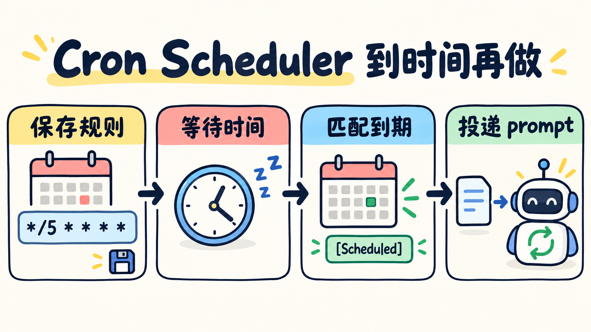

# 第 12 章：Cron Scheduler —— 到时间再启动任务



> **一句话总结：Cron 保存“什么时候做什么”，到点后把 prompt 放进 Agent Loop，而不是现在立刻执行。**

**本章新增：** 新增定时规则存储和 `poll_cron()`，到点后把 prompt 投递进下一轮循环。

第 11 章解决的是“任务开始后不要阻塞”。这一章解决另一个问题：

> **如果任务还没到执行时间，谁负责记住它？**

## 先看图

```text
创建 Cron
   ↓
保存：时间规则 + prompt
   ↓
调度器检查当前时间
   ↓
匹配？ ── 否 ──→ 继续等待
   │
   是
   ↓
放入待投递队列
   ↓
Agent 下一轮看到 [Scheduled] prompt
```

Cron 负责“何时触发”，Agent Loop 负责“触发后怎么做”。不要把它和后台任务混在一起：后台任务已经开始执行，Cron 任务只是等待未来的时间。

## 五段 Cron 怎么读？

```text
分钟   小时   日   月   星期
  *      *    *    *     *
```

本章示例支持最常见的几种写法：

- `* * * * *`：每分钟；
- `*/5 * * * *`：每 5 分钟；
- `0 9 * * *`：每天 09:00；
- `0 9 * * 1-5`：工作日 09:00。

## 什么时候值得用 Cron？

- 适合：日报、定时检查、周期性提醒；
- 不适合：只想立刻执行一次的动作，用普通工具更直接；
- 代价：要处理时区、重启、重复投递和任务持久化。

本章保存的是 `.scheduled_tasks.json` 中的任务定义。进程重启后可以恢复定义，但不会自动补跑停机期间错过的时间点；真正需要机器关机后仍然执行，应使用系统 Cron、systemd timer 或云调度服务。

## 用 DeepSeek 跑起来

完整代码在 [`code.py`](./code.py)。本章新增三个核心动作：

```python
schedule_cron("*/5 * * * *", "检查测试状态")
list_crons()
cancel_cron("cron_...")
```

`poll_cron()` 只负责把到期任务标记为待投递，`agent_loop()` 下一轮再把它变成 `[Scheduled] ...` 用户消息。这样调度器不直接替模型回答问题。

运行：

```bash
python chapters/12-cron-scheduler/code.py
```

可以输入：

```text
创建一个每 5 分钟提醒我检查测试的周期任务，然后列出任务。
```

想做无等待测试，也可以让模型调用 `poll_cron` 并传入指定时间，例如 `2026-09-22 09:00`。

## 今天只记住

> **Cron 记住未来的时间，队列负责交付，Agent Loop 负责处理交付后的任务。**

## 想一想

如果进程在模型刚收到定时 prompt 后崩溃，重启后可能再次收到它。为什么“至少一次投递”比悄悄丢掉任务更容易接受？

<details>
<summary>参考思路（先自己想一想，再展开）</summary>

重复投递的代价通常只是多做一次，比如多发一次提醒，而且可以记下已处理的任务 ID 来去重。悄悄丢掉就没人知道任务没做，发现时往往已经晚了。所以常见做法是“至少投递一次 + 处理端去重”。

</details>

## 参考

- [learn-claude-code：s12 Cron Scheduler](https://github.com/shareAI-lab/learn-claude-code/tree/main/s12_cron_scheduler)
- [上游中文说明](https://raw.githubusercontent.com/shareAI-lab/learn-claude-code/main/s12_cron_scheduler/README.zh.md)
