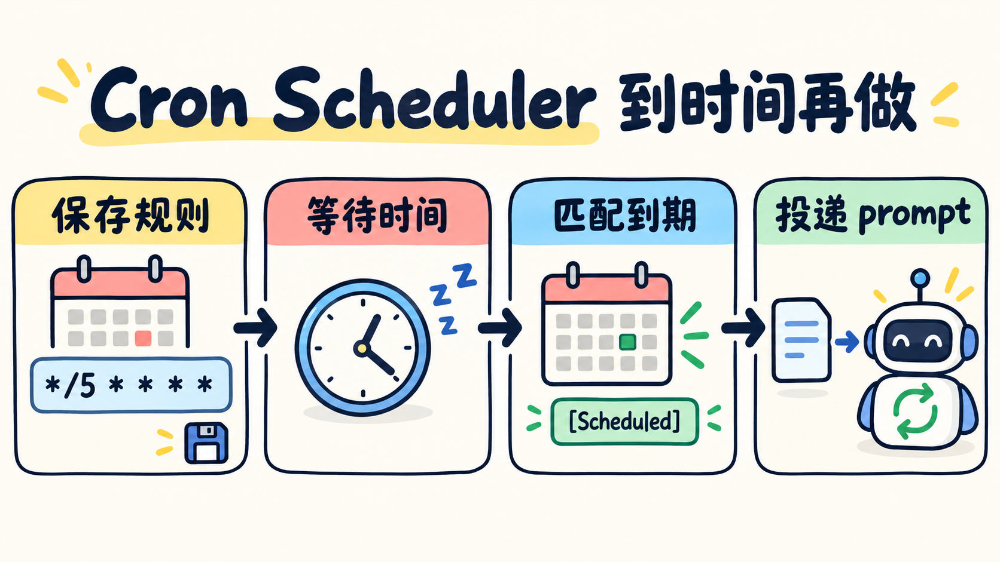

# 第 12 章：Cron Scheduler —— 让任务在未来某个时间进入 Agent



> Cron 记住“什么时候把什么事交给 Agent”；它不负责让 Agent 永远在线，也不保证任务一定成功。

第 11 章把已经启动的慢操作放到后台。本章处理的是另一种等待：任务现在还没开始，要等到指定时间再进入 Agent Loop。

## 图里的分工

- `schedule_cron` 保存时间规则和 prompt。
- 调度线程按本机时间检查规则，到期后持久化一个待投递标记。
- Agent 下一次进入 `agent_loop` 时，才会把待投递 prompt 加进消息。
- Agent 正常结束这一轮后，代码才清除待投递标记。

调度器只判断时间。收到 prompt 后怎么做，仍由 Agent Loop 和它已有的工具决定。

## 这份代码支持哪些 Cron 写法？

常见表达式分五段：分钟、小时、日、月、星期。本例支持 `*`、`*/N`、数字、升序范围和逗号组合，例如：

```text
* * * * *       每分钟
*/5 * * * *     每 5 分钟
0 9 * * 1-5     工作日早上 9 点
```

本例星期字段接受 `0` 或 `7` 表示星期日。日和星期都写成具体值时，采用常见 `crontab(5)` 规则：两个字段命中任意一个就触发。例如 `0 9 1 * 1` 会在每月 1 日或星期一的 9 点触发。其他 Cron 实现可能支持更多语法；这里不支持月份或星期名称、`1-10/2` 这类范围步长，也没有每个任务单独设置时区。[Linux `crontab(5)` 手册](https://man7.org/linux/man-pages/man5/crontab.5.html)列出了常见规则和边界。

## 触发了，为什么还不一定马上运行？

这份教学 CLI 每秒检查一次时间，但它不在空闲时自动启动一轮 Agent。到期任务会留在 `.scheduled_tasks.json`；用户下一次输入时，`agent_loop()` 才会把它和这次请求一起交给模型。因此，用户一直不输入时，任务不会执行。要让服务在无人交互时也自动处理，需要再增加队列消费者或唤醒机制，并避免它和用户回合并发修改同一份会话。

这个文件以明文保存任务 prompt 和待投递状态，代码用临时文件替换来更新；不要把密钥或不该落盘的敏感信息放进 prompt。它不保存任务运行结果，也不补跑程序停机期间错过的时间点。调度线程使用本地时区；夏令时跳时、重复时段和跨时区任务都没有专门处理。

## 投递和任务成功不是一回事

到期后，任务会保持待投递状态，直到 Agent Loop 返回正常结束标记。若请求失败或达到轮数上限，标记会留下，下一回合可能再次收到同一 prompt；若模型已触发外部副作用、但确认状态写回前程序退出，也可能重复执行。这是“至少一次投递”的取舍，不等于业务操作至少成功一次，更不等于恰好执行一次。

所以真实系统通常要给任务实例分配稳定 ID，记录执行状态，并让可能重放的副作用支持幂等或去重。本例还会在前一次投递未确认时跳过该周期的后续触发，因此不会积累完整的错过次数。

## 运行和观察

在 `.env` 中填写 `DEEPSEEK_API_KEY`，运行完整示例：

```bash
uv run python chapters/12-cron-scheduler/code.py
```

输入“创建一个每分钟提醒我检查测试的周期任务”，再等待一会儿并输入另一个请求。程序会把到期 prompt 和新请求一起交给 Agent。退出前可以调用 `cancel_cron` 停用任务；也可以用 `poll_cron` 指定时间观察规则命中，但这会真的写入待投递状态。

## 面试时可以继续追问

如果任务可能执行两次，你会把确认点放在哪里？

<details>
<summary>参考思路</summary>

先区分“prompt 已投递”“Agent 回合已结束”和“业务效果已确认”。确认点取决于系统要保证什么；如果要避免重复副作用，不能只根据模型返回了最终文本就当作业务成功。需要持久化执行状态、设计幂等键，并说明失败后如何重试或转人工处理。

</details>

## 参考

- [learn-claude-code：s12 Cron Scheduler](https://github.com/shareAI-lab/learn-claude-code/tree/main/s12_cron_scheduler)
- [上游中文说明](https://raw.githubusercontent.com/shareAI-lab/learn-claude-code/main/s12_cron_scheduler/README.zh.md)
- [Linux `crontab(5)` 手册](https://man7.org/linux/man-pages/man5/crontab.5.html)
- [DeepSeek：Chat Completions API](https://api-docs.deepseek.com/api/create-chat-completion/)
