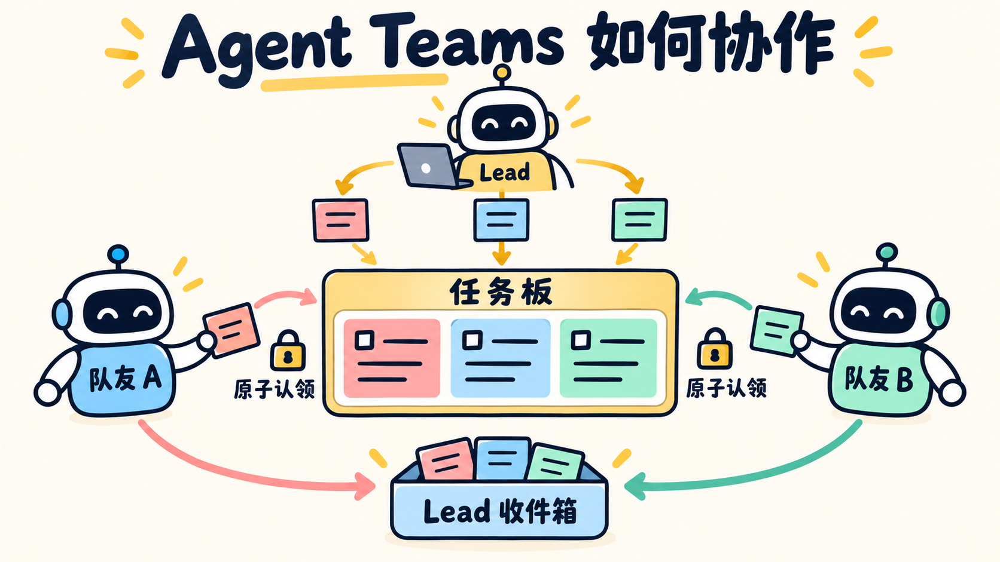

# 第 13 章：Agent Teams —— 让多个 Agent 分工



> **一句话总结：主 Agent（Lead）拆分任务，队友从共享任务板领取并执行，再把结果发回。**

**本章新增：** 新增共享任务板、队友线程和 Lead（主 Agent）的收件箱，让多个 Agent 能分工并回传结果。

第 06 章的 Subagent 更像“请一个人查完一次资料就回来”。Teams 更像一个持续工作的项目小组：

- Lead（主 Agent）负责和用户沟通、拆分任务；
- 队友在各自的线程里工作；
- 任务板决定谁可以领取什么；
- MessageBus（消息通道）传递结果，队友之间不共享对话历史。

## 先看图

```text
用户
 ↓
Lead：拆任务、启动队友
 ├──→ 队友 A ──┐
 ├──→ 队友 B ──┼──→ 共享任务板
 └──→ 队友 C ──┘
                    ↓
              Lead 收件箱
```

队友不会直接改 Lead 的 `messages`。它们只把“完成结果”和“空闲通知”发送到收件箱，运行时再把这些事件交给 Lead。

## Subagent 和 Team 有什么区别？

| | Subagent | Agent Team |
| --- | --- | --- |
| 生命周期 | 完成一次子任务后结束 | 可以持续工作、回到空闲（`IDLE`）状态 |
| 协作方式 | 主 Agent 等待一次总结 | 队友通过任务板和收件箱协作 |
| 适合 | 一个边界清楚的调查 | 多个可并行、彼此独立的任务 |
| 代价 | 一次额外模型调用 | 线程、认领、消息、关机都要管理 |

如果任务只有一个小步骤，直接用工具或 Subagent 更简单；如果多个队友会改同一个文件，也不能只因为“并行”就启动团队，冲突成本可能更高。

## 为什么认领必须加锁？

两个队友可能同时看到同一个 `pending` 任务。程序要把“检查状态”和“写入负责人”锁在一起一次完成，这类不可拆开的操作叫原子操作；否则两个人可能同时认领。

本章的 `TaskBoard.claim_next()` 在锁内完成：

```python
if task["status"] == "pending" and task["owner"] is None:
    task["status"] = "in_progress"
    task["owner"] = owner
```

这只是进程内的教学锁；真实多进程团队还需要文件锁或数据库事务。

## 用 DeepSeek 跑起来

完整代码在 [`code.py`](./code.py)。关键动作是：

```python
create_team_tasks(["检查配置", "检查测试", "整理文档"])
spawn_teammates(["alice", "bob"])
collect_team_messages()
```

本章队友只模拟完成任务，不修改文件、不创建 worktree，先让你看懂三件事：任务认领、独立线程、消息回传。

运行：

```bash
uv run python chapters/13-agent-teams/code.py
```

可以输入：

```text
创建三个独立任务，启动 alice 和 bob 并行处理，收集结果后关闭团队。
```

启动队友会增加模型调用、线程和协调成本，所以应先确认任务确实可以拆开；上游实现还会继续处理 worktree、计划审批和结构化控制消息，本章暂不展开。

## 今天只记住

> **团队协作的难点不是启动多个线程，而是让任务认领、消息传递和生命周期都可追踪。**

## 想一想

如果两个队友都想认领同一个任务，为什么“先列出待办，再稍后认领”仍然不够安全？

<details>
<summary>参考思路（先自己想一想，再展开）</summary>

“列出”和“认领”之间有时间差，两个队友可能同时看到同一个 `pending` 任务。把检查和更新放在同一把锁里一次完成，才能保证同一任务只被一个队友领取。

</details>

## 参考

- [learn-claude-code：s13 Agent Teams](https://github.com/shareAI-lab/learn-claude-code/tree/main/s13_agent_teams)
- [上游中文说明](https://raw.githubusercontent.com/shareAI-lab/learn-claude-code/main/s13_agent_teams/README.zh.md)
