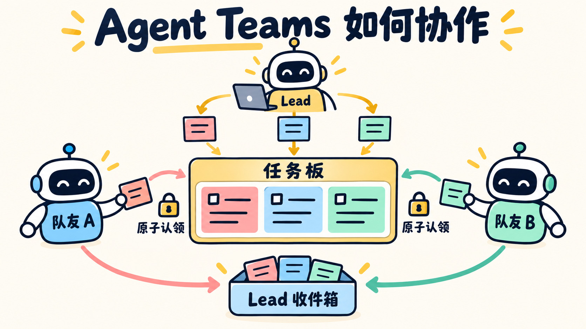

# 第 13 章：Agent Teams —— 多个 Agent 怎样协作



> **Agent Team 让多个执行单元围绕共享任务状态协作，并把结果送回 Lead。**

图中，Lead 负责拆分任务和汇总结果；队友各自处理任务；共享任务板记录负责人和进度，收件箱传递结果。队友不应直接改写 Lead 的对话历史。

按[第 01 章](../01-agent-loop/)的四个问题看，Team 也是在换“状态放在哪”：进度放在多个执行单元共享的任务板上，而不是一份 `messages` 里。

## 先分清“线程”和“Agent 上下文”

第 06 章的 Subagent 适合把一个边界清楚的子任务交出去，再等待一次结果。Team 更适合多个可以并行推进、需要共享进度或持续接活的任务。

本章代码里的 `threading.Thread` 是 Python 工作线程；模型对话上下文由独立的 `messages` 列表表示，它们是两个层次。这里的队友只模拟完成任务，没有自己的模型调用循环和 `messages`。代码先演示团队运行时的协作骨架：共享状态、原子认领和消息回传。

| 需要解决的问题 | 本章如何演示 | 完整 Agent Team 还需要什么 |
| --- | --- | --- |
| 谁可以做哪项任务 | 队友从任务板领取 `pending` 任务 | 依赖检查、负责人身份和任务恢复 |
| 两个队友会不会领到同一项 | 在同一把锁内检查并更新状态 | 多进程时使用数据库事务或跨进程锁 |
| 结果如何回到 Lead | 队友把结果和空闲通知放进收件箱 | 独立 Agent Loop、消息路由和可靠投递 |
| 任务是否真的完成 | 状态改为 `completed` | 检查交付物、测试结果和证据 |

## 看这段代码的执行过程

Lead 通过工具创建任务并启动队友。每个 Python 工作线程从共享任务板认领一项任务，短暂等待来模拟工作，更新任务状态，再把结果和 `idle_notification`（空闲通知）发到 Lead 收件箱。Lead 调用 `collect_team_messages` 读取结果。

代码只有一个 Lead 的 `messages` 列表。收件箱是任务结果的传递通道，不会自动创建队友各自的模型上下文；`idle_notification` 也只是状态消息，不代表任务结果经过了验证。

运行前在项目根目录的 `.env` 中填写 `DEEPSEEK_API_KEY`，然后运行：

```bash
uv run python chapters/13-agent-teams/code.py
```

可以输入：

```text
创建三个互相独立的任务，启动 alice 和 bob，等结果返回后汇总并关闭团队。
```

`collect_team_messages` 最多等待 5 秒，等当前任务都完成后再读取收件箱；超时会连同仍未完成的任务状态一起返回。收件箱只是内存列表，读取后会清空，尚未实现持久化确认。关闭团队时，如果还有任务未完成，任务板会保留它们的状态供 Lead 汇报。

## 认领为什么要加锁？

如果队友先各自读取列表，再分别更新负责人，就可能同时看到同一个 `pending` 任务。`TaskBoard.claim_next()` 把“检查状态”和“写入负责人”放在同一把锁里，所以在这个进程内，一项任务只会被一个线程成功认领。Python 的 GIL 不能代替这个状态转换约束。

锁的边界也要说清楚：它只保护当前进程里的内存数据。任务板重启后会丢失；多个进程各有一把锁，仍可能重复领取。跨进程协作需要共享存储和原子事务。若队友在领取后崩溃，本例也没有 `failed` 状态、租约超时或重试机制，任务会停在 `in_progress`。

## 什么时候值得组队？

适合拆分的任务彼此依赖少、产出边界清楚，而且能独立检查。例如分别调查三个互不重叠的模块。任务有严格先后顺序、多人要改同一文件，或最后很难判断结果是否正确时，团队可能只增加调用、等待和合并成本。

面试时可以继续追问：

- 队友认领后崩溃，怎样让任务可恢复，又避免两个队友同时执行？
- `completed` 只表示任务板状态变了，怎样验证它声称的结果？
- 如果消息发送成功但 Lead 没读到，重试会不会造成重复处理？

一个常见方向是使用带过期时间的任务租约、幂等操作和可核对的交付证据；这些机制超出本章的内存模拟范围。

## 参考

- [learn-claude-code：s13 Agent Teams](https://github.com/shareAI-lab/learn-claude-code/tree/main/s13_agent_teams)
- [上游中文说明](https://raw.githubusercontent.com/shareAI-lab/learn-claude-code/main/s13_agent_teams/README.zh.md)
