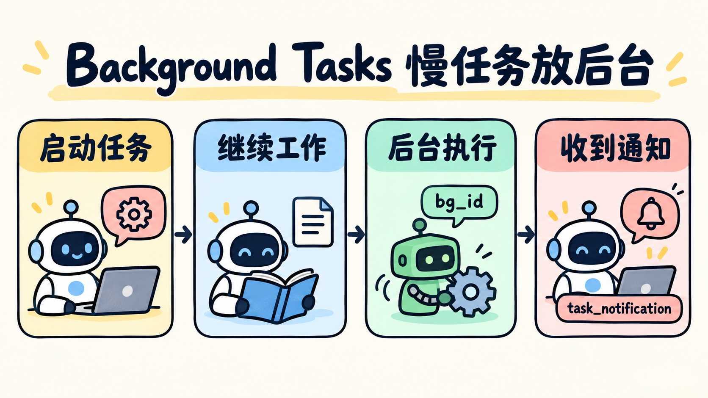

# 第 14 章：MCP Plugin —— 把外部能力接进工具池



> **一句话总结：MCP 把“工具在哪里、叫什么、怎么调用”约定下来，让 Agent 可以发现并使用外部能力。**

**本章新增：** 工具不再只写在本地，新增“先发现、再按 `server + tool` 调用”的外部工具接入。

前面的工具都是直接写在 Python 里的函数。MCP 是一套连接 Agent 与外部工具的约定：Agent 可以先发现服务提供了哪些工具，再按统一方式调用。

```text
外部 MCP Server
   ↓ 暴露工具清单
MCP Client / Registry
   ↓ 加入统一工具池
Agent 选择并调用
```

## 先看图

本章把过程拆成两个动作：

1. **发现**：先获取有哪些 Server、有哪些工具；
2. **调用**：按 `server + tool` 找到准确的处理入口，再传入参数。

```text
list_mcp_tools
      ↓
project_docs.search
clock.now
      ↓
call_mcp_tool(server, tool, arguments)
      ↓
返回工具结果给模型
```

命名空间很重要。两个 Server 都可能有一个叫 `search` 的工具，但 `project_docs.search` 和 `other_service.search` 不应该互相覆盖。

## MCP 和普通工具有什么区别？

- 普通工具：函数和 Agent 通常在同一个项目里直接注册；
- MCP 工具：能力由外部 Server 提供，Client 先发现，再把它接入当前工具池；
- MCP 不是权限绕过：发现到工具之后，仍然要做参数校验、权限检查和错误处理。

本章使用两个本地模拟 Server，不连接真实外部服务；这样可以先看懂“发现—调用—返回”的边界。真实 MCP 还会涉及传输方式、进程生命周期和 Server 信任问题。

## 什么时候值得用 MCP？

- 适合：多个 Agent 或项目需要复用同一组外部能力；
- 不适合：只有一个简单本地函数，直接注册工具更容易；
- 代价：要管理 Server 连接、版本、命名空间、权限和失败重试。

## 用 DeepSeek 跑起来

完整代码在 [`code.py`](./code.py)。最小调用路径是：

```python
list_mcp_tools()
call_mcp_tool("project_docs", "search", {"query": "assets"})
```

模型先发现 `project_docs.search` 和 `clock.now`，再选择对应的 Server 与工具。Python 程序只允许调用注册表中的名称，不接受任意 URL 或任意 Shell 命令。

运行：

```bash
uv run python chapters/14-mcp-plugin/code.py
```

可以输入：

```text
先发现可用的 MCP 工具，再搜索项目中关于 assets 的说明。
```

## 今天只记住

> **MCP 解决的是外部工具如何被发现和接入，不会替你解决工具是否安全、结果是否正确。**

## 想一想

如果一个外部 Server 声称自己提供 `delete_file`，Agent 能不能因为它出现在工具清单里就直接调用？还缺少哪些检查？

<details>
<summary>参考思路（先自己想一想，再展开）</summary>

不能。工具清单只说明 Server 声称自己能做什么，不代表这个动作已经被授权。还缺少：这个 Server 是否可信、参数是否越界（比如路径）、删除这类破坏性操作是否需要确认或直接拒绝，以及调用失败时怎么处理。MCP 工具和本地工具一样，要过同一道权限关。

</details>

## 参考

- [learn-claude-code：s14 MCP Plugin](https://github.com/shareAI-lab/learn-claude-code/tree/main/s14_mcp_plugin)
- [上游中文说明](https://raw.githubusercontent.com/shareAI-lab/learn-claude-code/main/s14_mcp_plugin/README.zh.md)
