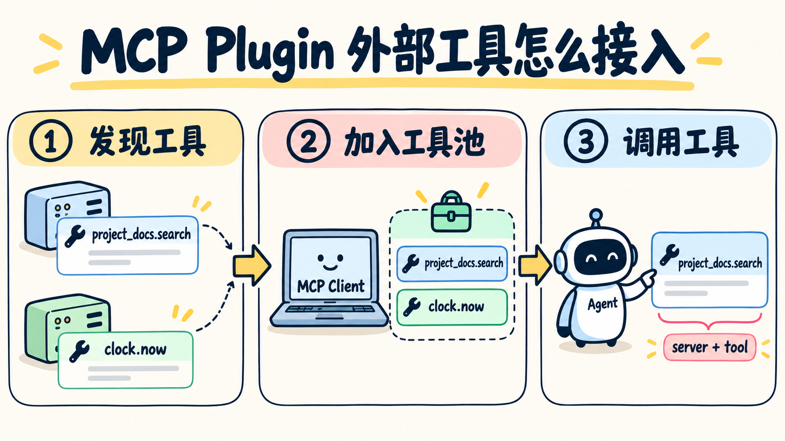

# 第 14 章：MCP 工具接入——让 Agent 复用外部能力



> **一句话总结：MCP 约定应用怎样连接外部能力；模型发起调用，Host 和 Client 负责把请求安全地送到 Server。**

MCP 是一套互操作协议，不是 Agent 框架，也不是某个模型的插件商店。它约定不同应用如何交换上下文和调用能力。

## 先分清三个角色

| 角色 | 在 Agent 应用里的位置 | 做什么 |
| --- | --- | --- |
| Host | 你的 Agent 应用 | 管理模型对话、用户同意和应用策略 |
| Client | Host 里的 MCP 连接器 | 按协议连接 Server、发现能力并转发请求 |
| Server | 提供能力的服务 | 暴露 Tools、Resources 或 Prompts |

一条常见的工具调用路径是：Client 取得工具清单，Host 把名称和参数结构交给模型；模型选择工具后，Host 检查这次请求，再让 Client 调用对应 Server。模型不会自己建立 MCP 连接，也不会直接向 Server 发送 JSON-RPC。

MCP 标准化了消息和能力接口，底层消息使用 JSON-RPC 2.0。`tools/list` 用于获取工具定义，`tools/call` 用于请求执行；Resources 用来提供上下文，Prompts 用来提供可复用提示。把多个 Server 的同名工具整理成 `server + tool`，是本例客户端注册表采用的命名方式，便于避免本地工具冲突。连接和传输细节随协议版本演进，接入时要核对所用 MCP SDK 与 Server 支持的版本。

## 看代码时要认清演示边界

本章的 [`code.py`](./code.py) **没有实现 MCP 协议**：它没有 MCP SDK、传输连接、协议协商或 OAuth。代码里的静态 `REGISTRY` 和两个 Python 函数只是模拟已连接的 Server；`list_mcp_tools` 与 `call_mcp_tool` 展示客户端如何发现、路由和回传结果。面试时应称它为“客户端接入流程的简化示意”，不要说成真实 MCP Client。

工具清单描述了 Server 声称能做什么，不等于用户已同意，也不等于调用已获授权。MCP 规范要求 Host 在工具调用前取得用户明确同意，并为远程 HTTP 场景定义授权机制。Host 和 Server 还要落实各自的权限策略，例如哪些用户能用哪些工具、参数能访问哪些数据。工具描述和风险提示来自 Server，不能单独当作权限判断。本示例只模拟本地只读搜索和时间查询，没有实现 MCP 要求的同意流程或生产级授权。

## 什么时候值得接入？

- 多个 Agent 应用需要复用同一项外部服务时，统一协议能减少每个应用各写一套连接器。
- 只有一个简单的本地函数时，直接注册普通工具更省事。
- 接入成本包括 Server 生命周期、版本兼容、认证、权限、超时和错误处理；外部工具的结果也要当作不可信输入处理。

## 运行示例

```bash
uv run python chapters/14-mcp-plugin/code.py
```

可以输入：

```text
先发现可用的工具，再搜索项目里关于 assets 的说明。
```

本例会把 Server 和工具的名称、参数结构一起放进清单。模型可先调用 `list_mcp_tools`，再将清单里的 `server`、`tool` 和参数交给 `call_mcp_tool`。客户端只路由到预先登记的本地处理函数，不接受模型提供的任意 URL 或 Shell 命令。

## 面试时检查调用链

如果清单中出现 `delete_file`，模型发出调用后，执行前还要经过什么？想想用户同意、Server 身份、当前用户权限、参数范围和失败处理分别由哪一层负责。

<details>
<summary>参考思路</summary>

Host 应先取得用户对工具调用的明确同意，再按应用策略检查用户和参数；Client 负责把请求发给正确的 Server；Server 仍需验证身份、授权和参数。工具出现在清单里，只能说明它被发现了，不代表这些检查已经通过。

</details>

## 参考

- [MCP 官方规范](https://modelcontextprotocol.io/specification/2026-07-28)
- [learn-claude-code：s14 MCP Plugin](https://github.com/shareAI-lab/learn-claude-code/tree/main/s14_mcp_plugin)
- [上游中文说明](https://raw.githubusercontent.com/shareAI-lab/learn-claude-code/main/s14_mcp_plugin/README.zh.md)
