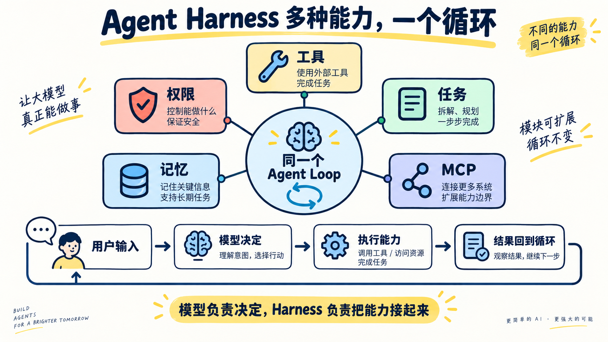

# 第 15 章：Agent Harness —— 多种能力，一个循环



> **一句话总结：Harness 不是替模型思考，而是把工具、权限、记忆、任务和 MCP 组织成一个可运行的环境。**

前面的章节分别讲了很多零件。本章把它们放回同一辆车里：模型负责决定，Harness 负责提供能力、边界和结果。

## 先看图

- 中间只有一个 Agent Loop；
- 工具、权限、记忆、任务和 MCP 都接到这个循环上；
- 每次工具调用前后，都可以经过权限和 hooks；
- 工具结果回到循环，模型再决定下一步。

可以把它想成驾驶：模型是司机，Harness 是车、道路、仪表盘和安全带。司机再聪明，没有方向盘和刹车也无法安全到达目的地。

## 这章新增了什么？

不新增一种孤立能力，而是新增一个 `Harness` 对象，集中管理：

```text
Harness
├── 工具池：当前能做什么
├── 权限：哪些调用可以执行
├── 记忆：已经知道什么
├── 任务：接下来还要做什么
└── MCP：外部能力是否已连接
```

关键点是：**工具增加了，主循环不需要复制一份；上下文变了，模型仍然通过同一个入口工作。**

## 用 DeepSeek 跑起来

完整代码在 [`code.py`](./code.py)。关键的分工是：

```python
messages[0]["content"] = harness.system_prompt()
tools = harness.tool_schemas()
response = client.chat.completions.create(..., tools=tools)

# 模型只提出调用，Harness 负责检查并执行
result = harness.dispatch(tool_name, arguments)
```

本例里的工具是安全的教学工具：读取几份项目文档、保存短记忆、创建内存任务，以及连接一个本地模拟 MCP Server。它没有默认执行任意 Shell 命令。

运行：

```bash
python chapters/15-integrated-harness/code.py
```

可以输入：

```text
连接项目文档 MCP，搜索 assets，并记住图片统一放在哪里。
```

## 什么时候需要 Harness？

- 适合：工具、权限、记忆和长任务已经变多，需要统一管理；
- 不适合：只有一次普通问答，直接调用模型更简单；
- 代价：运行底座越强，权限、状态、错误恢复和可观测性也越需要认真设计。

## 今天只记住

> **模型提供判断，Harness 提供它能够安全行动的世界。**

## 想一想

如果新增一个“删除文件”的工具，应该只注册函数就结束吗？还需要在哪个 Harness 层加入确认和权限？

## 参考

- [learn-claude-code：s15 Integrated Harness](https://github.com/shareAI-lab/learn-claude-code/tree/main/s15_integrated_harness)
- [上游中文说明](https://raw.githubusercontent.com/shareAI-lab/learn-claude-code/main/s15_integrated_harness/README.zh.md)
