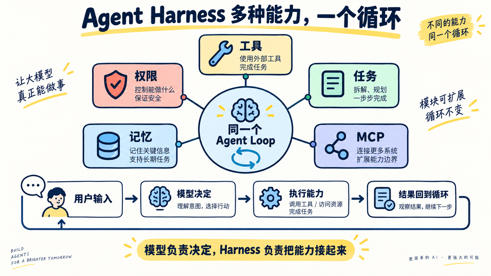

# 第 15 章：Agent Harness —— 能力接入同一个运行循环



> **Agent Loop 决定一轮轮怎么走；Harness 负责为每一轮准备能力、执行请求并把结果交还给模型。**

Harness（Agent 的运行环境）不是某个固定类名，而是一组运行时职责：组织上下文和工具清单，检查模型提出的调用，执行本地或外部能力，并维护任务状态。小例子可以把它们放进一个对象；实际项目也可以拆到不同模块。

## 一次工具调用经过哪些边界？

以“搜索项目文档并记住结果”为例：

1. Harness 根据当前状态构造 system prompt 和工具清单；
2. 模型返回普通回答，或提出一个/多个工具调用；
3. Harness 检查调用是否属于本轮提供的工具，再执行对应处理函数；
4. 工具结果作为 `tool` 消息回到同一个循环，模型据此继续或结束。

关键边界是：模型能提出调用，不代表调用已经获准或执行。工具注册、连接 MCP、路径限制和状态维护都由程序负责。

## 看代码时关注这三处

完整例子在 [`code.py`](./code.py)。

```python
turn_tools = harness.tool_schemas()
offered_tool_names = {tool["function"]["name"] for tool in turn_tools}
response = client.chat.completions.create(..., tools=turn_tools)

# 只接受模型这一轮实际看到的工具；新接入的 MCP 工具要等下一轮
result = harness.dispatch(tool_name, arguments, offered_tool_names)
```

`connect_mcp` 会改变 Harness 状态，因此下一轮才会把 MCP 工具放进清单。`read_file` 只允许读取仓库中的三份文档。记忆和任务保存在当前进程里，示例不提供持久化。

运行：

```bash
uv run python chapters/15-integrated-harness/code.py
```

试着输入：

```text
连接项目文档 MCP，搜索 assets，并记住图片统一放在哪里。
```

## 示例边界和工程取舍

这个 Harness 只演示职责怎样接在一起。它没有用户身份隔离、人工审批、可靠队列、数据库或完整审计；`before_tool` 只检查本轮工具清单和 MCP 连接状态，不能替代真正的授权策略。若加入写文件或 Shell 一类高风险能力，还要把工作区限制、命令校验、确认和失败处理放到实际执行边界。

上下文也有边界：示例只保留初始请求、最近几次完整工具交互，以及 Harness 中单独存放的记忆和任务。被裁掉的旧工具结果不会自动变成可靠摘要；后续步骤需要引用时，应把关键结果写入明确的状态，或采用有预算和校验的摘要机制。

面试中可以从职责追问：工具清单在哪构造？调用在哪授权？副作用在哪里发生？出错和超时如何回到循环？不要只回答“我写了一个 Harness 类”。

## 设计检查：刚连接的工具能否在同一轮调用？

模型本轮收到的工具清单里没有 `mcp__project_docs__search`，却在同一条回复里提出先连接 Server、再搜索。Harness 应该直接执行搜索吗？

<details>
<summary>参考思路</summary>

不应执行。Harness 要按本轮发给模型的工具清单校验调用；连接操作只改变后续轮次的能力集合。这样工具发现和工具执行的边界明确，也避免程序状态在一批调用中途变化，意外扩大本轮权限。

</details>

## 参考

- [learn-claude-code：s15 Integrated Harness](https://github.com/shareAI-lab/learn-claude-code/tree/main/s15_integrated_harness)
- [上游中文说明](https://raw.githubusercontent.com/shareAI-lab/learn-claude-code/main/s15_integrated_harness/README.zh.md)
