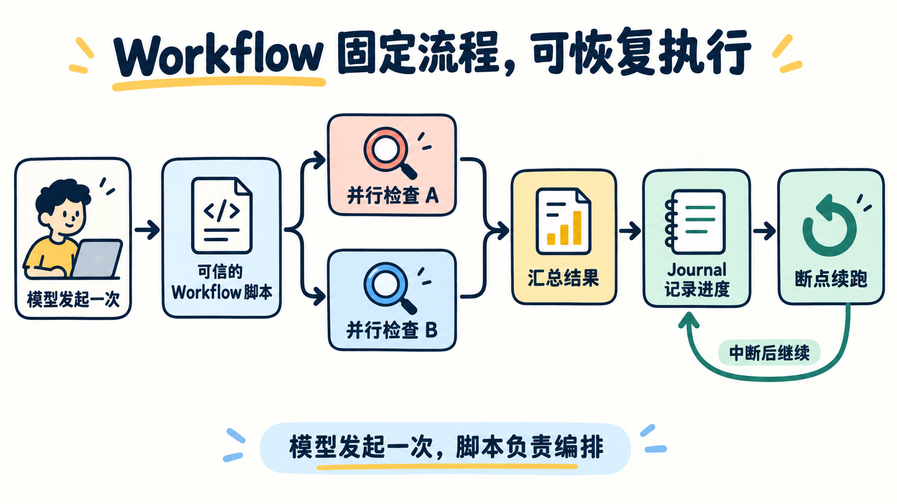

# 第 16 章：Workflow Runtime —— 固定流程，可恢复执行



> **一句话总结：当流程已经固定，就让代码负责编排，让模型负责每一步的判断和产出。**

Agent Loop 适合探索：模型看见结果后再决定下一步。但代码审查、资料汇总、发布检查这类任务，步骤通常提前就知道。

## 先看图

- 模型只需要发起一次 `run_workflow`；
- 可信的 Workflow 脚本负责安排并行检查和汇总；
- 每个步骤的结果写进 Journal；
- 中断后带着 `run_id` 继续，已完成的步骤不必重跑。

生活中的类比是快递分拣线：每个包裹都经过固定工位，某个工位停电后，恢复时从记录的工位继续，而不是把所有包裹重新扫描一遍。

## `parallel` 和普通工具调用有什么区别？

```text
一次 Workflow 调用
   ↓
并行检查 A ─┐
            ├─→ 汇总结果 → 写入 Journal
并行检查 B ─┘
```

这里的并行不是让模型随意发散，而是宿主提前写好的结构。模型可以改变每个步骤的回答，但不能把可信 Workflow 替换成任意代码。

## 用 DeepSeek 跑起来

完整代码在 [`code.py`](./code.py)。本章只暴露两个工具：

```python
list_workflows()
run_workflow("review_project", {"subject": "理解 Agent Harness"})
```

运行：

```bash
python chapters/16-workflow-runtime/code.py
```

可以输入：

```text
运行 review_project 工作流，分析这个项目如何帮助初学者理解 Agent。
```

输出里会有一个 `run_id`。如果运行中断，可以把它作为 `resume_from_run_id` 传回 `run_workflow`，Journal 会复用已完成步骤。

## 什么时候用 Workflow？

- 适合：步骤稳定、结果结构稳定、失败后需要恢复的任务；
- 不适合：每一步都必须根据现场发现临时改变的探索型任务；
- 代价：流程写死后，维护成本会转移到 Workflow 版本、参数校验和 Journal 兼容性上。

## 今天只记住

> **模型决定每一步做什么，Workflow 决定这些步骤怎样可靠地排队、并行和恢复。**

## 想一想

“写一个工作流”与“让模型自由使用工具”各有什么优点？哪些步骤值得固定，哪些步骤应该留给模型判断？

## 参考

- [learn-claude-code：s16 Workflow Runtime](https://github.com/shareAI-lab/learn-claude-code/tree/main/s16_workflow_runtime)
- [上游中文说明](https://raw.githubusercontent.com/shareAI-lab/learn-claude-code/main/s16_workflow_runtime/README.zh.md)
