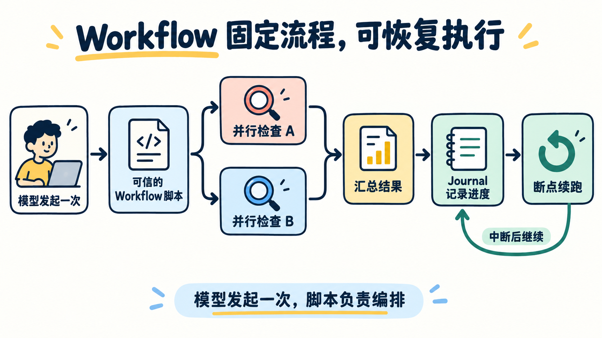

# 第 16 章：Workflow Runtime —— 固定流程，可恢复执行



> **步骤稳定时，把编排写进代码；把需要理解内容的判断留给模型。**

Agent Loop 适合边看结果边决定下一步。Workflow 适合代码审查、资料汇总等重复流程：宿主选择一段已注册的工作流代码，让它规定步骤、并行边界和汇总时机。

按[第 01 章](../01-agent-loop/)的说法，Workflow 不是另一种 Agent Loop：下一步由代码决定，模型只负责其中的步骤。

## 图里展示的是什么

- 主 Agent 通过一次 `run_workflow` 工具调用启动已注册的工作流。
- Python 同时发起两个互不依赖的模型调用；两者结束后再汇总。
- `Journal`（运行记录）保存每个步骤的结果；带着 `run_id` 重跑时，可跳过已经缓存的步骤。

代码中的 `ctx.agent()` 每次只发送一份分析提示，不是完整的子 Agent Loop：它没有工具，也不继承主 Agent 的对话历史。`ctx.parallel()` 是 Python 线程池并发调用并等待结果的屏障；这能减少等待时间，但不会自动让两个检查共享结论。

## 恢复时，哪些步骤会重跑？

工作流每次恢复都会从入口重新运行。`Journal` 只让同名且已完成的步骤返回旧结果；未完成的步骤会再调用模型。示例把原始参数保存在运行记录里，因此恢复时以已保存的参数为准。

缓存也有边界：步骤名相同不代表步骤内容永远相同。代码或提示词改变后，如果仍复用旧结果，汇总就可能混合新旧逻辑。本例给工作流登记了版本，版本不匹配时拒绝恢复；改动工作流语义时，维护者要提升版本。

如果一步已经产生外部副作用，但结果还没写入 Journal 时进程中断，恢复会再执行该步。Journal 不能保证“恰好执行一次”；发信、付款或写入外部系统还需要幂等键、去重或补偿机制。

本例用本地 JSON 记录和进程内锁演示续跑，不支持多进程同时恢复同一 `run_id`，也没有用户级授权或保留策略。它展示的是运行时思路，不是可直接上线的工作流服务。

## 跑一个固定工作流

完整代码在 [`code.py`](./code.py)，当前只注册了 `review_project`。Agent 不能提交任意 Python 代码，只能选择这个名称并传入参数。

在 `.env` 中填写 `DEEPSEEK_API_KEY`，然后运行：

```bash
uv run python chapters/16-workflow-runtime/code.py
```

输入“运行 review_project 工作流，分析这个项目如何帮助初学者理解 Agent”。终端会先打印 `run_id`，成功后工具结果也会带回它。若某一步报错或运行中断，可以用这个 ID 继续；已保存的参数和已完成步骤会从 Journal 读取。

## 面试时可以继续追问

哪一部分应固定在 Workflow 代码里，哪一部分应留给模型判断？

<details>
<summary>参考思路</summary>

步骤顺序、权限检查、并行边界、重试上限和输出校验通常应由程序明确控制；读懂代码含义、解释发现或生成摘要可以交给模型。固定流程更容易复现和恢复，代价是版本、缓存失效和副作用重放都要由宿主管理。

</details>

## 参考

- [learn-claude-code：s16 Workflow Runtime](https://github.com/shareAI-lab/learn-claude-code/tree/main/s16_workflow_runtime)
- [上游中文说明](https://raw.githubusercontent.com/shareAI-lab/learn-claude-code/main/s16_workflow_runtime/README.zh.md)（本项目实现更小，不包含上游运行时的全部能力。）
