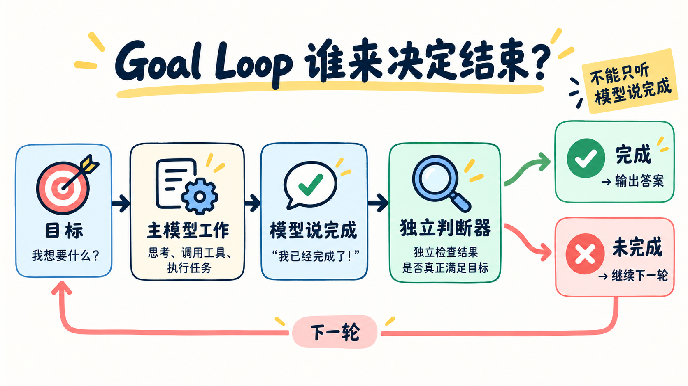

# 第 17 章：Goal Loop —— 谁来决定结束？



> **一句话总结：模型说“我完成了”只代表一轮想停，真正是否完成要由可检查的目标和独立判断器决定。**

**本章新增：** 在“模型不再调用工具”这个出口前，新增一道独立判断 `goal.evaluate()`。

普通 Agent 的退出条件通常是：模型不再调用工具，于是程序返回答案。

但“让测试全部通过”“找齐所有章节并给出证据”这类任务，模型可能只做了一半就认为完成。Goal Loop 在退出前再加一道检查。

## 先看图

- 先保存一个明确目标；
- 主模型工作，并调用工具获取证据；
- 主模型说“完成”后，独立判断器读取对话记录；
- 判断通过就输出答案，不通过就把原因送回同一个循环继续做。

判断器没有工具，也不替主模型执行任务。它只检查对话里有没有足够证据，所以主模型必须把关键结果写清楚。

## 好的目标长什么样？

```text
不够好：把登录功能弄好

更好：完成登录迁移，并让 pytest tests/auth 退出码为 0，
      同时不修改 tests/auth 之外的测试文件
```

一个好目标最好包含：最终状态、验证方式和不能破坏的限制。

## 用 DeepSeek 跑起来

完整代码在 [`code.py`](./code.py)。关键接入点很短：

```python
if not message.tool_calls:
    decision = goal.evaluate(messages)
    if not decision.ok:
        messages.append({"role": "user", "content": decision.reason})
        continue
    return answer
```

运行：

```bash
python chapters/17-goal-loop/code.py
```

可以输入：

```text
/goal 找出第 15、16、17 章，并总结它们各自解决的问题
```

也可以查看或清除当前目标：

```text
/goal
/goal clear
```

示例保留了两个出口：主循环最大轮数，以及连续阻止结束的次数上限。自动继续必须有出口，判断器失败时也不能假装任务完成。

## 什么时候用 Goal Loop？

- 适合：有明确验收条件、不能只靠模型自我判断的任务；
- 不适合：一次简单问答，增加判断调用只会增加成本和延迟；
- 代价：需要额外一次模型调用，而且完成条件写得越模糊，判断越不可靠。

## 今天只记住

> **“模型想停”不等于“目标已完成”；停止也需要证据。**

## 想一想

如果判断器只看对话记录、不能自己运行测试，那么主模型应该怎样把工具结果写进对话，才能让判断器做出可靠判断？

<details>
<summary>参考思路（先自己想一想，再展开）</summary>

把证据原样写出来，而不是只写结论。比如写“运行 `pytest tests/auth`，退出码 0，12 passed”，并附上关键输出，而不是只说“测试通过了”。判断器看不到外部世界，只能相信对话里的记录，证据越具体、越能核对，判断就越可靠。

</details>

## 参考

- [learn-claude-code：s17 Goal Loop](https://github.com/shareAI-lab/learn-claude-code/tree/main/s17_goal_loop)
- [上游中文说明](https://raw.githubusercontent.com/shareAI-lab/learn-claude-code/main/s17_goal_loop/README.zh.md)
