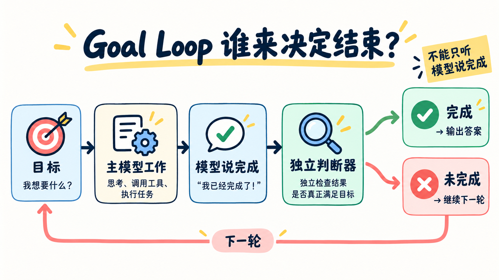

# 第 17 章：Goal Loop —— 谁来决定结束？



> **一句话总结：模型想停时，程序还要按明确的验收条件检查任务是否完成。**

普通 Agent 的退出条件通常是：模型不再调用工具，于是程序返回答案。

但“让测试全部通过”“找齐所有章节并给出证据”这类任务，模型可能只做了一半就认为完成。Goal Loop 在退出前再加一道检查。

## 先看图

- 先保存一个明确目标；
- 主模型工作，并调用工具获取证据；
- 主模型说“完成”后，独立判断器读取对话记录；
- 判断通过就输出答案，不通过就把原因送回同一个循环继续做。

判断器没有工具，也不替主模型执行任务。它只检查对话里有没有足够证据，所以主模型必须把关键结果写清楚。这里的“独立”指单独的一次判断调用；默认仍使用同一个模型配置，可用 `DEEPSEEK_GOAL_MODEL` 单独指定判断模型。

对退出码、文件是否存在、记录是否写入这类客观条件，应优先由程序直接验证；LLM 判断器更适合补充检查难以规则化的语义条件。只检查对话记录的判断器无法证明外部状态真实发生了变化，也可能被错误或伪造的工具输出误导。

## 好的目标长什么样？

```text
不够好：把项目介绍清楚

更好：读取第 15、16、17 章的 README，分别总结它们解决的问题，
      并用工具确认这三个 README 都存在
```

一个好目标最好包含：最终状态、验证方式和不能破坏的限制。

## 用 DeepSeek 跑起来

完整代码在 [`code.py`](./code.py)。关键接入点很短：

```python
if not message.tool_calls:
    decision = goal.evaluate(messages)
    if not decision.ok:
        messages.append({"role": "user", "content": decision.reason})
        continue
    return answer
```

运行：

```bash
uv run python chapters/17-goal-loop/code.py
```

Goal 只在这次任务运行期间有效，不会跨进程保存。可以用 `/goal` 加上验收条件启动：

```text
/goal 找出第 15、16、17 章，并总结它们各自解决的问题
```

不带验收条件的 `/goal` 会显示用法；清除目标的命令没有单独设置，因为每次运行只处理一个目标。示例限制主循环轮数和判断器最多调用次数。达到上限或判断器出错时，任务会标成“未验证”并交还给用户，不会当作已完成。自动继续必须有出口。

## 什么时候用 Goal Loop？

- 适合：有明确验收条件、不能只靠模型自我判断的任务；
- 不适合：一次简单问答，增加判断调用只会增加成本和延迟；
- 代价：需要额外一次模型调用，而且完成条件写得越模糊，判断越不可靠。

## 验收题：判断器能证明什么？

如果判断器只看对话记录、不能自己运行测试，它能否证明外部状态真实发生了变化？主模型应该怎样记录工具调用和返回结果，才能让判断器尽量可靠地判断？

<details>
<summary>参考思路（先自己想一想，再展开）</summary>

它不能独立证明外部状态；它只能核对对话里记录的证据。应保留工具名称、参数和原始返回结果。比如确认文件存在，应由工具实际检查并把结果写回对话，而不是只让主模型说“文件存在”。测试结果、权限等客观条件也应由程序直接验证。

</details>

## 参考

- [learn-claude-code：s17 Goal Loop](https://github.com/shareAI-lab/learn-claude-code/tree/main/s17_goal_loop)
- [上游中文说明](https://raw.githubusercontent.com/shareAI-lab/learn-claude-code/main/s17_goal_loop/README.zh.md)
