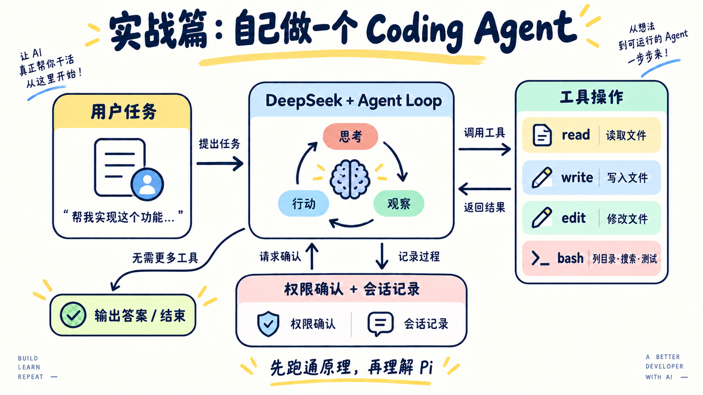

# 实战篇 01：Coding Agent 搭建

> **一句话总结：Coding Agent 不神秘，就是「模型循环 + 一组工具 + 一个安全的工作区」，再把每一步摆到浏览器里给你看。**

理论篇已经把 Agent 的零件拆开了。现在把它们装起来，做一个能读项目、搜代码、改文件、跑命令的 Coding Agent，并且给它一个网页界面：模型请求了什么工具、参数是什么、返回了什么、哪一步需要你点头，全都看得见。

## 先看图



看图时抓住三件事：

- 你的任务进来，模型决定下一步做什么；
- 想动手就得调用 `read / write / edit / bash`，工具由程序执行，不是模型自己执行；
- 会改动工作区的那一步会停下来，等你在网页上点「允许」或「拒绝」。

这是本项目的 Python 教学实现，不是 Pi 的内部架构图。它借鉴了 Pi 的核心取舍：模型提出下一步，Harness 负责执行；工具保持少量，列目录、搜索、检查这些都交给 `bash`。

## 能做什么

只有 4 个工具：

| 工具 | 作用 | 要不要授权 |
|---|---|---|
| `read` | 读取文本文件（带行号） | 否 |
| `write` | 创建或覆盖文件 | 是 |
| `edit` | 把一段唯一的旧文本换成新文本 | 是 |
| `bash` | 列目录、搜索、查看 Git 状态、跑检查 | 看命令 |

把「列文件」「搜索文本」「跑测试」各做成一个工具当然行，但工具一多，模型要记的接口也变多。这里借鉴 Pi：通用命令收进 `bash`，只保留最稳定的三个文件接口。

### bash 什么时候自动执行

规则只有一句话：

> **单条命令 + 不含 shell 操作符（`|` `>` `<` `;` `&` 反引号 `$(`）+ 首词在只读白名单里 → 自动执行；其余一律弹窗授权。**

白名单是 `ls / pwd / cat / head / tail / wc / file / tree / grep / rg`，外加 `git status`、`git diff`、`git log`、`git branch` 这几个两词前缀。

所以 `ls -la` 直接跑，`git status` 直接跑，而 `git commit`、`rm x`、`cat a > b`、`python3 script.py` 都会停下来问你。规则简单的好处是：你一眼能看完，也就不容易被花式写法绕过去。

另外，命令里出现 `.env`、`.git/`、`.ssh`、`/etc/`、`sudo` 会被直接拦掉，连授权框都不弹。

这不是完整沙箱。`bash` 仍然以你的用户权限运行，只在你信任的工作区里玩。

## 跑起来

先在项目根目录的 `.env` 里准备好：

```env
DEEPSEEK_API_KEY=你的_api_key
DEEPSEEK_BASE_URL=https://api.deepseek.com
# DeepSeek-V4.1-Flash 在 API 中的模型名是 deepseek-flash
DEEPSEEK_MODEL=deepseek-flash
```

然后启动：

```bash
uv run python labs/01-mini-coding-agent/server.py
```

打开 <http://127.0.0.1:8765>，直接在输入框里说话。

默认工作区是本项目根目录。想让它只在某个目录里活动：

```bash
uv run python labs/01-mini-coding-agent/server.py --workspace ~/some-project
```

<details>
<summary>界面怎么用（选读）</summary>

界面参考了 Claude Code 的样子：模型的回复按 Markdown 渲染，边生成边显示；每次工具调用默认折叠成两行，例如：

```text
● Bash  ls labs
  ⎿ exit 0 · 3 行输出
```

圆点颜色表示状态：灰色闪烁是正在执行，绿色是成功，红色是出错或被拒绝，黄色是等你决定。工具名标签的颜色和上面配图里的工具卡片一致：`read` 黄、`write` 蓝、`edit` 绿、`bash` 粉。

点开一行能看到详情：`bash` 显示命令，`read` 显示带行号、按文件类型高亮的内容，`write` 显示将要写入的代码，`edit` 显示红绿 diff。最下面的「原始 JSON」是模型实际发出的参数原文——这才是 tool call 在协议层的样子。

需要授权的步骤会自动展开，授权按钮就在内容下面，你看清了再决定，决定完它会自己收起来。如果那一行滚出了屏幕，底部会浮出提示；切到别的标签页，标签标题会变成「等你决定」——Agent 此刻正阻塞着等你。

几个顺手的操作：

- 按 `Y` 允许、`N` 拒绝，不用去找按钮；
- 任务跑偏了，点「停止」或者按 `Esc`；
- 代码和命令输出都有「复制」按钮，复制 `read` 的结果时会自动去掉行号；
- 「新对话」只清空上下文，已经改动的文件不会回滚。

</details>

网页只负责看和点。真正的路径检查、命令判断、权限判断都在 Python 里；关掉网页或者拒绝授权，模型没有别的路可以绕过去。

## 代码结构

三个 Python 文件，加上一个不需要构建的前端：

```text
agent.py           Agent 内核：工具定义、工作区边界、模型循环、扩展接口
server.py          网页界面：HTTP 接口 + SSE 事件流 + 授权开关 + 加载扩展
observability.py   可选追踪桥：Lab 06 加载时把已有事件接到 Phoenix
web/index.html     页面骨架
web/app.js         前端核心：连事件流、按事件更新页面、发送输入和授权
web/render.js      渲染：Markdown、代码高亮、工具摘要和详情视图
web/style.css      样式
```

Markdown 解析（marked）、HTML 清洗（DOMPurify）和代码高亮（highlight.js）从 CDN 加载。模型的输出不可信，渲染成 HTML 之前一定先过 DOMPurify。断网时这几个库加载不到，页面会退回纯文本显示。

`agent.py` 完全不知道浏览器的存在。它和界面只靠两个回调连接：

```python
CodingAgent(workspace, confirm=..., emit=...)
#   confirm(action) -> bool   需要授权时问用户
#   emit(event)     -> None   把每一步广播出去
```

想换成终端界面、换成 Slack Bot，只要换这两个回调，Agent 本身一行都不用改。

### 一个工具就是一个类

工具的三件事写在同一个类里：给模型看的说明书、要不要授权、真正干活的代码。

```python
class WriteTool(Tool):
    name = "write"
    description = "创建或整体覆盖一个文本文件。执行前会请求用户授权。"
    parameters = {"path": {"type": "string"}, "content": {"type": "string"}}
    required = ("path", "content")

    def confirm_prompt(self, workspace, path, content):
        # 返回一句话 = 这一步要授权；返回 None = 只读，直接做
        target = workspace.resolve(path)
        return f"写入文件 {workspace.label(target)}（{len(content)} 个字符）"

    def run(self, workspace, path, content):
        target = workspace.resolve(path)
        target.write_text(content, encoding="utf-8")
        return f"已写入 {workspace.label(target)}。"
```

新增一个工具，就是再写一个子类，然后加进 `TOOLS`。不用改 Agent Loop，也不用在三个地方各登记一次。

### 循环长什么样

```python
for _ in range(MAX_TURNS):
    message = self._ask_model()
    self.messages.append(message)
    if message["content"]:
        self.emit({"type": "assistant_message", "content": message["content"]})
    if not message.get("tool_calls"):   # 模型不要工具了，任务结束
        return
    for call in message["tool_calls"]:
        self._handle_tool_call(call)
```

就这么点东西。循环的出口只有一个：模型这一轮没有请求工具。（挂了扩展以后，扩展可以在这个出口前再插一句话，见下面“怎么加能力”。）

### 为什么要流式

`_ask_model()` 请求时带了 `stream=True`。不开的话，模型要把整段话生成完才返回，写一个大文件时，你可能对着空白等十几秒。

开了流式以后，模型每吐出一小段文字，就发一个 `assistant_delta` 事件，页面马上接着显示。tool call 也是分片到的：同一个 `index` 的 id、名字、参数片段要自己拼起来，拼完才是一个完整的调用。

流式只改变「你什么时候看到」，不改变循环本身：拼好的消息照样进 `messages`，工具照样等参数完整了才执行。

### 授权是怎么从浏览器传回来的

Agent 跑在后台线程。它调 `confirm(...)` 时，`PermissionGate` 做三件事：发一个 `permission_request` 事件到页面、阻塞等待、被 `/api/permission` 唤醒后返回 `True` 或 `False`。超过 5 分钟没人理，默认当作拒绝——宁可不做，也不要背着你动文件。

停止也走同一条路：`/api/stop` 让 `CodingAgent` 立一个停止标记，同时把还在等的授权请求当作拒绝。Agent 只在安全的地方检查这个标记：收流的间隙、每个工具执行之前。正在跑的那条 bash 命令不会被打断，但它之后的步骤都不会再执行。

页面这边用 SSE 收事件。每条事件都有编号，所以刷新页面或者断线重连，带上上次的编号就能接着读，不丢也不重。

## 怎么加能力：Extension

后面几个实战都不改这个文件的循环，而是写一个 `Extension` 子类挂上来。它只有三个挂载点：

```python
class Extension:
    tools = ()                            # 多给模型几个工具
    def system_prompt(self, workspace):   # 往 system prompt 里补一段话
        return ""
    def on_stop(self, agent):             # 模型想结束时插一句话；返回文字，循环就继续
        return None
```

每个实战目录里放一个 `extension.py`，提供 `create(workspace)`。想看哪个实战，一条命令启动：

```bash
uv run python labs/01-mini-coding-agent/server.py --lab 05
```

`--lab 05` 会挂上 `labs/05-verify/` 的扩展。如果那个实战在 `DEMO` 里写了自带的练习目录，工作区也会自动切过去；页面空白时显示它在 `SAMPLES` 里写的示例任务。

想自由组合，就用 `--ext`，可以写多次，按目录名后半截匹配（`--ext memory` 找 `labs/NN-memory/`）：

```bash
uv run python labs/01-mini-coding-agent/server.py --lab 05 --ext subagent
```

| 实战 | 扩展 | 新增能力 | 对应理论篇 |
|---|---|---|---|
| [02 · 项目记忆](../02-memory/) | `memory` | `system_prompt` | 07 Skill Loading、09 Memory |
| [03 · 子 Agent 任务委派](../03-subagent/) | `subagent` | `tools` | 06 Subagents |
| [04 · MCP 工具接入](../04-mcp/) | `mcp` | `tools`、`system_prompt` | 14 MCP、03 Permission |
| [05 · 代码自动验收](../05-verify/) | `verify` | `system_prompt`、`on_stop` | 17 Goal Loop、04 Hooks |
| [06 · Agent 可观测性](../06-observability/) | `observability` | 复用现有事件流接入 Phoenix，不增加 Extension 挂载点 | 01 Agent Loop、02 Tool Use、15 Agent Harness |
| [07 · 上下文管理](../07-context-management/) | `context` | 任务结束后压缩旧历史，保留当前任务 | 08 Context Compact、04 Hooks |
| [08 · Agent 效果评估](../08-evaluation/) | `evaluation` | 用固定案例和 on_stop 评分器标注行为；离线实验比较版本 | 01 Agent Loop、15 Agent Harness |

挂载点刻意只有三个。权限不单独做挂载点，仍然由每个工具自己的 `confirm_prompt` 决定。扩展加进来的工具，走的也是 `_execute()` 这个唯一入口和同一套授权。

## 对应理论篇

| 理论篇 | 实战代码 |
|---|---|
| Agent Loop | `CodingAgent.run()` |
| Tool Use | `Tool` 基类和它的四个子类 |
| Permission | `Workspace.resolve()`、`Tool.confirm_prompt()`、`PermissionGate` |
| Hooks | `Extension` 的三个挂载点。`on_stop` 就是第 04 章的 `Stop` 节点 |
| Harness | `CodingAgent + Workspace + AgentSession` |

上下文只是 `CodingAgent.messages` 这个列表；Lab 01 基线不做压缩。Lab 07 展示如何在任务结束后整理旧历史，不修改这个循环。

最值得注意的一点：模型从头到尾没有直接读过文件，也没有直接执行过命令。它只能提出 Tool Call，真正动手的是 `Tool.run()`，而动手之前还要过 `Workspace` 和授权这两关。

## 上下文只在内存里

这个例子没有把会话存到磁盘。点「清空上下文」或者重启服务，对话就没了，但工作区里已经改过的文件不会回滚——这两件事是分开的。

如果你想加持久化，可以在 `CodingAgent` 里把每条 message 追加写进一个 JSONL 文件，启动时再读回来。这是个不错的练手题。

## 和 Pi 的关系

这里没有复制 Pi 的代码，而是用 Python 重现它背后的几个想法：

1. 核心循环尽量简单；
2. 工具少而稳，通用能力收进 `bash`；
3. 工具通过统一接口注册和执行；
4. 加能力靠加工具，而不是改 Agent Loop。

注意区分：Pi 默认并不以权限弹窗为核心。本项目的授权确认、工作区限制是教学需要额外加的 Harness 层。

扩展阅读：

- [Pi 官方文档](https://pi.dev/docs/latest)
- [Pi Agent Harness](https://github.com/earendil-works/pi)
- [Pi Extensions](https://github.com/earendil-works/pi/blob/main/packages/coding-agent/docs/extensions.md)

## 今天只记住

> **Coding Agent = 模型决定 + 程序执行 + 边界检查 + 你点头。**

## 想一想

如果要加一个 `delete_file` 工具，你会把授权写在哪里？如果只在 system prompt 里写「删文件前要先问用户」，而不写进程序，会有什么风险？

<details>
<summary>参考思路（先自己想一想，再展开）</summary>

授权写在 `DeleteTool.confirm_prompt()` 里：返回一句“删除文件 xxx”，`_execute()` 就会先弹窗，拿到允许才调用 `run()`。路径检查照样交给 `Workspace.resolve()`。

只写在 system prompt 里，等于把安全交给模型的自觉。模型可能忘记、可能被文件里的内容误导，也可能觉得“这个文件显然没用”就直接删了。程序里的检查不会被说服。

</details>
