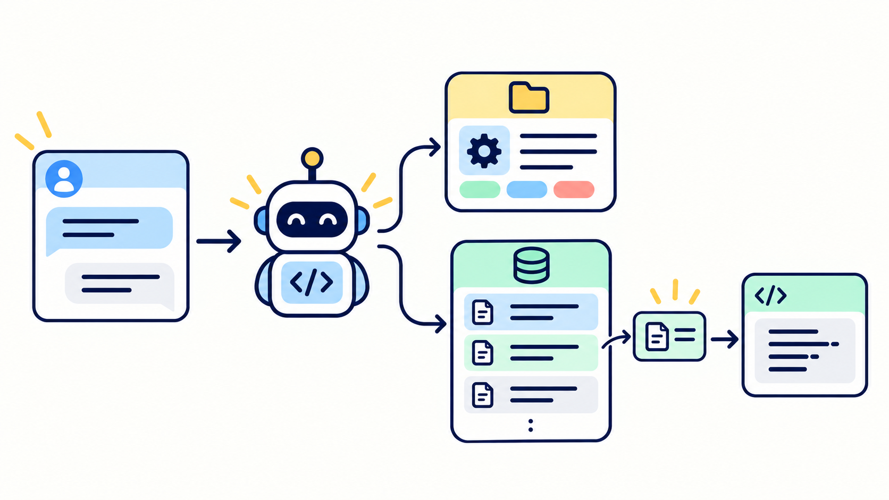

# 实战篇 02：长期记忆



> **一句话总结：当前对话保存短期状态；项目规则跨会话常驻，过去的经验按任务召回。**

**本实战新增：** 一个项目级记忆层，分开保存常驻规则和按需读取的历史经验。

对应理论篇：[第 09 章 Memory](../../chapters/09-memory/)。

## 两种状态，两种保存方式

```text
同一个对话
CodingAgent.messages 保存当前消息、工具结果和任务进度
        ↓
点“新对话”后，这些短期状态清空

开始新对话
.agent/MEMORY.md       → 精简的项目规则，每次带入
.agent/memories/*.md  → 经验目录，相关时再读取正文
```

本实战沿用 Lab 01 的对话状态，没有新增 Session 数据库。长期记忆写在工作区的 `.agent/` 目录，Agent 清空对话或服务重启后，文件仍然存在。

## 跑起来

```bash
uv run python labs/01-mini-coding-agent/server.py --lab 02
```

按顺序操作：

1. 问“`stats.py` 里的 `median()` 为什么要检查偶数个数字？”观察 Agent 是否根据经验目录读取 `stats-median.md`，再检查当前代码。
2. 在同一对话里追问刚才讨论过的内容。这时答案可以来自短期对话历史。
3. 点“新对话”，再问“这个项目的 `median()` 以前发现过什么问题？”短期历史已经清空；相关经验仍可从长期记忆召回。
4. 说“记住：统计函数收到空列表时，要给出清楚的错误。”授权写入后点“新对话”，再问项目对空列表的约定。新规则会从常驻记忆中带入。

也可以看一次代码任务：让 Agent 修复 `median()` 的偶数项问题。记忆提供排查线索，当前 `stats.py` 才能确认问题是否仍存在。

记忆文件会写入本实战的 `demo/.agent/`。恢复 `labs/02-memory/demo` 下的示例文件即可重新开始。

## 记忆怎样进入 Agent

扩展在新对话开始时读取 `MEMORY.md`，并把经验文件的名称、类型、范围和简介组成目录。模型判断某条经验与任务相关后，再调用已有的 `read` 工具读取正文。

| 位置 | 保存内容 | 读取方式 |
| --- | --- | --- |
| `.agent/MEMORY.md` | 每次任务都可能用到的项目规则 | 新对话时全文带入，长度设上限 |
| `.agent/memories/*.md` | 某次故障、决定或解决办法 | 先看目录，相关时再读一条正文 |

记录正文应写清来源，并提醒 Agent 在当前代码中复核。用户当前的要求优先；涉及写入的操作仍走 Lab 01 的授权弹窗。

## 这个原型的边界

- 经验条目少时，模型可以从简介目录里选文件；条目很多时，需要向量或混合检索、排序和召回预算。
- 示例按项目目录隔离，不实现个人、团队和跨仓库的记忆服务。
- 不做自动归纳、冲突合并和后台清理。大规模系统还要记录来源、时间、有效状态，并提供检查和删除路径。
- 记忆是辅助线索，必须核对当前文件、测试结果和用户要求。

## 今天只记住

> **短期记忆让当前任务接得上；长期记忆让新任务用得上过去的经验。**

## 想一想

如果记忆说 `median()` 的偶数项问题已经修好，而当前文件里仍是旧实现，Agent 应该如何处理？

<details>
<summary>参考思路（先自己想一想，再展开）</summary>

先检查当前文件和测试。记忆负责提供线索，不能代替当前证据；如果两者不一致，应标记旧记忆过期或补充新的修复记录。

</details>
