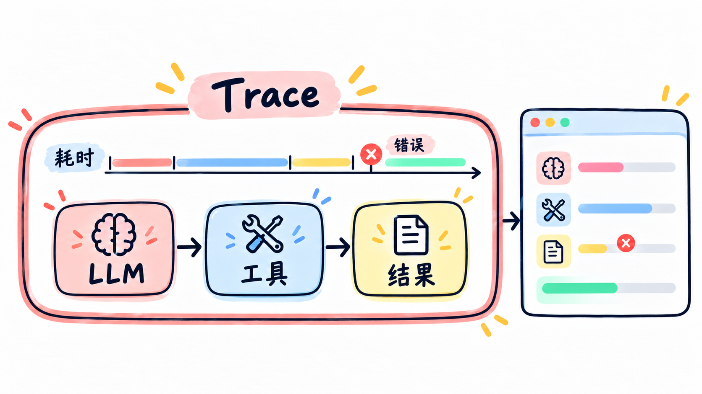
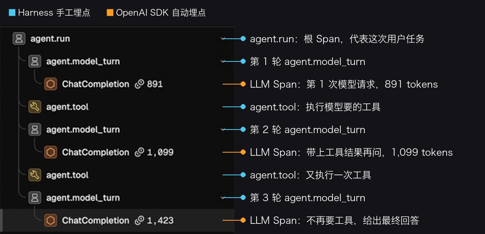
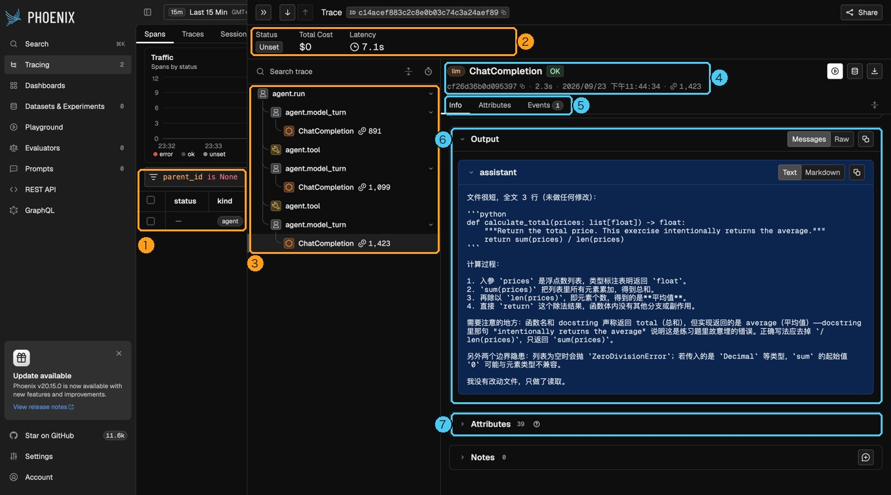
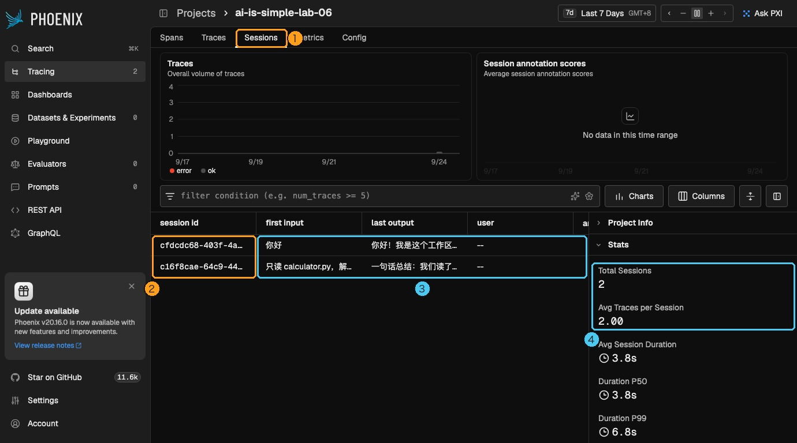
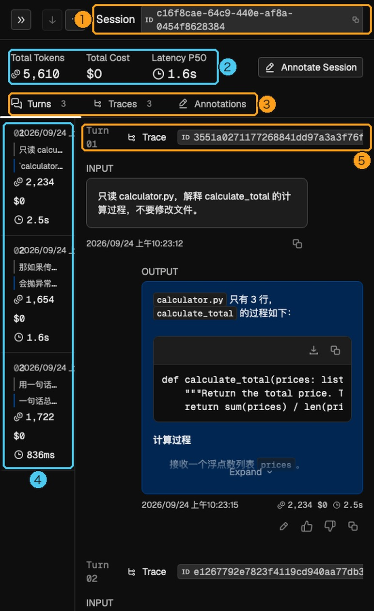

# 实战篇 06：把 Agent 的每一步记下来，出错时方便排查

> **一句话总结：本实战把一次用户提问记为一条 Trace，把模型请求和工具执行记为其中的 Span；沿着 Span 树看，就能找到 Agent 做过什么、哪里变慢或失败。**

**本实战新增：** 给 Lab 01 接入 Phoenix（收集和查看 Agent 运行记录的工具）。OpenAI SDK（Python 客户端）自动记录模型请求；Harness（负责检查权限并运行工具的程序）补上任务和工具记录。Agent Loop 不变。

## 先看图

- **Project（项目）**：同一个应用的 Trace 放在一起。
- **Session（会话）**：把同一段对话里的多条 Trace 关联起来。
- **Trace（轨迹）**：本实战中，用户提交一次问题就产生一条 Trace。
- **Span（片段）**：记录 Trace 里的一个步骤，例如一次模型请求或一次工具执行。
- **父子关系**：大步骤可以包含小步骤；没有父 Span 的根 Span 代表整条 Trace。

本页说的“模型回合”指一次模型请求。一条 Trace 里可能有多次模型回合和工具调用；对话里的下一条用户提问则会产生另一条 Trace。

## 看一条 Trace

下面这条记录来自示例任务：

> 只读 calculator.py，解释 calculate_total 的计算过程，不要修改文件。

左侧的树展示了这次任务经过的步骤。蓝色是 Agent 手工记录的 Span，橙色是 OpenAI SDK 集成自动记录的模型请求。

按顺序读这棵树：

~~~text
agent.run                           ← 一次用户提问，根 Span
├─ agent.model_turn  #1
│  └─ ChatCompletion  891 tokens    ← 第一次模型请求，模型要求调用工具
├─ agent.tool                       ← Harness 执行工具
├─ agent.model_turn  #2
│  └─ ChatCompletion  1,099 tokens  ← 模型看过工具结果，再次要求调用工具
├─ agent.tool                       ← Harness 执行第二个工具
└─ agent.model_turn  #3
   └─ ChatCompletion  1,423 tokens  ← 模型直接回答，任务结束
~~~

`agent.run` 包住整次任务。`agent.model_turn` 标出 Agent 正在进行第几次模型请求；`ChatCompletion` 记录 SDK 发出的请求。模型给出工具调用后，这个模型回合就结束，Harness 随后执行工具，所以 `agent.tool` 和 `agent.model_turn` 是同级 Span。

图里的 token（模型处理文本的计量单位）数是一次运行的结果。后续请求会带上之前的对话和工具结果，因此输入 token 可能逐轮增加；每次运行的数字会不同。

## 用 Trace 定位问题

选中一个 Span，右侧会显示它的详情：

排查时先看这三项：

| 想知道什么 | 看哪里 | 例子 |
| --- | --- | --- |
| Agent 做过什么 | Span 树，以及 `tool.name`、`input.value`、`output.value` | 哪个工具被调用、收到什么参数、返回了什么 |
| 哪一步最慢 | Trace 总耗时和各 Span 的 Duration（耗时） | 模型请求慢，还是工具执行慢 |
| 哪一步失败 | 标红的 Span、Status（状态）和错误输出 | 具体是哪次工具调用报错 |

模型的 Input / Output 可以在 `Info` 标签页查看；模型名、token 数和工具结果等原始字段在 `Attributes`（属性）里。

`agent.tool` 的计时从模型提出工具调用时开始，包含等待网页授权的时间。工具 Span 很长时，先检查是否花时间等人确认。

为什么根 Span 有时显示 Unset？

Span 状态有 `Unset`（未设置）、`OK`（成功）和 `Error`（出错）。本实战会把异常记在出错的工具 Span 上；工具失败时，根 Span 不会自动变成 `Error`。因此要沿着树检查子 Span，不能只看根 Span 的状态。

## 多轮对话：Session 把 Trace 串起来

一段对话可以持续很久，但一次用户提问到 Agent 回答有明确的开始和结束。因此，本实战为每次提问创建一条 Trace，再用同一个 Session ID 关联这些 Trace。这样可以单独查看某一轮，也能回顾整段对话。

网页后端在对话开始时生成会话编号；点“重置”后会生成新的编号：

~~~python
with self.observer.agent_run(prompt, session_id=self.conversation_id):
    self.agent.run(prompt)
~~~

`agent_run()` 会把同一个 `session.id` 写入根 Span，并传给里面自动记录的模型 Span。

下面的列表里，每行是一段对话。重置前后的问题属于两个 Session：

打开一个 Session，可以看到它包含的 Trace，也就是一轮轮用户提问：

同一 Session 后续的模型请求会带上前面的对话，所以输入 token 往往会增加。重置后上下文清空，新问题会进入新的 Session。

## 模型请求怎么自动记录，工具怎么补上

启动时，`register(auto_instrument=True)` 会为 OpenAI SDK 的请求安装追踪集成。DeepSeek 提供 OpenAI 兼容接口，因此这里可以自动记录 `ChatCompletion` 的输入、输出、模型名和耗时。

~~~python
provider = register(
    project_name="ai-is-simple-lab-06",
    auto_instrument=True,
    batch=False,
)
~~~

注册要在创建 Agent 的 OpenAI 客户端之前完成。SDK 只知道模型请求，不知道 Agent 任务何时开始，也看不到 Python 函数怎样执行工具；Harness 会利用已有事件补上 `agent.run`、`agent.model_turn` 和 `agent.tool`。

`agent.run` 从 Agent 开始处理用户请求时持续到最终回答。记录代码收到 `tool_call`（模型请求使用工具）时打开 `agent.tool`，收到 `tool_result` 时记录输出并关闭它。`agent.model_turn` 标记模型回合；`ChatCompletion` 记录实际的 SDK 请求。

手工 Span 优先记录任务入口、工具执行、外部服务调用和授权等待；这些步骤出问题时，通常需要单独查看耗时或输入输出。这段记录代码不负责路径限制或权限判断；工具能否执行，仍由 Lab 01 的 Harness 决定。

## 跑起来

先在项目根目录的 `.env` 中配置 DeepSeek Key，然后启动 Phoenix：

~~~bash
docker compose -f labs/06-observability/compose.yaml up -d
~~~

等 Phoenix 容器状态变为 `healthy` 后，打开 <http://127.0.0.1:6006>。首次启动需要准备数据库，可能要等一会儿。

安装观测依赖并启动 Lab 06：

~~~bash
uv sync --group observability
uv run --group observability python labs/01-mini-coding-agent/server.py --lab 06
~~~

打开 <http://127.0.0.1:8765>，运行页面提供的三个示例，再到 Phoenix 找到对应的 Trace：

1. **只读解释**：对照 Span 树，看一次任务里的模型请求和工具执行。
2. **定位并修复**：观察 `edit`、验证命令和授权等待分别记录在哪个 Span。
3. **故意失败**：找到标红的 `agent.tool`，查看错误输出；根 Span 仍可能是 `Unset`。

不点“重置”，连续追问几次，再去 Sessions 查看它们如何归在一起。完成后可用下面的命令停止 Phoenix；轨迹会保留在 Docker 数据卷中：

~~~bash
docker compose -f labs/06-observability/compose.yaml down
~~~

可选：修改端口或清空轨迹

本机的 6006 端口被占用时，可以换 Phoenix 页面端口和接收端口：

~~~bash
PHOENIX_UI_PORT=16007 PHOENIX_GRPC_PORT=14317 docker compose -f labs/06-observability/compose.yaml up -d
~~~

启动 Agent 时，把收集地址改成新的页面端口：

~~~bash
PHOENIX_COLLECTOR_ENDPOINT=http://127.0.0.1:16007 uv run --group observability python labs/01-mini-coding-agent/server.py --lab 06
~~~

`docker compose down` 会保留轨迹。想清空这次练习的数据库和 Trace，在命令后加 `-v`。

## 数据会发到哪里

模型提示词、模型回复、工具参数和工具返回值会发送到本机 Phoenix；超过 8000 个字符的工具内容会被截断。模型请求仍会发送到 `.env` 配置的 DeepSeek API。示例默认使用单独的 `demo/` 工作区；查看真实项目的 Trace 前，先确认这些内容适合保存在本机数据库中。

## 今天只记住

> **Trace 记录一次任务，Span 记录任务里的步骤；自动追踪模型请求，Harness 补上任务和工具信息。**

## 想一想

Phoenix 里看得到 `ChatCompletion`，却没有 `agent.tool`，你会先检查哪一段记录过程？

参考思路（先自己想一想，再展开）

模型 Span 已经出现，说明自动追踪正常。接下来检查 Agent 是否发出了 `tool_call` 和 `tool_result` 事件，以及事件桥有没有收到它们。

## Phoenix 官方资料

- [Docker 部署](https://arize.com/docs/phoenix/self-hosting/deployment-options/docker)
- [OpenAI Python SDK 追踪](https://arize.com/docs/phoenix/integrations/llm-providers/openai/openai-tracing)
