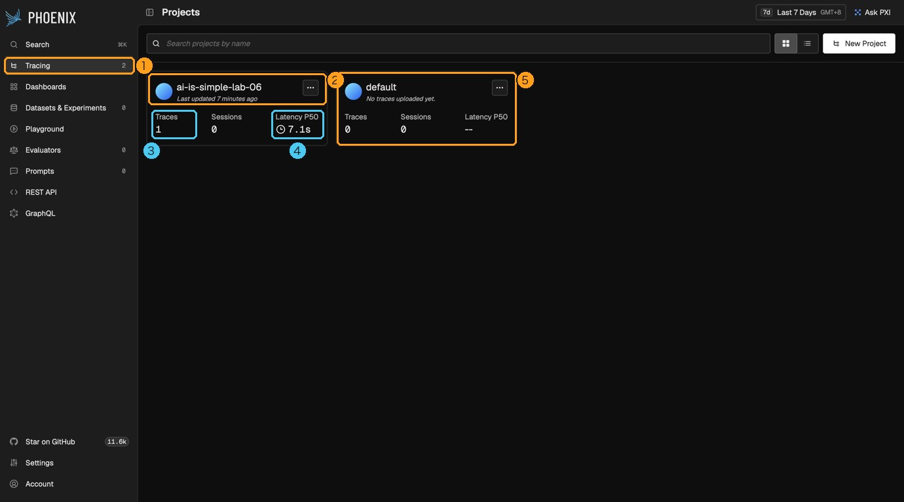

# 实战篇 06：看见 Agent 的运行轨迹


> **一句话总结：一条 Trace 是一棵 Span 树。顺着树读，就能看出 Agent 做了什么、哪一步慢、哪一步错。**

**本实战新增：** Phoenix 的 OpenTelemetry 接入，以及一个轻量事件桥，把模型请求和工具执行放进同一条轨迹；Agent Loop 不变。

这一章的目标只有一个：**以后拿到任意一条 Phoenix Trace，你都能读懂它。** 所以先讲怎么看，再讲怎么埋点，最后才讲怎么部署。

## 先看图

- `Project`（项目）是一本工单簿，装着同一个应用产生的所有 Trace。
- `Session`（会话）是一位客户的所有工单，把同一段多轮对话里的 Trace 串起来。
- `Trace`（轨迹）是一张工单，代表用户交给 Agent 的**一次任务**。
- `Span`（片段）是工单上的一步，记录这一步的输入、输出、耗时和成败。
- Span 之间有父子关系：父 Span 包住子 Span，整张工单就长成一棵树。

## 用生活例子理解

把一次 Agent 任务想成一张维修工单。工单是 Trace；“检查”“换零件”“试机”是 Span；“换零件”下面还可以再细分“拆外壳”“装新件”，这就是父子 Span。只看最后的“已修好”，你不知道中间发生了什么；翻开工单，才知道哪一步花了最久、哪一步返工了。

## 第一步：Project → Trace → Span

先看项目列表。下图是运行完一次任务后的 Phoenix 首页：



1. **Tracing**：所有轨迹的入口，右边的数字是项目数量。
2. **项目卡片 `ai-is-simple-lab-06`**：项目名来自代码里的 `project_name`。同一个应用的 Trace 都进这个项目。
3. **Traces**：这个项目里有多少条 Trace。这里是 1，说明只跑了一次任务。
4. **Latency P50**：一半任务在这个时间内完成。只有一条 Trace 时，它就是那条 Trace 的总耗时 7.1 秒。
5. **Sessions**：有多少段多轮对话。这张截图拍于代码接入 Session 之前，所以是 0；现在运行会看到实际数量，后面“多轮对话”一节会细讲。
6. **`default` 项目**：没指定项目名时，Trace 会落到这里。如果你在自己的项目里找不到轨迹，先来这里看看。

四个概念的关系可以对照这张表：

| 概念 | 一句话 | 本实战里对应什么 |
| --- | --- | --- |
| Project | 一类应用的所有记录 | `ai-is-simple-lab-06` |
| Session | 一段多轮对话 | 从打开页面到点“重置”之间的所有提问 |
| Trace | 一次完整任务 | 网页上提交一次问题 |
| Span | 任务里的一步 | 一次模型请求、一次工具执行 |
| 父子 Span | 大步骤包住小步骤 | `agent.run` 包住模型回合和工具 |

父子关系靠的是“当前 Span”：代码进入一个 Span 后，在它里面新建的 Span 会自动记下 `parent_id`，指向这个父 Span。没有父 Span 的那一个叫**根 Span**，它就代表整条 Trace。

## 第二步：顺着一条真实 Trace 读一遍

下面这条 Trace 来自第一个示例任务：

> 只读 calculator.py，解释 calculate_total 的计算过程，不要修改文件。

点开它，左侧是 Span 树。放大后逐行标注如下：


把它改写成缩进，就是 Agent Loop 真实跑过的样子：

~~~text
agent.run                           ← 用户任务（根 Span）
├─ agent.model_turn  #1
│  └─ ChatCompletion  891 tokens    ← 模型说：我要调工具
├─ agent.tool                       ← Harness 执行工具
├─ agent.model_turn  #2
│  └─ ChatCompletion  1,099 tokens  ← 模型看了工具结果，又要调工具
├─ agent.tool                       ← Harness 再执行一次
└─ agent.model_turn  #3
   └─ ChatCompletion  1,423 tokens  ← 模型不再要工具，输出最终回答
~~~

按时间顺序读：

1. **`agent.run` 开始**：网页后端收到任务，开了一个根 Span，输入是用户原话。
2. **第 1 轮**：Agent 请求模型。模型没有直接回答，而是返回一个 tool call。
3. **第 1 次 `agent.tool`**：Harness 按模型的要求执行工具，把结果放回消息列表。
4. **第 2 轮**：模型带着工具结果再想一次，又要了一次工具。
5. **第 2 次 `agent.tool`**：Harness 再执行。
6. **第 3 轮**：这次模型没有 tool call，直接输出答案。Agent Loop 结束，`agent.run` 关闭。

想知道每次 `agent.tool` 具体调了什么，点开它看右侧的 `tool.name` 和 `input.value`。

### 为什么这样嵌套

- **`ChatCompletion` 挂在 `agent.model_turn` 下面**：模型请求发出时，`agent.model_turn` 正是“当前 Span”，自动埋点生成的 Span 就挂到它下面。
- **`agent.tool` 和 `agent.model_turn` 是兄弟**：模型输出完整的 tool call 后，这一轮就结束了。执行工具是 Harness 的事，不属于模型回合，所以事件桥先关掉模型回合，再开工具 Span。
- **所有 Span 都挂在 `agent.run` 下面**：因为整个 Agent 运行都包在 `agent.run` 里面。少了这一层，三次模型请求会变成三条互不相干的 Trace。

### 顺手发现两件事

- **token 一轮比一轮多**：891、1,099、1,423。每轮请求都要带上完整历史和工具结果，上下文会越滚越大。这正是 Lab 07 要解决的问题。
- **Span 数量能算出来**：这条 Trace 有 9 个 Span。规律是 `1 个 agent.run + 每轮 2 个（model_turn + ChatCompletion）+ 每次工具 1 个`，也就是 1 + 3×2 + 2 = 9。轮数越多、工具越多，Span 就越多。

## 第三步：读懂右侧的字段

点左侧任意一个 Span，右侧就显示它的详情。下图选中的是最后一次模型请求：


1. **根 Span 列表**：左栏 `Spans` 标签页带着 `parent_id is None` 过滤条件，意思是“只看根 Span”，一行就是一条 Trace。上方的 Traffic 图按 `error / ok / unset` 统计 Span 数量。
2. **Trace 总览**：`Status` 是根 Span 的状态，`Latency` 是整条 Trace 的耗时 7.1 秒。
3. **Span 树**：上一节讲过的父子结构。
4. **选中 Span 的标题行**：`llm` 是 Span 类型，`OK` 是状态，`2.3s` 是这一步的耗时，后面是开始时间和 token 数 1,423。
5. **三个标签页**：`Info` 看输入输出，`Attributes` 看全部原始字段，`Events` 看这一步里发生的时间点事件。
6. **Output**：模型这次的完整回复。往上滚还有 Input，也就是这次请求发给模型的全部消息。
7. **Attributes**：这个 Span 带了 39 个字段，包括模型名、token 数、完整消息列表等。

光看这一个 Span 就能读出不少信息：整个任务 7.1 秒，最后一轮模型请求占了 2.3 秒，其余时间花在前两轮和工具执行上。

### 五类最值得看的信息

| 信息 | 在哪里看 | 能帮你定位什么 |
| --- | --- | --- |
| **Input / Output** | `Info` 标签页 | 模型看到了什么、回了什么；工具收到什么参数、返回了什么。答案不对时，先看是输入就错了，还是模型理解错了。 |
| **Duration（耗时）** | 标题行，例如 `2.3s` | 哪一步最慢。比较模型 Span 和工具 Span，就知道是等模型还是等工具。 |
| **Status / Error** | 标题行的 `OK`，Traffic 图 | 哪一步失败了。失败的 Span 会标红，并带上错误描述。 |
| **Attributes** | `Attributes` 标签页 | 模型名、token 数、工具名、执行结果等细节。token 突然变大，往往说明上下文塞进了太多东西。 |
| **父子关系** | 左侧 Span 树 | 这一步属于哪一轮、哪个任务。一个工具被调了几次、在第几轮调的，一眼就能看出来。 |

本实战里各类 Span 的关键字段：

| Span | 关键字段 | 含义 |
| --- | --- | --- |
| `agent.run` | `input.value` / `output.value` | 用户任务 / Agent 最终回复 |
| `agent.model_turn` | `agent.turn.index` | 这是第几轮 |
| `ChatCompletion` | `llm.model_name`、`llm.token_count.*`、`llm.input_messages.*` | 模型名、token 用量、发给模型的完整消息 |
| `agent.tool` | `tool.name`、`input.value`、`output.value`、`tool.outcome` | 工具名、参数、返回值、结果（`success / error / blocked`） |

### 两个容易看错的地方

- **根 Span 是 `Unset`，不代表全程没出错。** OpenTelemetry 的状态有三种：`Unset`（没人设置，默认值）、`OK`、`Error`。本实战的 `agent.run` 只在整个 Agent 抛异常时才标 `Error`；某个工具失败只会把那个 `agent.tool` 标红，不会往上传。所以要看 Traffic 图里的 `error`，或者逐个检查子 Span。
- **`agent.tool` 的耗时包含等待授权的时间。** 工具 Span 在模型给出 tool call 时就开始了，要等你在网页上点“允许”、工具真正跑完才结束。如果某个工具 Span 特别长，先想想是不是你离开座位没点授权。

## 第四步：用 Trace 回答四个问题

拿到任意一条 Trace，按这个顺序看：

1. **Agent 做了什么？** 从上到下读 Span 树。每个 `agent.tool` 的 `tool.name` 和 `input.value` 连起来，就是 Agent 的行动记录。
2. **哪一步慢？** 先看 Trace 总耗时，再挨个点 Span 比较 Duration。模型慢，看 token 数是不是太大；工具慢，看是命令本身慢还是在等授权。
3. **哪一步错？** 找标红的 Span，看它的 Status 描述和 Output。第三个示例任务会故意跑一条抛异常的命令，可以在对应的 `agent.tool` 上看到 `Error` 和 `tool.outcome=error`。
4. **为什么有这么多 Span？** 数一数轮数和工具次数，套上面的公式。多出来的 Span 通常说明 Agent 绕了弯路：同一个文件读了好几遍，或者一个命令反复重试。

## 多轮对话：一轮一条 Trace，用 Session 串起来

网页上连续问好几个问题，Agent 会记住前面的对话。那这几轮应该放进同一条 Trace，还是各开一条？

**答案是每轮单独一条 Trace，再用 Session 把它们串起来。**

### 为什么不放进同一条 Trace

- **Trace 要有明确的起点和终点。** 一轮提问从用户发消息开始，到 Agent 给出回答结束。一段对话却可能断断续续聊好几个小时，根 Span 一直关不上，总耗时也就没法算。
- **统计会失真。** 项目卡片上的 Latency P50 是按 Trace 算的。把用户思考、喝咖啡的时间也算进去，这个数字就没有意义了。
- **树会越长越大。** 聊十轮就是几十上百个 Span 挤在一棵树里，想找第 7 轮哪一步出错会很费劲。
- **问题要能单独定位。** 第 3 轮出错、第 5 轮变慢，最好各自是一条完整的记录，可以单独打开、单独分享。

本实战的代码就是这样做的：每次提交问题都会进入一次新的 `agent.run`，所以每轮都是一条新 Trace。

### 用 Session 关联

Phoenix 遵循 OpenInference 的约定：给 Span 加上同一个 `session.id` 属性，这些 Trace 就会归到同一个 Session 下面。

本实战在网页后端为每段对话生成一个会话编号，点“重置”清空上下文时换一个新的：

~~~python
# server.py 的 AgentSession
self.conversation_id = str(uuid.uuid4())      # 创建时生成，reset() 时重新生成

with self.observer.agent_run(prompt, session_id=self.conversation_id):
    self.agent.run(prompt)
~~~

`agent_run()` 做两件事：把 `session.id` 写进根 Span 的属性，再用 OpenInference 的 `using_session()` 把编号放进当前上下文，让里面自动产生的模型 Span 也带上它：

~~~python
if session_id:
    attributes["session.id"] = session_id
...
with _session_context(session_id):   # 内部就是 using_session(session_id)
    yield
~~~

完整代码见 `labs/01-mini-coding-agent/observability.py`。实测下来，一段对话里所有 Span 都带着同一个 `session.id`，包括自动产生的 `ChatCompletion`。

### 在 Phoenix 里看 Session

下面是连续问了三个问题、点“重置”、再说一句“你好”之后的 Sessions 标签页：


1. **Sessions 标签页**：在项目页里，和 Spans、Traces 并列。
2. **session id**：每行一段对话，就是代码里生成的 `conversation_id`。重置前后是两个不同的编号。
3. **first input / last output**：这段对话的第一句提问和最后一句回答，用来快速认出是哪段对话。
4. **统计**：一共 2 段对话，平均每段 2 条 Trace（第一段 3 条，第二段 1 条）。

点开第一段对话，能看到它像聊天记录一样按轮排开：


1. **Session ID**：这段对话的编号。
2. **汇总**：整段对话用了多少 token、每轮耗时的中位数。
3. **Turns / Traces**：3 轮对话，对应 3 条 Trace。
4. **轮次列表**：每轮的提问、回答开头、token 和耗时。第一轮调了工具，有两次模型请求，所以 token 最多、耗时最长。
5. **Turn 和 Trace 的对应**：每一轮都有自己的 Trace ID，点进去就回到上面讲过的那棵 Span 树。

### 多轮对话里的 Trace 要怎么读

**看 token 有没有逐轮上涨。** 同一次测试里，每轮第一次模型请求的输入 token 是这样的：

| 轮次 | 提问 | 输入 token |
| --- | --- | --- |
| 第 1 轮 | 只读 calculator.py，解释计算过程 | 812 |
| 第 2 轮 | 那如果传入空列表会怎样？ | 1,368 |
| 第 3 轮 | 用一句话总结我们刚才聊了什么 | 1,666 |
| 重置后 | 你好 | 797 |

后面的问题更短，输入却更大，因为每次请求都带着前面所有的对话和工具结果。重置之后上下文清空，又回到了起点。

- **答案和前面对不上时，看 Input。** 打开这一轮的 `ChatCompletion`，检查模型拿到的历史消息里有没有你以为它记得的内容。
- **同一个用户的多段对话**，可以再加一个 `user.id`，用法和 `session.id` 一样。本实战只有一个本地用户，没有加。

## 自动埋点和手工埋点

**埋点**就是在代码里创建 Span 的地方。上面的 Span 树里，橙色和蓝色来自两种不同的埋点方式。

### 为什么模型请求能自动产生 Span

启动时调用 `register(auto_instrument=True)`，Phoenix 会装上 OpenInference 的 OpenAI 集成。它会包装 OpenAI SDK 的请求方法：只要代码通过 SDK 发出 `chat.completions.create`，就自动生成一个 LLM Span，记下消息、模型名、token 数和耗时。DeepSeek 提供 OpenAI 兼容接口，所以可以直接复用。

~~~python
import os
from phoenix.otel import register

os.environ.setdefault("PHOENIX_COLLECTOR_ENDPOINT", "http://127.0.0.1:6006")
provider = register(
    project_name="ai-is-simple-lab-06",
    auto_instrument=True,
    batch=False,
)
tracer = provider.get_tracer("ai-is-simple.lab06")
~~~

Lab 扩展加载时先调用这段注册代码，再创建 Agent，这样后面所有模型请求都会被记录。完整代码在 `labs/01-mini-coding-agent/observability.py` 的 `enable_phoenix()`。

### 为什么工具和 Agent Loop 要手工埋点

自动埋点只认识 SDK。SDK 能看到的只有“发出一次请求、收到一次回复”，它不知道：

- **工具怎么执行的**：模型只返回一段 tool call，真正读文件、跑命令的是我们自己的 Python 函数。SDK 根本不在场。
- **一次任务从哪开始、到哪结束**：Agent Loop 是我们写的 `for` 循环。SDK 只看到三次独立的请求，不知道它们属于同一个任务。
- **业务步骤的含义**：“第几轮”“是否授权”“验证是否通过”“Workflow 走到哪一步”，这些都是 Harness 自己的概念。

这些信息只有 Harness 知道，所以只能由 Harness 主动创建 Span。

**给任务开根 Span。** 网页后端在现有 Agent 调用外包一层：

~~~python
with self.observer.agent_run(prompt):
    self.agent.run(prompt)
~~~

`agent_run()` 内部用 `start_as_current_span("agent.run")`，让它成为“当前 Span”。里面发生的模型请求会自动挂到它下面。

**把工具事件补成 Span。** Agent 本来就会发出 `tool_call` 和 `tool_result` 事件，事件桥在收到前者时开 Span，收到后者时关 Span：

~~~python
if event_type == "tool_call":
    call_id = str(event.get("call_id", ""))
    attributes = {
        "openinference.span.kind": "TOOL",
        "tool.name": str(event.get("name", "unknown")),
        "input.value": _bounded(event.get("arguments", {})),
        "input.mime_type": "application/json",
    }
    self._tool_contexts[call_id] = self._start_span("agent.tool", attributes)
elif event_type == "tool_result":
    context_and_span = self._tool_contexts.pop(str(event.get("call_id", "")), None)
    if context_and_span is None:
        return
    context, span = context_and_span
    result = str(event.get("content", ""))
    span.set_attribute("output.value", _bounded(result))
    self._safe_close(context)
~~~

实际实现还会截断过长内容、标记错误和权限拒绝，并在任务结束时关闭没关上的 Span。它只观察事件，不参与路径限制或授权判断。`agent.model_turn` 也是这样：收到 `thinking` 事件时打开，收到 `tool_call` 或 `assistant_message` 时关闭。完整逻辑见同一个文件的 `PhoenixTraceObserver`。

两种方式对比：

| | 自动埋点 | 手工埋点 |
| --- | --- | --- |
| 谁创建 | 集成库包装 SDK 方法 | 自己的代码调 `tracer` |
| 本实战的例子 | `ChatCompletion` | `agent.run`、`agent.model_turn`、`agent.tool` |
| 知道什么 | 请求和回复本身 | 任务边界、轮次、工具结果、业务含义 |
| 代价 | 几乎零代码 | 要自己决定在哪开、在哪关 |

数据最终的流向：

~~~text
OpenAI SDK 请求 ──自动埋点──┐
                            ├─ agent.run Trace ── OTLP ──> Phoenix
Agent 的 tool_call/result ──事件桥──┘
~~~

### Span 过多通常是怎么来的

Span 多不一定是坏事，但一条 Trace 有几百个 Span 时就很难读了。常见原因：

- **Agent 绕圈子**：轮数多、工具调用多，Span 自然成倍增长。这是最该关注的情况，它说明 Agent 本身效率低。
- **自动和手工重复记录**：已经有自动的 LLM Span，又手工包一层“调用模型”，同一件事记了两遍。本实战的 `agent.model_turn` 就有这种味道：目前它只包着一个 `ChatCompletion`，主要作用是标出轮次。
- **多个集成叠加**：同时开了 OpenAI、HTTP 客户端、上层框架的自动埋点，一次请求会在三层各留一个 Span。
- **埋点粒度太细**：给每个小函数、每次字符串处理都开 Span，树会变得又深又宽，真正重要的步骤反而被淹没。
- **重试和批量调用**：失败重试三次就是三个 Span；给 100 段文本逐条算 embedding 就是 100 个 Span。

### 哪些地方值得埋点

值得埋：

- **任务入口**：一次用户请求一个根 Span，所有步骤都挂在它下面。
- **工具执行**：参数、结果、成败，排查问题时最常看。
- **外部调用**：数据库、检索、HTTP 接口，这些最容易慢或出错。
- **有业务含义的阶段**：规划、子 Agent、验证、Workflow 的每个节点。
- **会等人的地方**：授权、人工审核。不单独标出来，就会误以为是工具慢。

不必埋：

- 纯计算的小函数、格式转换。
- 已经被自动埋点覆盖的调用。
- 流式输出的每个 chunk。

判断标准只有一个：**出问题时，你会不会想单独看这一步的耗时和输入输出？** 会，就埋；不会，就别埋。

## 部署：用 Docker 启动 Phoenix

看懂 Trace 之后，再来动手产生自己的 Trace。

项目提供独立的 Compose 配置：Phoenix 保存轨迹到 Postgres，数据库数据放在 Docker volume 里。Postgres 只在 Compose 内部开放；Phoenix 页面和接收轨迹的端口只绑定本机。这个练习不需要 Redis。

在项目根目录运行：

```bash
docker compose -f labs/06-observability/compose.yaml up -d
```

检查容器状态：

```bash
docker compose -f labs/06-observability/compose.yaml ps
```

首次启动会运行数据库迁移，需要等 Phoenix 状态变为 `healthy`。迁移期间页面可能暂时返回 502；可查看 `docker compose -f labs/06-observability/compose.yaml logs -f phoenix`，等日志显示服务已启动后再刷新。

打开 <http://127.0.0.1:6006>。想停止 Phoenix：

```bash
docker compose -f labs/06-observability/compose.yaml down
```

`down` 会保留轨迹数据；如需从头练习，在 compose 命令后加 `-v` 会删除这个练习的数据库 volume 和其中的轨迹。

默认页面端口是 `6006`，接收 gRPC 轨迹的端口是 `4317`。如果本机端口被占用，可以改端口启动：

```bash
PHOENIX_UI_PORT=16007 PHOENIX_GRPC_PORT=14317 docker compose -f labs/06-observability/compose.yaml up -d
```

换了页面端口后，启动 Agent 时也要把收集地址设成相同端口：

```bash
PHOENIX_COLLECTOR_ENDPOINT=http://127.0.0.1:16007 uv run --group observability python labs/01-mini-coding-agent/server.py --lab 06
```

Compose 的本地数据库密码默认是练习用的 `phoenix-local-only`。如果通过 `PHOENIX_DB_PASSWORD` 覆盖，只使用 URL 安全的字母和数字。

## 跑起来

先在项目根目录的 `.env` 里准备 DeepSeek 配置，格式与 Lab 01 相同。运行时加上 `observability` 依赖组，uv 会按锁文件准备 Phoenix 相关依赖：

```bash
uv sync --group observability
```

启动 Agent：

```bash
uv run --group observability python labs/01-mini-coding-agent/server.py --lab 06
```

打开 <http://127.0.0.1:8765>，页面会切到 `demo/` 工作区并显示三个示例任务。每跑一个，就去 Phoenix 用上面的四个问题读一遍它的 Trace：

1. **只读解释**：得到和本章截图类似的 Trace，对照着认一遍每一层。
2. **定位并修复**：会多出 `edit` 和验证命令的 `agent.tool`。看看授权等待让工具 Span 变长了多少。
3. **故意失败**：页面会弹出授权请求，允许后可以在 Phoenix 里找到标红的工具 Span，同时注意根 Span 仍然是 `Unset`。

再试一次多轮对话：不点重置，接着追问两三句，然后去 Sessions 标签页找到这段对话，看看每轮的输入 token 怎么变化。点“重置”后再问，会出现一个新的 Session。

每次运行的轮数、内容和耗时都会不同，这很正常。

## 数据会发到哪里

本实战会把模型提示词、模型回复、工具参数和工具返回值发到本机 Phoenix。工具内容超过 8000 个字符时会截断。示例默认使用单独的 `demo/` 工作区；查看真实项目轨迹前，先确认这些内容适合发送到你的本机 Phoenix 数据库。模型请求仍会发送到配置的 DeepSeek API。

## 今天只记住

> **Trace 是一棵 Span 树：自动埋点记下模型请求，手工埋点补上任务、轮次和工具。**

## 想一想

如果 Phoenix 里有模型请求，却没有 `agent.tool`，你会先检查自动追踪注册顺序，还是 `tool_call / tool_result` 事件？为什么？

<details>
<summary>参考思路（先自己想一想，再展开）</summary>

模型 Span 能出现，说明收集地址和 OpenAI 自动埋点都正常，问题出在手工埋点这一侧。所以先检查事件桥有没有收到工具调用和结果。如果连模型 Span 也没有，才回头查收集地址和自动埋点的注册。

</details>

## Phoenix 官方资料

- [Docker 部署](https://arize.com/docs/phoenix/self-hosting/deployment-options/docker)
- [OpenAI Python SDK 追踪](https://arize.com/docs/phoenix/integrations/llm-providers/openai/openai-tracing)
