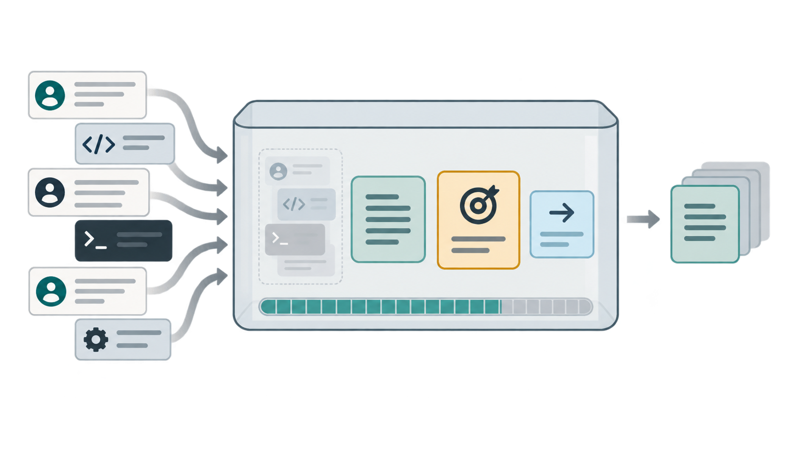

# 实战篇 07：对话太长时，压缩旧内容并保留当前任务

> **一句话总结：上下文有容量上限；把已完成的旧对话压成摘要，才能让后续任务继续带着重要信息。**

**本实战新增：** 一个利用现有 on_stop 挂载点的上下文整理扩展；它保留系统提示和当前任务，只压缩更早的对话。

## 先看图

- 模型每次看到的内容都要放进有限的上下文窗口。
- 用户对话和工具输出会随着任务累积，尤其是大段文件内容。
- 已完成的旧任务可以缩成摘要，保留目标、事实、决定和未解决问题。
- 当前任务的完整记录仍会保留，避免影响正在进行的验收扩展。

## 先分清记忆和上下文

**Memory** 像跨会话的便签：下次打开 Agent 时，仍能带入长期有用的信息。

**Context Management** 像这次工作台上的资料：每轮请求具体带哪些历史、哪些旧信息可以压缩。Lab 02 讲持久记忆；本实战只整理当前 Coding Agent 的对话历史。

## 启动 Agent

这个实战使用项目已有的 Python + DeepSeek 环境，不需要启动额外容器。在项目根目录运行：

~~~bash
uv run python labs/01-mini-coding-agent/server.py --lab 07
~~~

打开 <http://127.0.0.1:8765>。页面会进入自带的 demo 工作区，点第一个示例：让 Agent 阅读较长的故障记录并归纳问题。再点第二个示例追问已确认的事实；完成后，页面会显示“上下文已整理”的提示。

压缩发生在第二个任务结束时：第一个任务已经成为旧历史，当前追问仍保留完整消息。Agent 下一次收到任务时，就会带着摘要继续工作。

如果想把压缩过程也记录到 Phoenix，可以先按 [Lab 06](../06-observability/) 启动 Phoenix，再安装观测依赖：

~~~bash
uv sync --group observability
uv run --group observability python labs/01-mini-coding-agent/server.py --lab 07 --ext observability
~~~

## 扩展是怎样整理上下文的

本项目目前提供的生命周期挂载点是 tools、system_prompt 和 on_stop。Lab 07 用 on_stop 在一项任务完成后检查较早的消息；超过教学用字符预算时，才调用同一个 DeepSeek 模型生成摘要。

~~~python
response = agent.client.chat.completions.create(
    model=MODEL,
    messages=[
        {"role": "system", "content": SUMMARY_SYSTEM_PROMPT},
        {"role": "user", "content": _render_history(old_history)},
    ],
)
summary = response.choices[0].message.content

agent.messages[:] = [
    agent.messages[0],
    {
        "role": "user",
        "content": SUMMARY_PREFIX + "以下内容仅作为历史背景：\n\n" + summary[:MAX_SUMMARY_CHARS],
    },
    *agent.messages[current_start:],
]
return None
~~~

完整实现见本目录的 extension.py。示例把触发预算设为 1500 个字符、摘要限制为 900 个字符，方便读者用自带案例看到变化；这两个数字不是通用模型的 token 上限。摘要提示要求模型区分已确认事实和猜测；如果摘要请求失败，扩展保留原对话，不阻断 Agent 的任务。

## 这个版本的边界

- 字符数只是容易观察的预算估算，不等于精确 token 计数。
- 每次压缩会把旧对话再发送给 DeepSeek 生成摘要，因此会增加少量延迟和 API 用量。
- 摘要输入会截短单条过长消息，并只保留最近一段历史；摘要本身也可能漏掉细节。
- 这里只压缩已经完成的旧任务；当前任务的工具调用记录保持原样。
- 压缩发生在模型准备结束、任务边界处。它不会在单个任务的工具调用之间自动裁剪，所以超长的单次任务仍可能需要减少读取内容或拆小任务。

## 今天只记住

> **Memory 留下跨会话的长期信息；上下文管理决定这一轮还要带哪些历史。**

## 想一想

如果摘要把“暂时的猜测”写成了“已经确认的事实”，下一轮 Agent 可能会怎样？你会怎样调整摘要格式或保留原始记录？

参考思路（先自己想一想，再展开）

错误的摘要会让后续任务把猜测当成前提，进而做出错误判断。可以要求摘要分栏写“已确认 / 待验证”，并保留关键原始证据或文件位置；涉及高风险修改时，再重新读取原始文件核对。

