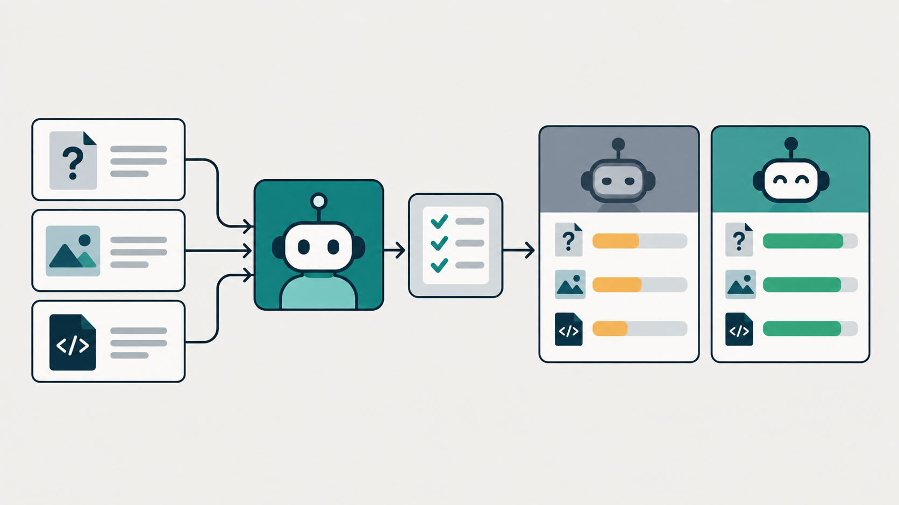

# 实战篇 08：用固定任务比较 Agent 修改前后的表现

> **一句话总结：固定一组输入和评分规则，才能判断 Agent 改动后有没有变好。**

**本实战新增：** 一个包含固定案例、任务运行器和确定性评分器的 Phoenix 实验；相同输入可以用来比较不同版本。

## 先看图

- **Dataset** 是一组固定的案例，记录问题和预期行为。
- **Task** 是要评估的 Agent 版本，它会对每个案例运行一次。
- **Evaluator** 按规则给回答和工具选择打分。
- **Experiment** 保存一次运行结果，方便比较版本和定位失败案例。

## Verify 和 Evaluation 有什么不同

Lab 05 的 Verify 针对刚修改的代码运行测试：这一轮改动是否通过验收？Lab 08 的 Evaluation 会对一组固定输入运行 Agent：多种回答、文件读取行为和对话场景整体表现如何？

前者是单次任务里的反馈循环；后者是跨案例的质量测量。Phoenix 的 Dataset 保存测试案例，Experiment 用同一批输入运行任务并附上评估分数。[Phoenix 的数据集说明](https://arize.com/docs/phoenix/learn/datasets-and-experiments/datasets-concepts) [Phoenix 的实验流程](https://arize.com/docs/phoenix/datasets-and-experiments/how-to-experiments/)

## 用 Phoenix 跑一次评估

先启动 [Lab 06 的 Docker Compose](../06-observability/)，等待 Phoenix 页面可以打开：

~~~bash
docker compose -f labs/06-observability/compose.yaml up -d
~~~

再在项目根目录安装观测与评估依赖：

~~~bash
uv sync --group observability --group evaluation
~~~

运行前还要在项目根目录的 .env 中配置 DeepSeek Key，格式与 Lab 01 相同。

运行基线实验：

~~~bash
uv run --group observability --group evaluation python labs/08-evaluation/evaluate.py --name baseline
~~~

脚本会把三个固定案例写入 Phoenix Dataset，在只读工作区里逐条运行 Agent，再保存两个评分：回答是否包含案例要求的关键事实、是否按预期选择 read 工具。它不会让评估任务写文件或执行 Bash。

打开 <http://127.0.0.1:6006>，进入 Datasets & Experiments 查看案例、每轮输出、评分和 Trace。选择失败案例，就能从分数回到具体的模型或工具 Span。

想比较改动前后，先修改 Agent 的 system prompt 或读取策略，再用相同数据集运行另一版：

~~~bash
uv run --group observability --group evaluation python labs/08-evaluation/evaluate.py --name prompt-v2
~~~

Dataset 有稳定的案例 ID，重复运行会更新同一个数据集版本，不会每次都追加一份相同案例。

案例、实验结果和 Trace 会发送到本机 Phoenix；Agent 的模型请求仍会发到项目配置的 DeepSeek API。

## 核心代码

Phoenix 实验把任务函数和评分函数分开。Task 只负责运行 Agent；Evaluator 只负责判断结果：

~~~python
experiment = run_experiment(
    dataset=dataset,
    task=run_agent,
    evaluators=[required_facts_score, tool_selection_score],
    experiment_name=f"mini-agent-{args.name}",
)
~~~

确定性评分器可以直接复跑和比较：

~~~python
def tool_selection_score(input, output, expected):
    expected_tools = {"read"} if expected["must_use_read"] else set()
    actual_tools = set(output["tools_used"])
    return float(actual_tools == expected_tools)
~~~

完整实现见本目录的 evaluate.py 和 extension.py。Phoenix Python Client 支持从 DataFrame 创建 Dataset，并用稳定 ID 更新案例；Experiment 会把同一 Task 跑在每个案例上。[创建 Dataset](https://arize.com/docs/phoenix/datasets-and-experiments/how-to-datasets/creating-datasets) [更新 Dataset](https://arize.com/docs/phoenix/datasets-and-experiments/how-to-datasets/updating-datasets)

## 评分不能代替判断

本实战用关键字和是否调用 read 作为入门评分。它们容易复现，但不能覆盖表达是否清晰、推理是否完整等主观质量。固定案例也只代表你写进去的场景；评估通过不等于 Agent 在所有情况下都可靠。

可以先从真实失败的 Trace 中挑案例，逐步丰富 Dataset；需要判断语义正确性时，再尝试 Phoenix 的 LLM-as-a-judge，并抽查它的解释。评分是定位问题和比较改动的证据，不是质量证明。

## 今天只记住

> **固定案例让改动可以比较；评分让失败更容易被发现。**

## 想一想

如果一次修改让“读文件”的案例全通过，却让打招呼也开始调用 read，你会如何在 Dataset 和评分规则里发现这个退步？

参考思路（先自己想一想，再展开）

同时保留“无需工具”的对话案例，并给工具选择单独评分。这样一个版本即使回答内容没变，只要不必要地调用了 read，也会在该案例上失分。

