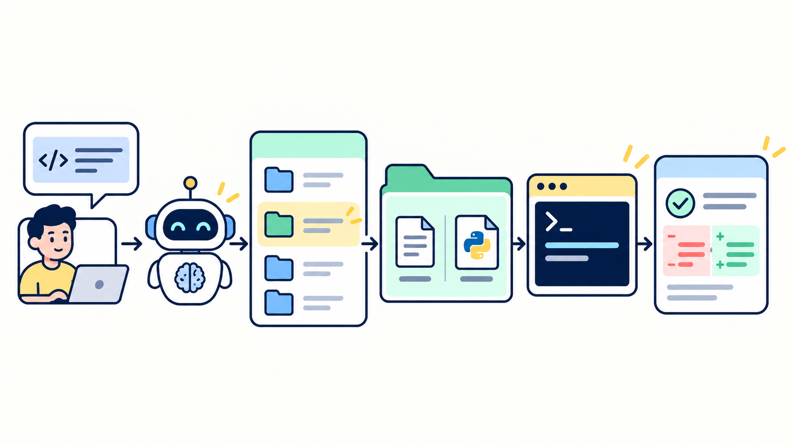

# 实战篇 09：Skill Loading：代码审查



> **一句话总结：Skill 用 `SKILL.md` 描述流程，再按任务需要加载；配套脚本负责确定性检查。**

**本实战新增：** 一个按需加载的 `statistics-review` Skill，以及它附带的 Python 静态检查脚本。

对应理论篇：[第 07 章 Skill Loading](../../chapters/07-skill-loading/)。

## Skill 包含什么

```text
.agent/skills/statistics-review/
├── SKILL.md                       # 适用场景、审查步骤和脚本用法
└── scripts/
    └── inspect_stats.py           # 扫描函数结构，提示应检查的边界
```

`SKILL.md` 告诉 Agent 什么时候使用、按什么步骤做；脚本处理适合确定性执行的部分。脚本只给检查线索，不判断代码对错，Agent 仍要读取源码并验证结论。

## 跑起来

```bash
uv run python labs/01-mini-coding-agent/server.py --lab 09
```

打开本地页面，先试“审查 `stats.py` 的边界情况”。观察 Agent 是否先根据目录简介判断任务相关，再调用 `load_skill` 读取 `SKILL.md`，随后读取并运行配套脚本。运行脚本会经过 Lab 01 的命令授权。

脚本可能提示 `median()` 需要检查奇数、偶数和临界长度。Agent 还要自己读取实现，才能发现偶数列表现在只返回右侧中间值。脚本的提示不是审查结论。

再试“修复 `stats.py` 里 `median` 对偶数长度列表的处理问题”，观察 Skill 是否继续指导检查过程。问一个与代码审查无关的概念问题时，不需要加载这个 Skill。

## 实现里值得看的两处

**启动时只提供目录。** 扩展从工作区的 `SKILL.md` front matter 读取名称和简介，完整说明只在 `load_skill(name)` 被调用时返回。

**脚本仍通过受控的 `bash` 执行。** Skill 不能绕过工作区和命令授权。脚本路径由 `SKILL.md` 指定，Harness 仍负责确认和执行。

## 适用边界

- 任务流程稳定、经常重复时，适合整理成 Skill；一次性要求留在当前对话里。
- `SKILL.md` 是模型遵循的指引，不会自动执行。要确认关键步骤确实完成。
- 脚本适合语法检查、格式检查和固定规则；需要语义判断的部分仍由 Agent 检查。
- Skill 来自工作区文件。本实战只展示本地可信 Skill，不讨论从外部来源安装 Skill 的供应链风险。

## 今天只记住

> **Skill 负责组织做事步骤，脚本负责稳定执行其中可自动化的检查。**

## 想一想

如果 `inspect_stats.py` 没有报告问题，是否能说明 `stats.py` 一定正确？

<details>
<summary>参考思路（先自己想一想，再展开）</summary>

不能。脚本只检查它编码过的模式，语义错误可能不符合任何模式。Skill 要求 Agent 再读取实际实现，必要时运行项目已有的检查。

</details>
